# LOCATE — Master Implementation Plan

Plan only. Nothing in this repository is implemented yet. No program has been written or deployed, no transaction has been sent, and no mainnet SOL has been spent.

- **Plan written:** 2026-09-23 ~22:45 UTC (2026-09-24 ~01:45 UTC+3).
- **Opportunity Layer revision:** 2026-09-23 ~23:20 UTC. Protocol V1 is unchanged. See §38.
- **Submission deadline:** Friday 2026-09-25 16:00 ET = **20:00 UTC** = 23:00 UTC+3. This was re-verified live on the hackathon page at 2026-09-23T21:53Z: "Submissions close: Friday 25 September, 4:00pm ET".
- **Time available from plan start (T0 = 2026-09-23 23:00 UTC):** 45 hours.
- **Repository:** `https://github.com/goat-dev8/LOCATE`. The local path is `D:\route\sol\LOCATE`; branch `main`, head `efb58e8` (the initial commit).

Status labels used throughout:

| Label | Meaning |
|---|---|
| **VERIFIED-LIVE** | Fetched or queried during this planning session. The timestamp is given. |
| **VERIFIED-SOURCE** | Read in the upstream source code (token-2022, anchor v1.2.0, or litesvm, cloned at their current heads). |
| **DOCUMENTED** | Stated in official documentation, but not exercised by us yet. |
| **INFERRED** | Reasoned from verified facts. Must be proven by a named test before anything relies on it. |
| **UNKNOWN** | Not known. Either the owning phase is blocked, or a BLOCKER question is open (see the end of the file). |

---

## 1. Executive Summary

LOCATE lets a PreStocks holder lend out their tokens for an upfront USDC fee. The borrower posts USDC collateral and can sell the borrowed tokens immediately. Settlement is by time and delivery only:

- **Returned:** the borrower returns the tokens before maturity, meaning the lender's balance rises by at least N raw units *net of the Token-2022 transfer fee*. The borrower then gets the collateral back.
- **Claimed:** otherwise, after maturity plus grace, anyone can trigger the claim, and the collateral goes to the lender.

No price is read anywhere on-chain. There is no oracle and no liquidation.

The **Opportunity Layer** (§38) sits above that protocol. It shows which names have a live premium and real borrowable supply, and it computes short economics before a borrow. It does not settle anything. The app still borrows, returns, and verifies if that layer is absent.

- **What gets built:** one Anchor program with exactly 5 instructions; a TypeScript SDK that builds transactions; and a read-only indexer API on Render with a minimal Supabase read model. The React/Vite frontend is built externally and is **not edited by LOCATE**; LOCATE supplies the SDK, the API, and exact integration instructions, and deploys the delivered build to Vercel.
- **Why it can win:** the PreStocks FAQ promises "lend out your PreStocks to earn yield", and the PreStocks founder named shorting-by-lending as the missing primitive. OPENAI trades about 28% above PreStocks' own mark, and nobody can borrow the token today. The main track explicitly lists "Credit and yield: borrowing against stocks".
- **Proof tier (owner decision: Tier B):**
  - A devnet deployment, with real devnet signatures for both the return cycle and the claim cycle.
  - A devnet synthetic mint that mirrors OPENAI's extensions.
  - Tests against the cloned **real OPENAI mint bytes** and the **Token-2022 program as deployed on mainnet**.
  - Mainnet **read-only** evidence: live data, plus Jupiter swap legs checked by `simulateTransaction`, with no signatures.
  - **Nothing is ever described as a mainnet loan.**
  - Tier A (a mainnet loan cycle) is kept only as a post-hackathon procedure (the "Tier A appendix" at the end of Phase 12).

**Owner decisions** (answered 2026-09-23 ~23:00Z):

| Question | Answer |
|---|---|
| B1 Eligibility | A genuinely separate team builds and submits LOCATE |
| B2 Mainnet | **Devnet only → Tier B** |
| B3 Database | Dedicated new Supabase project (verified: connects, empty) |
| B4 RPC | Public endpoints |
| B5 Frontend | **Do not edit it.** LOCATE delivers integration instructions + SDK + API. |
| B6 Render | Free tier |

**GO/NO-GO (details at the end of the file):**

| Part of the plan | Decision |
|---|---|
| Build, all phases in their Tier B form | **GO** |
| Mainnet | **Out of scope** by owner decision; every surface says "devnet" |
| Submission | **GO** by the separate team |

---

## 2. Product Thesis

**Sentence (used first in every surface):** *Lend out your PreStocks. Short the premium.*

**One-line product:** *LOCATE turns idle PreStocks into borrowable short supply.*

**The loop:** Discover → understand → find supply → check thesis → check economics → borrow → short → return → verify.

**The problem.** A holder can buy a PreStock and can sell one. There is still nowhere to borrow the token itself. The names that trade far from the issuer's own reference are the ones a borrower would want, and only if someone has actually listed them:

Catalog premium is `(tokenPrice − markPrice) / markPrice` from `https://prestocks.com/api/prestocks`, not a blend with Jupiter. VERIFIED-LIVE 2026-09-23T23:15:40Z:

| Token | Mark | Catalog token price | Premium | Borrowable on LOCATE |
|---|---:|---:|---:|---|
| OPENAI | $1,025.10 | $1,309.48 | +27.74% | none until a holder lists |
| NEURALINK | $337.16 | $430.73 | +27.75% | none until a holder lists |

At that same fetch the other catalog names ran from −22.2% (SPACEX, excluded from Discover) to +1.3% (ANDURIL). Discover still lists every eligible name. A non-positive premium is a row in the `LOW_NEGATIVE_PREMIUM` state, not a hidden asset and not a short. Jupiter Price v3 for OPENAI was $1,309.21 at 21:52Z, a different source, shown separately and never folded into the premium.

Nobody outside the issuer's KYC mint path can act on that gap, because nobody lends the token.

**Why an oracle-free design is required.** Every existing credit design (lending USDC against PreStocks) needs a trusted price and a liquidation venue. PreStocks has neither:

- The mark has no timestamp, no history, and no on-chain presence.
- The order books are thin: a $6 buy showed a price impact of 0.0192 (Jupiter's `priceImpactPct`) at 21:52Z.

LOCATE inverts the loan. The PreStocks token is the lent asset, and USDC is the collateral.

**What each party gets:**

- **The lender** receives an upfront fee and caps their upside at K/N. The payoff is equivalent to a covered call.
- **The borrower** gets real, sellable tokens: a locate. Their payoff is capped at K + f from day one, and nothing can liquidate them early.

---

## 3. Exact V1 Scope

- **One Anchor program, exactly 5 instructions:** `create_offer`, `cancel_offer`, `take_offer`, `return_loan`, `claim_collateral`.
- **Accounts:** an Offer PDA, which also acts as the Token-2022 delegate authority; a Loan PDA; and a USDC vault, the associated token account (ATA) owned by the Loan PDA.
- **Token programs:** PreStocks mints are Token-2022; USDC is classic SPL Token, with the mint pinned per cluster.
- **Net delivery is measured on-chain**, as the change in the lender's `amount` before and after `return_loan`. Zero fee is never assumed.
- **Events** are emitted with `emit_cpi!` (inner instructions), so they are not lost to log truncation when a transaction also contains a Jupiter swap.
- **TypeScript SDK:** PDA helpers, account decoders, fee math, the four user transaction builders, and the Jupiter `swap-instructions` composition.
- **Backend (Render, read and index only):**
  - Open offers and active loans are read live from chain.
  - A receipt verifier stores decoded events in Supabase schema `locate`.
  - A market data service serves the issuer mark and the Jupiter price with timestamps.
- **Frontend (external React + Vite + npm, placed at `FRONTEND/`): LOCATE does not edit it.** LOCATE ships:
  - `@locate/sdk`
  - the production API
  - `docs/FRONTEND_INTEGRATION.md`: exact wiring instructions, including how to remove the fakes
  - a contract checker the frontend owner runs (`sdk/tools/check-frontend.mjs`)

  LOCATE also runs read-only Chrome QA on the delivered build. Navigation is Discover, Book, My Offers, My Loans, Verify. Discover is the Opportunity Layer. Book through Verify still run if Discover is down.
- **Mint allowlist (off-chain):** built from `https://prestocks.com/api/prestocks` `contract_address`, excluding SPACEX. The program itself stays mint-generic.
- **Evidence pack:** devnet signatures, fork-test output, and mainnet read-only snapshots and simulations, all generated by scripts from chain and RPC data.

## 4. Non-Goals

Excluded from V1:

- **Risk machinery:** oracles, liquidation, mark-based margining, margin calls.
- **Features:** AI, leverage, perps, pools or pooled collateral, interest accrual, lender recall, partial takes, rolling offers, hook-account resolution.
- **Mints:** SPACEX (its token has a published hard expiry) and any non-PreStocks mint, which would also make the project ineligible for the PreStocks bounty.
- **Product surfaces:** analytics dashboards, and any admin instruction that touches funds.
- **PreLaunch-shaped features, explicitly rejected** (§38): baskets, portfolio tracking, cost basis, wallet-versus-strategy comparison, a generic what-if simulator, creator profiles, a research catalog, implied-valuation screens, news, social, AI, and copy-trading. Prices stay context. They never become a score, a forecast, or a settlement input.
- **Evidence:** fake activity, seeded or fake offers on mainnet, synthetic mainnet receipts, and simulated signatures presented as real.
- **Backend writes:** the backend never signs or sends transactions.
- **Database access from the browser:** no Supabase keys, PostgREST access, or DB credentials are sent to the browser.
- **Code reuse:** no imports from, or references to, any other local project.

---

## 5. Verified Research Findings

All UTC timestamps below are from this session unless marked otherwise.

### 5.1 Hackathon (VERIFIED-LIVE, 2026-09-23T21:53Z; rules captured earlier the same day)

| Fact | Value |
|---|---|
| Submissions close | Friday 25 September, 4:00pm ET (= 2026-09-25T20:00Z). Judging runs through 2 October. |
| Registered / submissions | 866 / 194 |
| Eligibility | "Individuals and teams, **one submission per team**, original work." This is the BLOCKER in §33. |
| Sponsor tracks | Pick up to 3. Prize pool $126k: main $100k, PreStocks $10k, Tessera $6k, Clawpump $5k, Meteora $5k, Pyth (non-cash). |
| PreStocks bounty | It explicitly names "lending/collateral, structured products". **Projects that integrate any non-PreStocks pre-IPO tokens are ineligible.** |
| Main-track rubric | "could this be a real app that people will actually use?" The judges look for a real user and problem, a working end-to-end demo, a reason it belongs on Solana, and quality of execution. |
| Visibility | Projects stay private until after judging, and can be edited until the deadline. |

### 5.2 PreStocks (VERIFIED-LIVE, `/api/prestocks` 2026-09-23T21:48:18Z; `/api/metrics` 21:5xZ)

Both `https://prestocks.com/api/prestocks` and `https://www.prestocks.com/api/prestocks` return HTTP 200. The raw snapshot is in `research-raw/`, outside this repository.

| Symbol | Mint | Mark ($) | Token price ($) | Premium | V1 |
|---|---|---:|---:|---:|---|
| ANDURIL | `PresTj4Yc2bAR197Er7wz4UUKSfqt6FryBEdAriBoQB` | 151.78 | 153.71 | +1.3% | allow |
| ANTHROPIC | `Pren1FvFX6J3E4kXhJuCiAD5aDmGEb7qJRncwA8Lkhw` | 1040.83 | 1049.00 | +0.8% | allow |
| FIGUREAI | `PreZad18qfPtbxNpMtMuAuX2zVpvkEU8DnJx56faCWd` | 181.14 | 174.09 | −3.9% | allow |
| KALSHI | `PreLWGkkeqG1s4HEfFZSy9moCrJ7btsHuUtfcCeoRua` | 883.91 | 850.83 | −3.7% | allow |
| NEURALINK | `PrekqLJvJ3qVdXmBGDiexvwUTF4rLFDa6HWS4HJbw9S` | 337.22 | 430.72 | +27.7% | allow |
| OPENAI | `PreweJYECqtQwBtpxHL171nL2K6umo692gTm7Q3rpgF` | 1025.71 | 1312.73 | +28.0% | allow (demo mint) |
| POLYMARKET | `Pre8AREmFPtoJFT8mQSXQLh56cwJmM7CFDRuoGBZiUP` | 144.40 | 143.97 | −0.3% | allow |
| SPACEX | `PreANxuXjsy2pvisWWMNB6YaJNzr7681wJJr2rHsfTh` | 149.07 | 118.05 | −20.8% | **excluded** (hard expiry) |

The allowlist is rebuilt from `GET /api/prestocks` at backend start and every 10 minutes. It is the catalog's `contract_address` list, minus SPACEX. It is not a hardcoded set of symbols, and it is not OpenAI alone. OpenAI is the demo and fork-test mint because its extension bytes are what the fork suite loads.

**xAI, checked 2026-09-23T23:29:04Z.** `GET /api/metrics` includes `XAI` with mint `PreC1KtJ1sBPPqaeeqL6Qb15GTLCYVvyYEwxhdfTwfx` and a token price. The products page includes it with `hideOnPrestocksApi: true`. `GET /api/prestocks` does not include it, including `?includeHidden=true`, and there is no mark-price endpoint for that mint (404). A row needs a catalog mark. Until `/api/prestocks` returns xAI, Discover does not invent one. When the catalog returns it, the same loop adds the row with no code change.

### 5.3 OPENAI mint on-chain (VERIFIED-LIVE, mainnet slot 449829712, epoch 1041, slot index 117714 of 432000)

- **Owner and precision:** owned by Token-2022 `TokenzQdBNbLqP5VEhdkAS6EPFLC1PHnBqCXEpPxuEb`. Decimals 9; raw supply 1,901,819,495,452.
- **Authorities:** mint authority and freeze authority are both `WV9PJN7XTmTLVwbutCLFxp8TyePee6Xq5mRq6Fti5Wc`.
- **Extensions:**

| Extension | State |
|---|---|
| `transferFeeConfig` | Older fee: epoch 1032, 50 bps. Newer fee: epoch 1039, **100 bps** (active, because 1039 ≤ 1041). Maximum fee is u64::MAX, so effectively uncapped. Withheld: 5,649,085,618. |
| `permanentDelegate` | WV9… (issuer) |
| `pausableConfig` | `paused = false` |
| `transferHook` | Program id null |
| `defaultAccountState` | `initialized` (new token accounts are not frozen) |
| `scaledUiAmountConfig` | Multiplier "1", new multiplier "1.4861347", effective timestamp 1784305800 (= 2026-07-17T16:30Z, already past). **The effective UI multiplier is 1.4861347.** This is INFERRED from the source rule "use the new multiplier once now ≥ its timestamp". |
| `confidentialTransferMint` (auto-approve false), `confidentialTransferFeeConfig`, `metadataPointer`, `tokenMetadata` ("OpenAI PreStocks") | present |

The Token-2022 program account is owned by `BPFLoaderUpgradeab1e11111111111111111111111` and is upgradeable. Because of that, tests must use the ELF dumped from mainnet, not an older bundled copy.

### 5.4 USDC (VERIFIED-LIVE, 2026-09-23T21:5xZ)

| Cluster | Mint | Owner program | Decimals | Notes |
|---|---|---|---:|---|
| mainnet | `EPjFWdd5AufqSSqeM2qN1xzybapC8G4wEGGkZwyTDt1v` | classic Token | 6 | Freeze authority `7dGbd2QZcCKcTndnHcTL8q7SMVXAkp688NTQYwrRCrar`. The issuer can freeze the vault; this is disclosed. |
| devnet | `4zMMC9srt5Ri5X14GAgXhaHii3GnPAEERYPJgZJDncDU` | classic Token | 6 | Mint authority `GrNg1XM2ctzeE2mXxXCfhcTUbejM8Z4z4wNVTy2FjMEz` (Circle devnet). Funded through Circle's faucet, which is a human step. |

### 5.5 Jupiter (VERIFIED-LIVE, 2026-09-23T21:52:44Z)

**Endpoint availability:**

| Endpoint | Result |
|---|---|
| `GET api.jup.ag/swap/v1/quote` | 200, **no key** |
| `GET lite-api.jup.ag/swap/v1/quote` | 200 |
| `POST api.jup.ag/swap/v1/swap-instructions` and `POST lite-api.jup.ag/swap/v1/swap-instructions` | 200, no key |
| `GET api.jup.ag/swap/v2/order` | 200 |
| `GET lite-api.jup.ag/swap/v2/order` | 404 |
| `GET api.jup.ag/price/v3?ids=OPENAI` | 200: usdPrice 1309.2067, liquidity $907,296, block 449830559 |
| OPENAI `swapMode=ExactOut` quote | **400**. Exact-out is unavailable, so buying tokens back must use ExactIn with a buffer. |

**`swap-instructions` response for an OPENAI→USDC sell** (input 2,018,660 raw = 0.003 UI tokens):

- 2 compute-budget instructions, 0 setup instructions, 1 swap instruction with 24 accounts, no cleanup instruction.
- 1 address lookup table (ALT): `zB2vDMHatDhYdTPGG5a4h6CZrDR5ravWa1TwqE5eFdJ`.
- Route: Manifest.

**Quotes at demo size:**

| Trade | Result |
|---|---|
| Sell 2,018,660 raw OPENAI | 3,968,542 µUSDC out (minimum 3,849,486 at 300 bps slippage) → about $1,322.8 per UI token. Price impact reported as "0". |
| Buy with 6,000,000 µUSDC | 3,018,639 raw OPENAI (= 0.004486 UI tokens) → about $1,337.5 per UI token. `priceImpactPct` 0.0192. |

**Access rules (DOCUMENTED at developers.jup.ag portal/rate-limits, portal/setup, portal/migration):**

- Keyless requests on `api.jup.ag` are limited to 0.5 requests per second (30 per minute).
- An `x-api-key` header raises that to 1 RPS on the free tier and 10–150 RPS on paid tiers.
- `lite-api.jup.ag` is being progressively deprecated, and paths are unchanged on `api.jup.ag`.

**Decision: use `api.jup.ag`.** The browser calls Jupiter directly, so rate limits are counted per user IP and no key is exposed. The backend caches price data for 30 seconds, so keyless access is enough. `JUPITER_API_KEY` is optional.

### 5.6 Token-2022 behaviour (VERIFIED-SOURCE, solana-program/token-2022 at its current head)

| Behaviour | Consequence for LOCATE |
|---|---|
| **Pause:** `TransferChecked`, `TransferCheckedWithFee`, `MintTo`, and `Burn` fail with `MintPaused`. `Approve` is not blocked, and the permanent delegate is not exempt. | Take refuses a paused mint. Return is impossible while paused, so claims are deferred during a pause. |
| **Unchecked `Transfer` on an extension mint** fails with `MintRequiredForTransfer`. | Always use `transfer_checked`. |
| **Fee selection:** `get_epoch_fee` uses the newer fee when `epoch ≥ newer.epoch`. The fee is the ceiling of `amount × bps / 10000`, capped at `maximum_fee`. `calculate_inverse_epoch_fee` exists but is not an exact inverse. | Compute the gross amount on-chain, then verify it and add 1 if needed. The balance delta is always the final check. |
| **Fee accounting:** the destination is credited `amount − fee`, and the fee goes to the destination's `withheld_amount`, which is excluded from `amount`. | The change in `amount` equals the net amount received. |
| **CPI Guard** blocks transfer, burn, approve, set-authority, and close-to-other when *signed by the owner* inside a CPI. A transfer signed by a *delegate* is allowed. | Approvals happen as top-level instructions, and the program moves tokens as a delegate (the Offer PDA or the Loan PDA). |
| **MemoTransfer:** the destination requires that the previous sibling instruction is a memo. | `return_loan` and `take_offer` CPI to the memo program right before each Token-2022 transfer (test S-07). |
| **DefaultAccountState** applies at `InitializeAccount`. | A recreated account inherits whatever the mint's default state is at that moment. |
| **TransferHook:** there is no hook CPI when the hook `program_id` is None. | Take refuses when a hook is set. Claims are deferred if a hook is set mid-loan. |
| **ScaledUiAmount** affects display only. | All program math is in raw units. |
| **PermanentDelegate** can transfer from, or burn, any holder's balance. | This is an issuer power. It is disclosed, and it carries the same risk as holding the token. |
| **Delegation accounting:** `delegated_amount` decreases on each transfer, and the delegate is cleared when it reaches 0. | Approve the exact amount, so delegation clears on its own. |
| **Required account extensions** (TransferFeeAmount, PausableAccount, TransferHookAccount) are added automatically at `InitializeAccount`. | Creating an ATA through the ATA program is enough. |

### 5.7 Anchor and test tooling (VERIFIED-SOURCE / VERIFIED-LIVE)

- **Anchor:** anchor-lang and anchor-spl 1.2.0 (crates.io, updated 2026-09-14).
  - The TypeScript client is `@anchor-lang/core` 1.2.0.
  - `anchor test` defaults to Surfpool; `--validator legacy` uses `solana-test-validator`.
  - Needed features: `event-cpi`, `init-if-needed`.
- **Token-2022 parsing:** anchor-spl pins `spl-token-2022-interface` "2" and re-exports it as `anchor_spl::token_2022::spl_token_2022`. `PausableConfig` and `ScaledUiAmountConfig` exist in interface versions 2.0.0 and 2.1.0 (docs.rs returned 200 for both). Interface 3.1.2 was published 2026-09-23 but is not needed.
- **LiteSVM 0.16.0** (2026-08-24): provides `add_program_from_file`, `set_account`, `set_sysvar::<Clock>`, and `warp_to_slot`. `litesvm-token` only handles account sizing, so Token-2022 extension mints are built with interface instruction builders.
- **Memo:** `spl-memo` 7.0.0 and `spl-memo-interface` 2.1.0.

### 5.8 Toolchain (VERIFIED-LIVE, this machine)

| Environment | Versions |
|---|---|
| Windows | node v24.12.0, npm 11.6.2, git 2.55, rustc 1.93. No solana or anchor. |
| WSL Ubuntu (user `devmo`) | rustc/cargo 1.96.0, solana-cli 4.1.2 (Agave), solana-test-validator 4.1.2, anchor-cli 1.2.0, avm 1.2.0, spl-token-cli 5.6.1, cargo-build-sbf 4.1.0. **No node in WSL. No keypair in `~/.config/solana`.** |

- WSL PATH needs `$HOME/.local/share/solana/install/active_release/bin:$HOME/.cargo/bin:$HOME/.avm/bin`.
- `spl-token create-token` supports `--program-2022 --transfer-fee-basis-points --transfer-fee-maximum-fee --enable-permanent-delegate --enable-pause --ui-amount-multiplier --default-account-state --enable-transfer-hook --enable-metadata --enable-freeze`. So a devnet mint that mirrors OPENAI can be created with the CLI alone.
- Latest npm versions: `@solana/web3.js` 1.99.0, `@solana/spl-token` 0.4.15, `@solana/kit` 8.3.0, `fastify` 5.12.5, `postgres` 3.4.9, `zod` 4.6.5, `pino` 10.3.1, `@fastify/rate-limit` 11.2.0, `@fastify/cors` 11.3.0, `vitest` 5.0.1, `tsx` 4.23.15, `typescript` 7.0.2.

### 5.9 Infrastructure (VERIFIED-LIVE, 2026-09-23 ~21:30–21:55Z)

- **GitHub:** the token has push and admin rights on `goat-dev8/LOCATE` (public, default branch `main`). `gh` CLI is not logged in; use a `GH_TOKEN` environment variable.
- **Supabase:**
  - **This is a dedicated Supabase project for LOCATE.** The owner replaced the URLs; re-verified 2026-09-23 ~23:05Z.
    - The `DATABASE_URL` pooler (`aws-1-eu-west-1`, port 6543, transaction mode) and the `DIRECT_URL` pooler (port 5432, session mode) both connect: PostgreSQL 17.6.
    - It is a different project from any other project's database, and `public` is empty.
  - Decision: tables still go in a `locate` schema, which keeps them out of PostgREST's default `public` exposure.
- **Render:**
  - The API key is valid. Owner: "My Workspace" (team) `tea-d6bako3nv86c73a9ti6g`. It has several other free services and no LOCATE service.
  - Documented limits (render.com/docs/free, fetched now): free web services spin down after 15 minutes with no inbound traffic and take about 1 minute to spin up. The **750 free instance hours per month are shared by the whole workspace**, and exhausting them suspends *all* its free services. **The pre-deploy command is available only on paid services** (render.com/docs/deploys).
- **Vercel:** the token is valid. User `benfelix2001193-6402`; team `goats-projects-3f023cc9` (`team_B9vYR6Em4sxuzRp2jkFCzwVF`). No LOCATE project yet.
- **Rent (mainnet RPC, now):**
  - A 300,000-byte account costs 1,524,650,240 lamports (1.5247 SOL), so program rent is about 5,082 lamports per byte.
  - A 165-byte account costs 1,488,440 lamports.
  - A 250 KB program would therefore lock about 1.27 SOL. It is recoverable with `solana program close`.

### 5.10 Market context (DOCUMENTED earlier today in `01-FORENSICS.md`; re-check before citing, Phase 18)

- Lavarage lends USDC against 7 PreStocks and has 0 PreStocks short offers.
- Gate has an OPENAI perp with about $50M open interest.
- The PreStocks FAQ says "lend out your PreStocks to earn yield".
- Founder quote: "going short… lending out these assets… hasn't really been possible to date."

---

## 6. Assumptions Ledger

| # | Assumption | Status | Proven by / resolution |
|---|---|---|---|
| A01 | Deadline 2026-09-25T20:00Z | VERIFIED-LIVE 21:53Z | Re-check at Phase 0 and Phase 19 |
| A02 | Who submits LOCATE | **RESOLVED (owner, B1):** a genuinely separate team builds and submits it | The submitting team's account and members are recorded at Phase 19 |
| A03 | Mainnet spend | **RESOLVED (owner, B2): none.** Tier B (devnet + real-mint fork). | Never claim mainnet anywhere |
| A04 | Deployer wallet and keypair | Devnet only: generate a new devnet deployer in Phase 1 (no keypair exists in WSL today) | Phase 1 |
| A05 | Database | **RESOLVED (owner, B3):** dedicated Supabase project; VERIFIED-LIVE (connects, empty) | Phase 8 migration |
| A06 | Public RPC is enough (small program, few accounts) | INFERRED; **the owner chose public (B4)** | Phase 9 load check; backoff everywhere |
| A07 | Frontend delivered to `FRONTEND/` by H32 | UNKNOWN (delivery time). **The owner's rule (B5): LOCATE does not edit it.** | Phase 15 delivers integration instructions only |
| A08 | OPENAI newer fee (100 bps) is active at epoch ≥ 1039 | VERIFIED-LIVE | Fork test F-01 |
| A09 | Effective UI multiplier is 1.4861347 | INFERRED from live fields + source | SDK unit test U-03 against a live `getTokenAccountBalance` uiAmount |
| A10 | Interface crate v2 exposes `PausableConfig` / `ScaledUiAmountConfig` / `TransferFeeConfig` / `TransferHook` | VERIFIED-LIVE (docs.rs) | Phase 1 `cargo check` probe; fallback is a manual TLV walk |
| A11 | Delegate transfer by a PDA works when the lender account has CPI Guard enabled | VERIFIED-SOURCE | Test S-05 |
| A12 | A memo CPI immediately before `transfer_checked` satisfies MemoTransfer on the destination | INFERRED (source check `check_previous_sibling_instruction_is_memo`) | Test S-07. If it fails, refuse memo-required destinations at take and defer claims while the lender's account requires memos. |
| A13 | LiteSVM can load the memo program | INFERRED | Phase 4 probe. If not, `add_program_from_file` with a dumped memo ELF. |
| A14 | take + Jupiter sell fits in one v0 transaction (1232 bytes) with Jupiter's ALT plus a LOCATE ALT | INFERRED | Phase 11 size test I-04. Fallback: two transactions. |
| A15 | Jupiter handles the Token-2022 fee on OPENAI input and output correctly in execution | INFERRED | Phase 11 `simulateTransaction` against mainnet (I-06) |
| A16 | Phantom signs v0 transactions containing `approveChecked` without blocking | DOCUMENTED (v0 support) / UNKNOWN (warning UX) | Phase 16 manual Chrome check. Fallback: escrow listing (§35). |
| A17 | Phantom-injected instructions (for example Lighthouse) may add bytes | INFERRED | Keep at least 120 bytes of headroom in size checks |
| A18 | Supabase transaction pooler needs `prepare:false` | DOCUMENTED; verified in practice with postgres.js | Phase 10 integration test |
| A19 | Render free tier: no pre-deploy command, 15-minute spin-down | VERIFIED-LIVE (docs) | Migrations run from CI or the operator machine |
| A20 | Render auto-deploy can wait for passing CI checks | INFERRED | Not relied on: deploys are triggered through the Render API after CI |
| A21 | The frontend consumes the SDK without monorepo coupling | **RESOLVED by design:** the SDK ships as an `npm pack` tarball that the frontend owner installs (B5: LOCATE doesn't edit `FRONTEND/`) | Phase 15 contract check; Phase 17 Vercel build |
| A22 | Circle devnet faucet funds devnet USDC | DOCUMENTED | Phase 7; human step (captcha) |
| A23 | Devnet SOL faucet is enough for a devnet deploy of about 1.3 SOL | INFERRED | Phase 7; `faucet.solana.com` as backup |
| A24 | Token-level borrower demand exists | UNKNOWN (product) | Disclosed as unproven. No fabricated demand. |
| A25 | PreStocks does not object to its tokens being shorted | UNKNOWN (product) | Disclosed. Founder quote cited. |
| A26 | Lavarage still has 0 PreStocks short offers | DOCUMENTED (earlier today) | Re-verify live in Phase 18 before citing |
| A27 | Hackathon submission fields and video-length limit | UNKNOWN | Read the submission form in Phase 0 (read-only) |
| A28 | Program binary is 200–320 KB | INFERRED (a comparable Anchor 1.2 program measured 209 KB) | Measure after the Phase 3 build: `solana rent <bytes>` |

---

## 7. System Architecture

```mermaid
flowchart LR
  subgraph Browser["Browser (Vercel static, React+Vite)"]
    UI[Screens: Book / Offer / Borrow / Loan / Verify]
    SDK[@locate/sdk: PDAs, decoders, fee math, tx builders]
    W[Phantom via Wallet Standard]
  end
  subgraph Chain["Solana (settlement source of truth)"]
    P[LOCATE program: 5 instructions]
    T22[Token-2022: PreStocks mints]
    SPL[SPL Token: USDC]
    JUP[Jupiter aggregator program]
  end
  subgraph Render["Render web service (read/index only)"]
    API[Fastify API]
    ING[Receipt verifier + lazy catch-up]
    MKT[Market service: mark + Jupiter price, 30s TTL]
  end
  DB[(Supabase Postgres, schema locate)]
  PS[prestocks.com API]
  JAPI[api.jup.ag]

  UI --> SDK --> W -->|signed v0 tx| P
  P --> T22
  P --> SPL
  SDK -->|quote + swap-instructions| JAPI
  UI -->|GET /v1/*| API
  UI -->|POST /v1/receipts/:sig| API
  API -->|getProgramAccounts / getTransaction| P
  ING --> DB
  API --> DB
  MKT --> PS
  MKT --> JAPI
```

**Trust boundaries:**

1. The browser holds no secrets. It signs with the user's wallet only.
2. The API holds `DATABASE_URL` and a public RPC URL. It holds no private keys, and a compromised API cannot move funds.
3. Settlement truth is the chain. The API is advisory: every receipt it shows carries a signature the user can open in an explorer.
4. The DB is a cache of verified receipts plus an ingest cursor. Losing it loses nothing, because it can be rebuilt from `getSignaturesForAddress`.

---

## 8. On-Chain Architecture

- **Program:** `locate`. One program ID for both clusters; the keypair is generated in Phase 1 and backed up outside the repo.
- **Cluster builds via Cargo features:**
  - `mainnet` (the default): USDC `EPjF…t1v`; `MIN_TERM_SECS = 3600`, `MIN_GRACE_SECS = 3600`.
  - `devnet`: USDC `4zMM…DncDU`; `MIN_TERM_SECS = 60`, `MIN_GRACE_SECS = 30`, so the claim path can be shown in real time. Devnet evidence is labeled with this difference.
- **Common constants:**
  - `MAX_TERM_SECS = 60 days`
  - `MAX_OFFER_TTL_SECS = 30 days`
  - `PAUSE_DEFER_CAP_SECS = 7 days`
  - `ACCOUNT_VERSION = 1`
- **No admin, config, or fee account.** The protocol takes no fee. The upgrade authority is the deployer during the hackathon; this is disclosed in the README, together with a post-hackathon plan to move it to a multisig or remove it.
- **Mint-generic program:** the program accepts any Token-2022 mint that passes the extension checks. The PreStocks-only allowlist is enforced in the API and UI. This is disclosed: a stranger could list any Token-2022 mint on-chain, and the UI would not show it.
- **Token programs:** `token_interface` types with `token_program = Token-2022` for the PreStocks side, and `Token` for the USDC side. Both program IDs are constrained by address.
- **Events:** `#[event_cpi]` on every instruction that changes state. `emit_cpi!` writes the event as a self-CPI through the `__event_authority` PDA, and indexers decode it from inner instructions.
- **Release profile:** `overflow-checks = true`, `lto = "fat"`, `codegen-units = 1`. All arithmetic uses `checked_*`.

## 9. Account Model

### Offer PDA — seeds `["offer", lender, mint, nonce.to_le_bytes()]`

The Offer PDA is also the Token-2022 **delegate authority** on the lender's token account. **An Offer account exists only while it is open.** It is closed on take (rent goes to the lender) and on cancel (rent goes to the lender), so it needs no state field.

| Field | Type | Bytes | Notes |
|---|---|---:|---|
| discriminator | [u8;8] | 8 | Anchor |
| version | u8 | 1 | = 1 |
| bump | u8 | 1 | |
| lender | Pubkey | 32 | signer at create |
| lender_ata | Pubkey | 32 | **must be the canonical ATA** (lender, mint, Token-2022) |
| mint | Pubkey | 32 | Token-2022 mint |
| nonce | u64 | 8 | chosen by the client (random) |
| amount_raw | u64 | 8 | N, the raw units lent. The same N must come back *net*. |
| collateral_usdc | u64 | 8 | K, in µUSDC |
| fee_usdc | u64 | 8 | f, in µUSDC, paid to the lender at take |
| term_secs | i64 | 8 | |
| grace_secs | i64 | 8 | |
| expires_at | i64 | 8 | |
| created_at | i64 | 8 | |
| reserved | [u8;32] | 32 | |
| **total** | | **202** | Rent is about 0.0023 SOL; measure with `getMinimumBalanceForRentExemption(202)`. |

- **One live offer per lender token account.** SPL delegation allows a single delegate per account, so a second offer's `approve` replaces the first. The first offer then fails at take with `TakeRefusedUnfunded`. The UI warns about this before a second listing.

### Loan PDA — seeds `["loan", offer_pubkey]`

**A Loan account exists only while the loan is active.** It is closed on return or claim, with rent returned to `rent_payer`, the borrower who paid it.

| Field | Type | Bytes |
|---|---|---:|
| discriminator | [u8;8] | 8 |
| version, bump, reserved_u8 | u8×3 | 3 |
| offer, lender, lender_ata, borrower, mint | Pubkey×5 | 160 |
| amount_raw, collateral_usdc, fee_usdc | u64×3 | 24 |
| start_ts, maturity_ts, claim_after_ts | i64×3 | 24 |
| fee_bps_at_take | u16 | 2 |
| reserved | [u8;32] | 32 |
| **total** | | **253** |

### Vault

The vault is the USDC ATA with owner = Loan PDA and mint = the pinned USDC mint, under the classic Token program. It is created in `take_offer` (payer: borrower) and closed in `return_loan` or `claim_collateral` (rent to the borrower).

### Other accounts touched

| Account | Created where | Payer |
|---|---|---|
| Lender USDC ATA | `create_offer` (`init_if_needed`); again in `claim_collateral` if the lender closed it | Lender at create; the caller at claim |
| Borrower Token-2022 ATA | `take_offer` (`init_if_needed`) | Borrower |
| Lender Token-2022 ATA | `return_loan` (`init_if_needed`, **anti-griefing**: a lender cannot block repayment by closing their account) | Borrower |
| `__event_authority` PDA | Anchor event-cpi | — |

### Lifecycle

```mermaid
stateDiagram-v2
  [*] --> OfferOpen: create_offer (lender approves Offer PDA for N, top-level)
  OfferOpen --> [*]: cancel_offer (Offer closed; client revokes)
  OfferOpen --> LoanActive: take_offer (Offer closed, Loan + vault created)
  LoanActive --> [*]: return_loan (net delta >= N; K to borrower; Loan + vault closed)
  LoanActive --> [*]: claim_collateral (now >= claim_after and not deferred; K to lender)
```



---

## 10. Instruction Specifications

Throughout: `T22` = Token-2022 program ID, `TOK` = classic Token program ID, `USDC` = the pinned mint for the cluster build. Every instruction carries `#[event_cpi]`, which adds the `event_authority` and `program` accounts.

### 10.1 `create_offer(nonce: u64, amount_raw: u64, collateral_usdc: u64, fee_usdc: u64, term_secs: i64, grace_secs: i64, expires_at: i64)`

**Accounts:**

- `lender` (signer, mut)
- `mint` (Token-2022 `InterfaceAccount<Mint>`, owner = T22)
- `lender_ata` (mut; address = ATA(lender, mint, T22); `token::authority = lender`)
- `offer` (init; PDA seeds above; payer = lender; space 202)
- `usdc_mint` (address = USDC)
- `lender_usdc` (`init_if_needed` ATA(lender, USDC, TOK); payer = lender)
- `token_2022_program`, `token_program`, `associated_token_program`, `system_program`

**Checks (in order):**

1. `amount_raw > 0`, `collateral_usdc > 0`; `fee_usdc ≥ 0`.
2. `MIN_TERM ≤ term ≤ MAX_TERM`; `MIN_GRACE ≤ grace ≤ 7 days`; `now < expires_at ≤ now + MAX_OFFER_TTL`. Otherwise → `InvalidTerms`.
3. The mint is owned by T22, and the extension screen passes: no `NonTransferable`, and no `TransferHook` with `Some(program_id)`. Otherwise → `InvalidMint` / `TakeRefusedHook`. A pending fee change is allowed at create but refused at take.
4. `lender_ata.delegate == Some(offer)` and `delegated_amount ≥ amount_raw` → otherwise `TakeRefusedUnfunded`.
   - The approval is a **top-level `approveChecked` in the same transaction, placed before this instruction**, signed by the lender. CPI Guard would block an approval made through CPI.
5. `lender_ata.amount ≥ amount_raw` and `lender_ata` is not frozen → otherwise `TakeRefusedUnfunded`.

**Effects:** writes the Offer and emits `OfferCreated`.

**Moves no tokens and charges no transfer fee.**

### 10.2 `cancel_offer()`

**Accounts:** `lender` (signer, mut); `offer` (mut; `has_one = lender`; `close = lender`); `lender_ata` (address = offer.lender_ata).

**Checks:** the signer is the lender. The offer exists, which by construction means it is open.

**Effects:** closes the Offer (rent → lender) and emits `OfferCancelled`.

**Client:** the same transaction adds a top-level `revoke(lender_ata)` *only if* `lender_ata.delegate == offer`. That avoids clearing an unrelated delegation.

### 10.3 `take_offer(expected_amount_raw: u64, expected_collateral_usdc: u64, expected_fee_usdc: u64, expected_term_secs: i64)`

The `expected_*` arguments protect the borrower if the offer's terms differ from what the UI showed.

**Accounts:**

- `borrower` (signer, mut); `lender` (unchecked, **mut**, address = offer.lender; it receives the Offer's rent); `offer` (mut; `close = lender`); `mint` (address = offer.mint)
- `lender_ata` (mut; address = offer.lender_ata)
- `borrower_ata` (`init_if_needed` ATA(borrower, mint, T22); payer = borrower)
- `loan` (init; seeds `["loan", offer]`; payer = borrower; space 253)
- `vault` (init ATA(loan, USDC, TOK); payer = borrower)
- `usdc_mint`; `borrower_usdc` (mut; `token::authority = borrower`; mint = USDC); `lender_usdc` (mut; address = ATA(lender, USDC, TOK))
- `memo_program`, programs

**Checks:**

1. `borrower != lender` → otherwise `SelfTakeNotAllowed`.
2. The offer fields equal the `expected_*` arguments → otherwise `TermsMismatch`.
3. `now < offer.expires_at` → otherwise `OfferExpired`.
4. `PausableConfig.paused == false` → otherwise `TakeRefusedPaused`.
5. `TransferHook.program_id == None` → otherwise `TakeRefusedHook`.
6. `TransferFeeConfig.newer_transfer_fee.epoch ≤ Clock.epoch` → otherwise `TakeRefusedFeePending`. With the fee config absent, the fee is treated as 0 bps.
7. `lender_ata.delegate == Some(offer)`, `delegated_amount ≥ N`, `amount ≥ N`, and the account is not frozen → otherwise `TakeRefusedUnfunded`.
8. The borrower's USDC balance is at least K + f. The SPL transfer enforces this anyway; checking first gives a clean error.

**Effects:**

1. Memo CPI "locate:take:<loan>", then `transfer_checked(lender_ata → borrower_ata, N, decimals)`, signed by the **Offer PDA as delegate** using the offer seeds. The borrower receives `N − fee(N)`.
2. `transfer(borrower_usdc → vault, K)`, signed by the borrower. USDC is classic Token, so CPI Guard does not apply.
3. `transfer(borrower_usdc → lender_usdc, f)` if f > 0.
4. Writes the Loan: `start = now`, `maturity = now + term`, `claim_after = maturity + grace`, `fee_bps_at_take` = the current epoch's bps.
5. Closes the Offer (rent → lender).
6. Emits `LoanTaken{offer, loan, lender, borrower, mint, amount_raw, borrower_received_raw, collateral_usdc, fee_usdc, maturity_ts, claim_after_ts, fee_bps}`.
   - `borrower_received_raw` is **measured**, as the reloaded `borrower_ata.amount` delta, not computed.

**Invariant check:** after the effects, `vault.amount == K`.

### 10.4 `return_loan(max_gross_raw: u64)`

**Accounts:**

- `borrower` (signer, mut); `loan` (mut; `has_one = borrower`; `close = borrower`); `mint` (address = loan.mint)
- `borrower_source` (mut; Token-2022 account of `mint`; `delegate == Some(loan)`; `token::authority = borrower`)
- `lender` (unchecked, address = loan.lender)
- `lender_ata` (`init_if_needed` ATA(lender, mint, T22); payer = borrower; address = loan.lender_ata)
- `vault` (mut; address = ATA(loan, USDC, TOK)); `borrower_usdc` (mut; address = ATA(borrower, USDC, TOK), `init_if_needed`); `memo_program`, programs

**Checks:**

1. The loan exists, meaning it is active.
2. The mint is not paused → otherwise `ReturnRefusedPaused`.
3. No hook is set → otherwise `ReturnRefusedHook`.
4. Compute `gross` from the **current-epoch** fee config:
   - `fee = calculate_inverse_epoch_fee(epoch, N)`; `gross = N + fee`.
   - While `gross − calculate_epoch_fee(epoch, gross) < N`: `gross += 1`, at most 2 iterations.
   - If `gross > max_gross_raw` → `ReturnExceedsMaxGross`.

**Effects:**

1. `before = lender_ata.amount`.
2. Memo CPI "locate:return:<loan>".
3. `transfer_checked(borrower_source → lender_ata, gross, decimals)`, signed by the **Loan PDA as delegate**. The borrower granted this with a top-level `approveChecked(borrower_source → loan, max_gross_raw)` placed earlier in the same transaction.
4. Reload `lender_ata`; `net = lender_ata.amount − before`. **Require `net ≥ N`** → otherwise `ReturnRefusedShortDelivery`. The whole transaction reverts.
5. `transfer(vault → borrower_usdc, K)`, signed by the Loan PDA.
6. `close_account(vault → borrower)`.
7. Close the Loan (→ borrower).
8. Emit `LoanReturned{loan, offer, lender, borrower, mint, amount_raw, gross_raw: gross, net_received_raw: net, fee_bps: current, collateral_released: K}`.

**Client:** appends a top-level `revoke(borrower_source)` so that any leftover delegation (`max_gross − gross`) is cleared.

### 10.5 `claim_collateral()`

**Accounts:**

- `caller` (signer, mut; anyone); `loan` (mut; `close = borrower`); `borrower` (unchecked, mut, address = loan.borrower); `lender` (unchecked, address = loan.lender)
- `mint` (address = loan.mint); `vault` (mut)
- `lender_usdc` (`init_if_needed` ATA(lender, USDC, TOK); payer = caller)
- programs

**Checks:**

1. `now ≥ loan.claim_after_ts` → otherwise `ClaimRefusedNotMatured`.
2. Deferral: if the mint is paused **or** a transfer-hook program is set, **and** `now < claim_after_ts + 7 days` → `ClaimDeferredPaused`.

**Effects:**

1. `transfer(vault → lender_usdc, K)`.
2. Close the vault (→ borrower).
3. Close the Loan (→ borrower, who paid the rent).
4. Emit `LoanClaimed{loan, offer, lender, borrower, mint, amount_raw, collateral_usdc, claimed_by: caller}`.

### 10.6 Compute budget

Target is under 120k compute units per LOCATE instruction; measure in LiteSVM (test M-01). The SDK sets the CU limit to the measured value plus 20%, or uses Jupiter's `dynamicComputeUnitLimit` result plus the LOCATE measurement for composed transactions.

---

## 11. Token-2022 Model

| Topic | Rule |
|---|---|
| Units | Program state and arguments are raw u64 only. UI amount = raw / 10^decimals × the effective multiplier. The SDK has `rawToUi(mintInfo, raw, nowTs)` and `uiToRaw(...)`, and the effective multiplier switches at `newMultiplierEffectiveTimestamp`. |
| Fee at take | The lender sends N gross, and the borrower receives `N − ceil(N × bps / 10000)` (capped at `maximum_fee`). The UI states "you receive X after the 1% PreStocks transfer fee". |
| Fee at return | The gross amount is computed on-chain from the live epoch fee; the balance delta is authoritative. |
| Fee change mid-loan | Token-2022 schedules a new fee at least 2 epochs ahead (to be confirmed in test S-10). Return uses whatever fee is active at return time. If an issuer raised the fee toward 100%, returning would become uneconomic; this is disclosed as an issuer risk. `fee_bps_at_take` is stored for display. |
| Withheld fees | Fees accumulate in the recipient accounts' `withheld_amount`. LOCATE never holds PreStocks in any PDA-owned account, so there is nothing to harvest and no close blocked by withheld amounts. This is a reason to prefer the delegation model over an escrow. |
| Pause | Take is refused, return fails (`ReturnRefusedPaused`), and claims are deferred up to 7 days after `claim_after`. |
| Hook | Take is refused, and so is return. Claims are deferred up to 7 days, the same as for a pause. |
| MemoTransfer | A memo CPI runs before each Token-2022 transfer (take and return). If test S-07 disproves A12, take refuses memo-required destinations, and claims are deferred while `lender_ata` requires memos. |
| CPI Guard | Tokens only move by delegate transfer (PDA signer), and approvals are top-level client instructions. |
| DefaultAccountState | If a recreated `lender_ata` is frozen because the issuer changed the default, the return transfer fails, and the borrower's recourse is the issuer. Disclosed. |
| PermanentDelegate / freeze authority | Issuer powers over lender and borrower accounts, the same as holding the token. The USDC vault is outside the reach of any PreStocks issuer power, but it is freezable by Circle. |
| ConfidentialTransfer | LOCATE reads and moves only the public `amount`. A borrower's confidential balance does not count toward repayment. |
| Extension parsing | `StateWithExtensions::<Mint>::unpack(&mint_data)` with `get_extension::<PausableConfig>()`, `TransferFeeConfig`, and `TransferHook`. `NonTransferable` is checked with `get_extension_types`. A fallback TLV walker is kept in `token2022.rs` in case A10 fails. |

## 12. Security Model

**Assets at risk:** the USDC in each vault, the lender's delegated tokens, and the borrower's approval during return.

| Threat | Control | Test |
|---|---|---|
| Account substitution (fake vault, mint, or ATA) | `seeds`/`has_one`/`address` constraints on every account; ATA addresses derived in the constraints; token program IDs pinned | S-01 |
| Fake USDC | USDC mint pinned per build feature | S-02 |
| Arbitrary Token-2022 mint | The program stays mint-generic; the UI/API allowlist controls what is shown; honest disclosure | U-10 (API) |
| Lender blocks repayment by closing `lender_ata` | `init_if_needed` recreates the canonical ATA in `return_loan` | S-06 |
| Lender enables MemoTransfer on `lender_ata` | Memo CPI before the transfer | S-07 |
| Lender enables CPI Guard | Delegate transfers are unaffected | S-05 |
| Lender changes the owner of `lender_ata` | The canonical ATA has ImmutableOwner, and SetAuthority fails | S-08 |
| Lender re-delegates or moves tokens after listing | Take re-checks delegate, amount, and freeze → `TakeRefusedUnfunded` | T-09 |
| Lender closes their USDC ATA before claim | `init_if_needed` in claim; payer = caller | S-09 |
| Borrower pays short at return | Balance-delta check; the whole transaction reverts | T-04 |
| Borrower returns from someone else's account | `borrower_source.owner == borrower` and the delegate is the Loan PDA | S-03 |
| Early claim | Clock check | T-03 |
| Double settlement (return after claim, or claim after return) | The Loan is closed, and the Anchor account discriminator is gone | T-11, T-12 |
| Replay of an old offer PDA (same nonce) after close | Allowed by design: a new offer needs a new approval. The Loan PDA from the prior cycle is closed, so `init` succeeds only once per live offer. | S-11 |
| Self-take wash trade | `SelfTakeNotAllowed` | T-13 |
| Terms race (lender cancels and recreates with worse terms at the same address) | `expected_*` arguments in `take_offer` | S-12 |
| Overflow | `checked_*` everywhere; `overflow-checks = true`; u64 bounds tests | S-13 |
| Clock skew | `grace ≥ 3600 s` on mainnet | — |
| Event spoofing toward the indexer | The verifier accepts an event only from an inner instruction whose program ID is LOCATE and whose first account is the `__event_authority` PDA, in a successful transaction that is finalized (or confirmed, then re-checked) | B-07 |
| Jupiter instruction injection or wrong route | The SDK asserts the swap instruction's program ID is Jupiter v6 `JUP6LkbZbjS1jKKwapdHNy74zcZ3tLUZoi5QNyVTaV4` and that it references none of the Offer, Loan, or vault accounts; atomic revert on any failure | I-05 |
| Sandwich on take + sell | Borrower-set slippage (default 100 bps; the UI shows the minimum out) | I-07 |
| API compromise | The API has no keys and cannot move funds. The UI shows explorer links, and the Verify page re-fetches each transaction from RPC in the browser. | E-09 |
| SQL injection / abuse | postgres.js tagged templates only; zod validation; `@fastify/rate-limit`; CORS allowlist; body limit 16 KB | B-10 |
| Secret leakage | `.env` gitignored; gitleaks in CI; a `dist/` scan for secret patterns before deploy; pino redaction | C-03 |
| Upgrade authority abuse | Disclosed. No admin instruction exists. A post-hackathon move to a multisig is planned. | — |

## 13. Invariants

Each invariant is asserted by a named helper run after every state transition in the LiteSVM suite (`assert_invariants(&svm, &ctx)`).

| ID | Invariant |
|---|---|
| I1 | No instruction reads any price, oracle, or off-chain value. The only inputs are account data and Clock (checked by code review plus a grep test in CI that rejects `pyth`/`switchboard`/`oracle` in `programs/`). |
| I2 | While a Loan exists: `vault.amount == loan.collateral_usdc`. |
| I3 | A Loan ends exactly once: either Returned with `net_received_raw ≥ amount_raw`, or Claimed with the lender receiving K. After either, the Loan and vault accounts no longer exist. |
| I4 | Vault funds go only to the borrower's USDC ATA (return) or the lender's USDC ATA (claim). |
| I5 | PreStocks tokens move only lender → borrower (take, exactly N gross) and borrower → lender (return, the gross amount computed on-chain). |
| I6 | The fee f moves only borrower → lender, and only at take. |
| I7 | An Offer exists only while it is open. There is at most one Loan per Offer. |
| I8 | Lamport conservation: all rent goes back to the party who paid it. |
| I9 | Lender token conservation: across create → cancel, the lender's `amount` is unchanged. Across create → take → return, the lender's `amount` after is at least the amount before. |

## 14. Error Model

The Anchor `#[error_code]` enum. Codes start at 6000, in this order. The SDK maps every code to a user-facing message, and the API returns the same code string.

| Code | Name | Where | User message (short) |
|---:|---|---|---|
| 6000 | InvalidMint | create | Unsupported token |
| 6001 | InvalidUsdcMint | all | Wrong USDC mint |
| 6002 | InvalidTerms | create | Terms out of range |
| 6003 | InvalidLenderAccount | create | Use your main token account |
| 6004 | OfferExpired | take | Offer expired |
| 6005 | TermsMismatch | take | Offer changed — refresh |
| 6006 | SelfTakeNotAllowed | take | You can't take your own offer |
| 6007 | TakeRefusedPaused | take | Token transfers are paused by the issuer |
| 6008 | TakeRefusedHook | create/take | Token has an active transfer hook |
| 6009 | TakeRefusedFeePending | take | Issuer scheduled a fee change — wait |
| 6010 | TakeRefusedUnfunded | create/take | Lender no longer has the tokens or approval |
| 6011 | ReturnRefusedPaused | return | Paused — your claim deadline is extended |
| 6012 | ReturnRefusedHook | return | Hook active — claim deadline extended |
| 6013 | ReturnExceedsMaxGross | return | Fee rose — approve a higher amount |
| 6014 | ReturnRefusedShortDelivery | return | Not enough tokens delivered |
| 6015 | ClaimRefusedNotMatured | claim | Not claimable yet |
| 6016 | ClaimDeferredPaused | claim | Deferred while the token is paused or hooked |
| 6017 | MathOverflow | all | Amount too large |
| 6018 | Unauthorized | cancel/return | Not your offer or loan |

- **Offer and Loan "not open" / "not active":** the account does not exist, so Anchor fails with `AccountNotInitialized` (3012). The SDK maps that to "Offer no longer available" or "Loan already settled".
- **The earlier `Refused{code}` event is dropped**, because a refused transaction reverts and cannot emit anything. Refusals are shown by simulation, and the Verify page labels them "simulation".

## 15. Event Model

All events are emitted with `emit_cpi!`. u64 values are serialized as decimal strings in the API.

| Event | Fields |
|---|---|
| OfferCreated | offer, lender, lender_ata, mint, nonce, amount_raw, collateral_usdc, fee_usdc, term_secs, grace_secs, expires_at |
| OfferCancelled | offer, lender, mint |
| LoanTaken | offer, loan, lender, borrower, mint, amount_raw, borrower_received_raw, collateral_usdc, fee_usdc, fee_bps, start_ts, maturity_ts, claim_after_ts |
| LoanReturned | loan, offer, lender, borrower, mint, amount_raw, gross_raw, net_received_raw, fee_bps, collateral_released |
| LoanClaimed | loan, offer, lender, borrower, mint, amount_raw, collateral_usdc, claimed_by |

**Decoding:** in the transaction meta's `innerInstructions`, find the instructions whose `programIdIndex` resolves to LOCATE and whose data starts with Anchor's `EVENT_IX_TAG` (8 bytes, little-endian `0x1d9acb512ea545e4`). Strip the tag, match the 8-byte event discriminator from the IDL, and decode with the Borsh coder from `@anchor-lang/core`.

The tag value is VERIFIED-SOURCE: anchor v1.2.0 `lang/src/event.rs:2` has `pub const EVENT_IX_TAG: u64 = 0x1d9acb512ea545e4`.

The Jupiter swap program ID is VERIFIED-LIVE: `JUP6LkbZbjS1jKKwapdHNy74zcZ3tLUZoi5QNyVTaV4`, as returned in `swapInstruction.programId` at 21:5xZ; it is an executable upgradeable program.

## 16. Local Test Matrix

**Harness:** Rust `cargo test -p locate`, with LiteSVM 0.16.0 loading `target/deploy/locate.so`, the **Token-2022 ELF dumped from mainnet** (`tests/fixtures/mainnet/token2022.so`), and the classic Token, ATA, and memo programs.

**Synthetic mint `SYN`** is built with interface instruction builders to mirror OPENAI:

- 9 decimals
- TransferFeeConfig at 100 bps with max u64, older fee = newer fee at the current epoch
- PermanentDelegate
- Pausable, with the pause authority held by the test "issuer"
- ScaledUiAmount 1.4861347
- TransferHook with program None and the authority held by the test issuer
- DefaultAccountState Initialized
- Freeze authority

The test USDC is a classic mint placed at the pinned address with `set_account`, labeled "test fixture".

**Functional tests:**

| ID | Scenario | Expect |
|---|---|---|
| T-01 | create → take → return | Lender `amount` after ≥ before; `net_received == N` (or N+ε) per event; borrower USDC back to its start minus f; the Loan and vault are closed |
| T-02 | create → take → warp past claim_after → claim | Lender receives K; the borrower keeps the tokens; accounts closed; rent to the borrower |
| T-03 | claim before `claim_after` (at maturity, inside grace) | `ClaimRefusedNotMatured`, state unchanged |
| T-04 | return with `max_gross < required` | `ReturnExceedsMaxGross`; with a crafted source balance below gross, `ReturnRefusedShortDelivery` or a token error; no state change |
| T-05 | pause → take | `TakeRefusedPaused` |
| T-06 | pause mid-loan → claim within 7 days after claim_after → then after 7 days | `ClaimDeferredPaused`, then success |
| T-07 | set hook program → take; set hook mid-loan → return and claim | `TakeRefusedHook`; `ReturnRefusedHook`; claim deferred, same as T-06 |
| T-08 | newer fee epoch > current epoch → take | `TakeRefusedFeePending` |
| T-09 | lender revokes, or transfers tokens out, after create → take | `TakeRefusedUnfunded` |
| T-10 | second offer from the same `lender_ata` replaces the delegate → take the first | `TakeRefusedUnfunded`; the second offer is takeable |
| T-11 | return after claim; claim after return | `AccountNotInitialized` |
| T-12 | double take; take after cancel | The second fails (Offer closed) |
| T-13 | self-take | `SelfTakeNotAllowed` |
| T-14 | fee raised to 250 bps mid-loan (warp epochs until the newer fee is active) → return | Gross recomputed on-chain; `net ≥ N` |
| T-15 | terms bounds (term 0, above the maximum, expired `expires_at`, K = 0) | `InvalidTerms` |
| T-16 | cancel → lender tokens unchanged; rent refunded | I9 holds |

**Security tests:**

| ID | Scenario | Expect |
|---|---|---|
| S-01 | substituted vault, mint, lender_ata, or loan (each in turn) | Constraint errors (2xxx/3xxx) |
| S-02 | fake USDC mint account passed | `InvalidUsdcMint` or a constraint error |
| S-03 | return from a third party's account (delegate = loan, owner ≠ borrower) | Constraint error |
| S-04 | `borrower_source` without a delegation to the Loan | Token error (owner does not match) — reverts |
| S-05 | CPI Guard enabled on `lender_ata` and on `borrower_source` → full cycle | Passes (delegate transfers) |
| S-06 | lender empties and closes `lender_ata` mid-loan → return | `lender_ata` recreated; return passes; lender net ≥ N |
| S-07 | lender enables MemoTransfer on `lender_ata` mid-loan → return | Passes (memo CPI). If it fails → apply the A12 fallback and re-run. |
| S-08 | SetAuthority owner on the canonical ATA | Fails (ImmutableOwner) — documents the assumption |
| S-09 | lender closes their USDC ATA → claim | Recreated; payer = caller; lender receives K |
| S-10 | issuer schedules a fee change → confirm the newer epoch is at least current+2 | Documents the pending-fee window |
| S-11 | recreate the same offer nonce after take → return settles the first loan; take the second | Both correct; PDAs don't collide while the first loan is active (the second take fails until the first closes) |
| S-12 | take with stale `expected_*` values | `TermsMismatch` |
| S-13 | u64 extremes (N = u64::MAX with a 100% fee cap; K near u64::MAX) | `MathOverflow` or a clean token error; no panic |
| S-14 | PermanentDelegate burns the borrower's tokens mid-loan → borrower can't return → claim after maturity | Claim pays the lender (issuer risk, documented) |

**Property and other tests:**

| ID | Scenario | Expect |
|---|---|---|
| FZ-01 | Property test (proptest, 10k cases): N ∈ [1, 10^15], bps ∈ [0, 10000], max_fee ∈ {u64::MAX, random} → the on-chain gross algorithm | `gross − fee(gross) ≥ N`, and `gross − 1 − fee(gross − 1) < N` (the minimal gross), or fail closed |
| M-01 | CU per instruction | Recorded; each under 120k |
| INV | `assert_invariants` after every step of T-01..T-16 | I2–I9 hold |

## 17. Real-Mint Fork Strategy

The goal is to prove net-exact delivery against the **real OPENAI mint bytes** and the **real Token-2022 program as deployed on mainnet**.

1. **Dump the fixtures** (Phase 6, `scripts/dump-fixtures.ts`, run on Windows Node against mainnet RPC). Record the slot and sha256 of each file in `tests/fixtures/mainnet/manifest.json`, and commit them. CI then never touches mainnet.
   - `solana program dump TokenzQdBNbLqP5VEhdkAS6EPFLC1PHnBqCXEpPxuEb token2022.so`
   - OPENAI mint account: base64 data, lamports, owner → `openai_mint.json`
   - Classic USDC mint account → `usdc_mint.json`
2. **LiteSVM fork suite** (`programs/locate/tests/fork.rs`):
   - `set_account` the real OPENAI mint and the real USDC mint.
   - Load the dumped `token2022.so` at `TokenzQd…`.
   - **Set the Clock sysvar `epoch = 1041`.** This is required: at epoch 0, `get_epoch_fee` would pick the *older* 50 bps fee, and take would refuse with `TakeRefusedFeePending` because 1039 > 0.
   - Create the lender and borrower ATAs through the ATA program; Token-2022 adds the required account extensions.
   - **Fixture balance:** write the lender ATA `amount` (bytes 64..72) directly with `set_account`. Test-USDC balances are written the same way. Every fork report says: *"balances injected by direct account write; the issuer did not mint these; mint/program bytes are real mainnet at slot S"*.
3. **Fork tests:**

| ID | Test | Expect |
|---|---|---|
| F-01 | T-01 at epoch 1041 on the real mint | `LoanTaken.borrower_received_raw == N − ceil(N/100)`; `LoanReturned.net_received_raw ≥ N`; the lender ends ≥ start |
| F-02 | T-02 on the real mint | Lender receives K |
| F-03 | Set epoch = 1038 | `TakeRefusedFeePending` (1039 > 1038) |
| F-04 | Sweep of demo sizes N ∈ {2,018,660 (0.003 UI), 3,364,433 (0.005 UI), 1, 99, 100, 101, 10^9} | Net-exact at every size; rounding edges covered |
| F-05 | ScaledUi: SDK `rawToUi(2,018,660)` at a timestamp after 1784305800 | 0.003000 ± 1e-6 |
| F-06 | Bytes-level check: `PausableConfig.paused == false` and the hook is None, read from the real mint through the program's own parser (a debug instruction built only under `#[cfg(test)]`, **or** a pure-Rust unit test over the same parser function) | Parser matches the RPC jsonParsed values |

4. **Secondary harness (optional, if time allows):** `solana-test-validator --clone PreweJ… --clone USDC --url mainnet-beta --clone-upgradeable-program TokenzQd… --warp-slot 449900000`. This is the only way to test the real program through actual RPC with the TS SDK. If warping to epoch 1041 fails on the test validator, skip it and rely on LiteSVM (disclose that).
5. **Kill condition 3:** if F-01 is not green by **H13.5**, STOP the build and report to the owner.

## 18. Devnet Strategy

- **Program:** `anchor build -- --features devnet`, then `solana program deploy` with `--max-len` equal to the `.so` size plus 10%, so upgrades remain possible without extending.
  - Funding: devnet SOL from `solana airdrop 2` (repeat) or `faucet.solana.com`.
  - Expected need is the rent for the `.so` bytes (about 1.3 SOL at 250 KB) plus fees.
- **Mint `dOPENAI`** (devnet synthetic, clearly labeled "devnet test mint mirroring OPENAI's extensions; not a PreStocks token"), created with `spl-token --program-2022 create-token --decimals 9 --transfer-fee-basis-points 100 --transfer-fee-maximum-fee 18446744073709551615 --enable-permanent-delegate --enable-pause --ui-amount-multiplier 1.4861347 --enable-transfer-hook --default-account-state initialized --enable-freeze --enable-metadata`.
  - The mint authority is a devnet-only `issuer.json` keypair outside the repo.
  - Supply is minted to the devnet lender wallet.
- **USDC:** Circle devnet USDC `4zMM…`, requested by the owner through the Circle faucet for the devnet borrower wallet (human step). If the faucet is unavailable for more than 2 hours, **ask the owner** before substituting anything.
- **Devnet E2E script** (`scripts/devnet-e2e.ts`, Windows Node, real devnet signatures):
  1. create
  2. take
  3. return (full cycle)
  4. create → take (60 s term / 30 s grace) → wait → claim
  5. simulate an early claim and record the error
  6. pause mint → attempt take → record the refusal (simulation)
  7. unpause
- **Output:** `evidence/devnet/*.json` with signature, slot, blockTime, decoded events, and pre/post token balances. The file is generated from `getTransaction`, not written by hand.
- **Jupiter does not route devnet assets.** The devnet flow therefore uses the non-swap builders. Under Tier B, the swap composition is proven by a mainnet transaction-size computation and by `simulateTransaction` of the Jupiter legs (Phases 11 and 13). It is never executed, and it is disclosed as such.

---

## 19. Backend Architecture

- **Runtime:** Node 22 LTS on Render, TypeScript compiled with `tsc` to `dist/`.
- **Libraries:** Fastify 5, zod 4, postgres.js 3.4 (`prepare:false`, `ssl:'require'`, `max: 5`), pino with redaction, `@fastify/rate-limit`, `@fastify/cors`, `@solana/web3.js` 1.99, and `@anchor-lang/core` 1.2.0 (IDL coder only).

```text
backend/
  src/
    config.ts          zod-validated env; refuses to boot on missing/invalid vars
    server.ts          fastify bootstrap, CORS allowlist, rate limit, error handler, graceful shutdown
    rpc.ts             Connection with timeout, 429 backoff (jittered, max 3), commitment helpers
    idl/locate.json    copied from target/idl at build (checked into backend/ by script)
    chain/
      accounts.ts      getProgramAccounts with discriminator memcmp; decode Offer/Loan
      funding.ts       for each open offer: lender_ata delegate/delegated_amount/amount/frozen → funded:boolean
      mint.ts          fee config (epoch-aware), paused, hook, effective ui multiplier, decimals
      events.ts        inner-instruction emit_cpi decoder (EVENT_IX_TAG + discriminator)
      verify.ts        receipt verification (see §24)
    market/
      prestocks.ts     /api/prestocks + allowlist (SPACEX excluded), TTL 600s
      jupiter.ts       price v3, TTL 30s; keyless unless JUPITER_API_KEY set
    ingest/
      catchup.ts       getSignaturesForAddress(programId, until=cursor) → verify → upsert; pg advisory lock
    db/
      sql.ts           postgres client
      receipts.ts      upsert/select
    routes/            health, config, markets, offers, loans, receipts, activity, evidence
  migrations/001_locate_schema.sql
  test/                vitest unit + integration
```

**Rules:**

- Every response that contains live data carries `fetchedAt` (ISO UTC) and, for chain data, `slot` and `commitment`.
- Market data older than 120 s is returned as `null` with `stale:true`, never silently.
- Offers and loans are read live from chain on each request, with a 5 s in-memory memo per query key to absorb bursts. The DB is never the source of open state.
- Catch-up is lazy: `GET /v1/receipts`, `/v1/activity`, and `/v1/evidence` trigger it if the last run is more than 60 s old. Otherwise a light timer runs every 5 minutes while the process is awake.
  - There is no reliance on the process staying up, because Render free instances spin down.
- **No keep-alive pinging.** The workspace shares 750 free hours with other services; see §27.

## 20. Supabase Schema

Isolated schema `locate`. The existing `public.*` tables are never touched.

```sql
-- migrations/001_locate_schema.sql  (applied via DIRECT_URL, session pooler)
create schema if not exists locate;

create table if not exists locate.schema_migrations (
  version     text primary key,
  applied_at  timestamptz not null default now()
);

create type locate.event_kind as enum
  ('offer_created','offer_cancelled','loan_taken','loan_returned','loan_claimed');

create table if not exists locate.receipts (
  signature        text        not null,
  event_index      smallint    not null,
  cluster          text        not null check (cluster in ('devnet','mainnet-beta','localnet')),
  program_id       text        not null,
  kind             locate.event_kind not null,
  slot             bigint      not null,
  block_time       timestamptz,
  offer            text,
  loan             text,
  lender           text,
  borrower         text,
  mint             text,
  amount_raw       numeric(20,0),
  collateral_usdc  numeric(20,0),
  fee_usdc         numeric(20,0),
  gross_raw        numeric(20,0),
  net_received_raw numeric(20,0),
  borrower_received_raw numeric(20,0),
  fee_bps          integer,
  maturity_ts      timestamptz,
  claim_after_ts   timestamptz,
  claimed_by       text,
  lender_delta_raw numeric(20,0),          -- independent check from meta pre/postTokenBalances
  commitment       text        not null check (commitment in ('confirmed','finalized')),
  source           text        not null check (source in ('client_submit','catchup','script')),
  label            text        check (label in ('self_originated_demo')),  -- null = organic
  raw_event        jsonb       not null,
  verified_at      timestamptz not null default now(),
  primary key (signature, event_index)
);
create index if not exists receipts_lender_idx   on locate.receipts (cluster, lender, slot desc);
create index if not exists receipts_borrower_idx on locate.receipts (cluster, borrower, slot desc);
create index if not exists receipts_loan_idx     on locate.receipts (loan);
create index if not exists receipts_offer_idx    on locate.receipts (offer);

create table if not exists locate.ingest_cursor (
  cluster        text not null,
  program_id     text not null,
  last_signature text,
  last_slot      bigint,
  updated_at     timestamptz not null default now(),
  primary key (cluster, program_id)
);

alter table locate.receipts      enable row level security;
alter table locate.ingest_cursor enable row level security;
alter table locate.schema_migrations enable row level security;
-- no policies: anon/authenticated roles get nothing; backend connects as the pooler DB user.
revoke all on schema locate from anon, authenticated;
insert into locate.schema_migrations(version) values ('001') on conflict do nothing;
```

- **Migration runner:** `backend/scripts/migrate.ts` reads `migrations/*.sql` in order, skips versions already applied, and runs each file in a transaction over **DIRECT_URL**.
  - It runs from the operator machine or the CI job only. Render never runs it, because pre-deploy commands need a paid plan.
- **Boot check:** at startup the server asserts that `locate.schema_migrations` contains the expected latest version. If it doesn't, it logs FATAL and fails `/ready`, while `/health` stays live.
- **Exposure:** the `locate` schema is **not** added to Supabase's exposed API schemas, so PostgREST never serves it.
- **Retention:** receipts are permanent (history). No market snapshots are stored, so there is no stale price data at rest.
- **Theses (migration `002`, optional):** `locate.theses` stores a non-binding borrower note. Settlement never reads it. Columns: `id`, `cluster`, `wallet`, `mint`, `offer`, `kind` (`premium_compression`, `relative_valuation`, `mean_reversion`, `event_driven`, `other`), `note` (≤ 140 chars), `current_premium_bps`, `target_premium_bps`, `acknowledged_non_binding` (must be true), `signature` (filled later, nullable), `created_at`. RLS on, no policies, no public feed. If the table is empty or the write fails, borrows still work.

## 21. API Contract

Base URL: `https://<render-service>.onrender.com`. All responses are JSON. Errors use `{ "error": { "code": "STRING", "message": "..." } }`. u64 values are decimal strings.

| Method | Path | Purpose | Cache |
|---|---|---|---|
| GET | `/health` | Liveness `{ok:true, version, gitSha}`. No DB or RPC. | none |
| GET | `/ready` | DB reachable, migration version OK, RPC `getSlot` OK | none |
| GET | `/v1/config` | `{cluster, programId, usdcMint, eventAuthority, allowlist:[{symbol,mint,decimals}], allowlistFetchedAt, gitSha}` | 60s |
| GET | `/v1/markets` | Per allowlisted mint. Premium is catalog `tokenPrice` versus catalog `markPrice` only. `dex` is Jupiter Price v3, labeled as a second source, and is not an input to `premiumBps`. `stale:true` and null premium when the catalog fetch is older than 120 s or mark is missing or zero. | 30s |
| GET | `/v1/opportunities` | One row per catalog mint except SPACEX (§38.3). Each row has `state` (`BORROWABLE`, `NO_SUPPLY`, `LOW_NEGATIVE_PREMIUM`, `UNAVAILABLE`, `STALE_DATA`), token price, mark, premium or null, funded supply, and `bestOffer` or null. `contextOnly:true`. No row is synthesized for a mint the catalog did not return. | 10s |
| GET | `/v1/offers/:pubkey/economics` | Protocol-only economics for that offer: received raw, return gross, extra raw, fee, collateral, max loss. `advisory:true`, `settlementIndependent:true`. No quote, no break-even USDC. 404 if the offer is gone. | none |
| POST | `/v1/theses` | Optional non-binding thesis. Returns `{id}`. Borrowing does not require it. Rate limit 10/min/IP. | none |
| GET | `/v1/theses?wallet=` | That wallet's theses only. No global list. | none |
| GET | `/v1/offers?mint=&lender=` | Open offers, live from chain: `{offers:[{pubkey, lender, mint, amountRaw, amountUi, collateralUsdc, feeUsdc, termSecs, graceSecs, expiresAt, funded, fundedReason}], slot, fetchedAt}` | 5s |
| GET | `/v1/offers/:pubkey` | One offer, or 404 `OFFER_NOT_FOUND` (taken, cancelled, or never existed) | 5s |
| GET | `/v1/loans?wallet=&role=lender\|borrower` | Active loans live: `{loans:[{pubkey, offer, lender, borrower, mint, amountRaw, collateralUsdc, maturityTs, claimAfterTs, claimableNow, deferred}], slot, fetchedAt}` | 5s |
| GET | `/v1/loans/:pubkey` | One active loan. A 404 includes `settledBy` (a receipt reference) if known. | 5s |
| POST | `/v1/receipts/:signature` | Client submits after confirmation. The server verifies (§24) and upserts. Returns `{status:"verified"\|"pending"\|"rejected", receipts:[...], reason?}`. Idempotent. Rate limit 10/min/IP. | none |
| GET | `/v1/receipts?wallet=&loan=&offer=&limit=` | Verified receipts, newest first; triggers lazy catch-up | 10s |
| GET | `/v1/activity?wallet=` | The wallet's timeline assembled from receipts plus live loans | 10s |
| GET | `/v1/evidence` | Receipts where `label='self_originated_demo'` for the demo cycle, grouped per loan, with explorer URLs | 30s |

- **Validation:** zod schemas on every route. Pubkeys go through a base58 regex plus a `PublicKey` parse, and signatures through a base58 length check of 87–88 characters.
- **CORS:** `CORS_ALLOWED_ORIGINS` lists the Vercel production and preview domains plus `http://localhost:5173`.
- **Rate limit:** 120 requests per minute per IP globally; 10 per minute on POST.

## 22. Jupiter Integration

- **Base URL:** `https://api.jup.ag` (VERIFIED-LIVE keyless). Paths: `/swap/v1/quote` and `/swap/v1/swap-instructions`. `lite-api` is not used because it is being deprecated. Optional `x-api-key` from `JUPITER_API_KEY` (backend only; never shipped to the browser).
- **Borrow and sell (take + swap, one v0 transaction):**
  1. Compute `received = N − fee(N)` locally from the live mint config at the current epoch.
  2. Quote `inputMint=PreStock&outputMint=USDC&amount=received&slippageBps=<user, default 100>&maxAccounts=40`.
  3. POST `swap-instructions` with `userPublicKey=borrower`, `wrapAndUnwrapSol=false`, `dynamicComputeUnitLimit=true`.
  4. Assemble `[computeBudget(limit = locate_take_cu + jupiter_cu, price), take_offer, ...setupInstructions, swapInstruction, cleanupInstruction?]`.
  5. Compile a v0 message with ALTs `[...addressLookupTableAddresses, LOCATE_ALT]`.
  6. Size-check against 1232 − 120 bytes of headroom. **If it's too big → two transactions** (take, then swap) and the UI says so.
- **Buy and return (one v0 transaction):**
  1. `required_gross = inverse(N)` from the live fee config.
  2. `need = max(0, required_gross − borrower_balance)`.
  3. ExactOut is unavailable for OPENAI (400, VERIFIED-LIVE), so use **ExactIn**:
     - Pick `usdcIn` by binary search over quotes (at most 4 quote calls, which respects 0.5 RPS if spaced 2 s apart), such that `otherAmountThreshold × (1 − bps) − 1 ≥ need`.
     - The fee-adjusted minimum is verified in simulation.
  4. Assemble `[CU, ...jupiter(USDC→PreStock), approveChecked(borrower_ata → loan, max_gross = required_gross + small buffer), return_loan(max_gross), revoke(borrower_ata)]`.
  5. Leftover tokens stay with the borrower; the UI shows the dust.
- **LOCATE ALT** (created once per cluster in Phase 11/12): LOCATE program ID, event authority, T22, TOK, ATA program, memo program, system program, USDC mint, the allowlisted mints.
  - ALT rent is recoverable after deactivation and close.
- **Guards:**
  - The swap program ID must equal `JUP6LkbZ…TaV4`, and no swap account may equal the offer, loan, or vault.
  - The quote's `inAmount` must equal `received` for the sell.
  - A quote older than 20 s is refetched before signing.
- **Quotes are advisory and never an on-chain input.** Settlement correctness does not depend on Jupiter.
- **Cover-cost hint (UI):** `coverUsdc = quote(ExactIn search for required_gross)`. Suggested K = 1.5 × cover. `NO_OFFER` warning when K < 1.1 × cover. "Warning" state on a loan when live cover ≥ 0.8 × K.

## 23. Wallet Flow

Wallet: Phantom (and any Wallet Standard wallet) via `@solana/wallet-adapter-react`. All transactions are v0. The SDK first runs `simulateTransaction(sigVerify:false, replaceRecentBlockhash:true)` and shows the decoded error before asking for a signature.

| Action | Signer | Instructions (in order) | Notes |
|---|---|---|---|
| List (lender) | lender | CU, `approveChecked(lender_ata → offer_pda, N, 9)`, `create_offer` | Delegation, not a transfer: tokens stay in the wallet, and the UI explains the approval prompt. |
| Cancel | lender | `cancel_offer`, `revoke(lender_ata)` if the delegate is this offer | |
| Borrow & sell (mainnet builds only; hidden on devnet under Tier B) | borrower | CU, `take_offer(expected…)`, Jupiter setup + swap (+ cleanup) | Falls back to 2 transactions if oversized |
| Borrow only | borrower | CU, `take_offer` | Always available |
| Buy & return | borrower | CU, Jupiter USDC→token, `approveChecked(src → loan, max_gross)`, `return_loan`, `revoke(src)` | |
| Return only | borrower | CU, `approveChecked`, `return_loan`, `revoke` | For a borrower who already holds the tokens |
| Claim | anyone | CU, `claim_collateral` | The button is enabled only when `claimableNow && !deferred` |

- **After confirmation** (at `confirmed`), the client POSTs `/v1/receipts/:sig`. The UI shows "Confirmed", then "Verified" once the backend has verified at `finalized`, retrying for up to 60 s.
- **Rejected by the user:** a neutral message and no retry loop.
- **Blockhash expired:** rebuild and re-simulate.

## 24. Verification Model

A receipt is **verified** only if every check passes:

1. `getTransaction(sig, {maxSupportedTransactionVersion:0, commitment})` returns a transaction with `meta.err == null`.
2. The LOCATE program ID is among the invoked programs, and the event comes from an inner instruction whose program ID is LOCATE, whose data starts with `EVENT_IX_TAG`, and whose first account is the `__event_authority` PDA of LOCATE.
3. The event decodes with the IDL coder into a known event type.
4. **Cross-check** from `meta.preTokenBalances` / `postTokenBalances`:
   - LoanReturned: the lender ATA delta for the mint must equal `net_received_raw`.
   - LoanTaken: the borrower ATA delta must equal `borrower_received_raw`, and the vault's post balance must equal `collateral_usdc`.
   - LoanClaimed: the lender USDC delta must equal `collateral_usdc`.
   - Any mismatch → `rejected: BALANCE_MISMATCH`, logged at error level.
5. Commitment is `finalized` for "Verified". `confirmed` is stored as `commitment='confirmed'` and upgraded by catch-up.

**What the UI may show:**

- "Verified on-chain" only for backend-verified finalized receipts.
- The Verify page also lets the user re-verify **in the browser** directly from RPC, using the same decoder from the SDK. That shows a judge that the API is not trusted blindly.
- Refusals (early claim, paused take) are shown as **simulation results**, labeled "simulation — not a transaction", with the program error code and logs.

## 25. Frontend Integration Plan

The frontend is built externally (React + Vite + npm) and placed at `D:\route\sol\LOCATE\FRONTEND`.

**Owner rule (B5): LOCATE never edits `FRONTEND/`.** LOCATE's job is to make integration exact and checkable, and then to QA and deploy the delivered build. Integration starts **only after Phase 14**, once the production API is live.

**What LOCATE delivers** (outside `FRONTEND/`):

1. **`@locate/sdk`** (`sdk/`, built to `sdk/dist`, and also packed as `sdk/locate-sdk-<ver>.tgz` so the frontend can install it with `npm i ../sdk/locate-sdk-<ver>.tgz`, with no workspace coupling). It provides:
   - PDAs, decoders, fee math, and `rawToUi`/`uiToRaw`
   - builders: `buildListTx`, `buildCancelTx`, `buildTakeTx`, `buildTakeAndSellTx`, `buildReturnTx`, `buildBuyAndReturnTx`, `buildClaimTx`
   - `simulateAndDecode` (errors mapped to §14 names)
   - `verifyReceiptInBrowser(signature, rpc)`
   - `quoteEconomics(protocolEconomics, quotes)` — bigint break-even (§38). Returns `breakeven: null` with a reason when a quote is missing, stale, or cannot prove the buy size.
   - `readAtaAmount(wallet, mint)` — lender balance for Borrow vs Hold. Not a portfolio API.
   - a typed API client `createLocateApi(baseUrl)` with zod-parsed responses, cold-start handling (90 s first-request timeout plus an `onWaking` callback), and u64 values as strings
2. **`docs/FRONTEND_INTEGRATION.md`**, the instructions, containing:
   - **Env** (public values only): `VITE_API_BASE_URL`, `VITE_SOLANA_CLUSTER=devnet`, `VITE_SOLANA_RPC_URL=https://api.devnet.solana.com`, `VITE_LOCATE_PROGRAM_ID`. The app must block with a mismatch screen if `VITE_LOCATE_PROGRAM_ID` differs from `GET /v1/config.programId`.
   - **Wallet:** `@solana/wallet-adapter-react` + `-react-ui`, `ConnectionProvider(endpoint = VITE_SOLANA_RPC_URL)`, `WalletProvider(wallets = [])` (Wallet Standard auto-detects Phantom), `autoConnect`. No custom key handling.
   - **Screen → source table:**

     | Screen | Source |
     |---|---|
     | Discover | `api.opportunities()`. Every eligible catalog mint, including zero supply and non-positive premium. TAKE OFFER only when `bestOffer` is non-null. Otherwise LIST YOURS or a non-action state. |
     | Why short (drawer) | `GET /v1/offers/:pubkey/economics` plus `quoteEconomics` when quotes exist. Scenarios labeled illustrative. |
     | Thesis (optional, same drawer) | local choice, then `POST /v1/theses`. Skip still enables Take. |
     | Book | `api.offers()` + `api.markets()` |
     | My Offers | `buildListTx`, plus the Borrow vs Hold panel from `readAtaAmount` |
     | Borrow | `buildTakeTx` (devnet has no Jupiter route; `buildTakeAndSellTx` is mainnet-only and hidden when `cluster=devnet`) |
     | My Loans | `api.loans({wallet})`, plus `buildReturnTx` / `buildClaimTx`, and `simulateAndDecode` for the early-claim refusal |
     | Verify | `api.receipts()`, `api.evidence()`, `verifyReceiptInBrowser` |
   - **Fake removal checklist:** delete mock modules and any constant that stands in for live data (`mock|faker|fixture|dummy|lorem|Math.random|fakeSig|sampleData|demoData|hardcoded` and simulated `setTimeout` loading). A number without a live source is removed, not approximated. Empty states name what is empty ("No open offers on devnet right now").
   - **Required honesty surfaces:**
     - a persistent **"DEVNET — test mint mirroring OPENAI; not a PreStocks token"** banner
     - the source and age on every price
     - the mark labeled "issuer reference (advisory, not used by the protocol)"
     - the self-originated demo label on demo loans
     - "simulation — not a transaction" on refusals
   - **Deploy requirements:** an SPA rewrite in `FRONTEND/vercel.json` (`{"rewrites":[{"source":"/(.*)","destination":"/index.html"}]}`) and a CSP that allows `api.jup.ag`, the devnet RPC, and the Render API host.
3. **`sdk/tools/check-frontend.mjs <path-to-FRONTEND>`:** a read-only checker that LOCATE and the frontend owner can both run. It exits non-zero if:
   - fake patterns appear in `src/` (with a reviewed allowlist file supplied by the owner)
   - the four `VITE_*` variables are missing
   - `dist/` contains `postgres://`, `sk_`, `ghp_`, `github_pat_`, `rnd_`, a Supabase host, or a Render or Vercel token prefix
   - the devnet banner string is absent from the built bundle
   - the strings "expected return", "guaranteed", or "investment advice" appear outside a negation
   - Discover has no path to an offer (a borrow button or equivalent)

**Handoff loop:** the frontend owner integrates → LOCATE runs `check-frontend.mjs` and the Chrome QA (§26) → LOCATE reports failures as a list with file and line references → the owner fixes → LOCATE re-runs. LOCATE records the results; it never patches the frontend.

## 26. Chrome E2E Plan

**Tools:** the `user-chrome-devtools` MCP (navigate, snapshot, click, fill, console, network, Lighthouse, screenshots) and Playwright for scripted runs.

- **Location:** all E2E code lives in the repo-root `e2e/` folder, **not in `FRONTEND/`**, so the frontend is never edited.
- **Automated devnet E2E:** Playwright serves the delivered `FRONTEND/dist` build (`vite preview`) and injects a **dev-only Wallet Standard test wallet** with `page.addInitScript` (`e2e/test-wallet.ts`). It signs **real devnet transactions** with devnet-only keypairs kept outside the repo. The production bundle cannot contain it, because it is never part of the frontend source.
- **Manual devnet check with real Phantom** (Phantom set to devnet), **clicked by a human** (the owner or the submitting team), while the agent drives the page and records it. This covers the approval-prompt UX (A16). There is no mainnet signing at all (Tier B).

| ID | Check | Mode |
|---|---|---|
| E-01 | Cold load: API waking state, then Discover renders Shortable Now with `fetchedAt`, or an explicit empty-supply state. Book still loads if Discover fails. | auto |
| E-13 | Why short: break-even is a computed value or the words "Break-even unavailable". No hardcoded percent. Scenarios say "illustrative". | auto |
| E-14 | Skip thesis → Take still builds. With a thesis saved, the signed transaction bytes match the skipped build. | auto |
| E-02 | Markets: mainnet mark vs DEX (read-only data) shows source and age; stale data renders as "stale", never as old numbers | auto |
| E-03 | List: approval + create_offer; the offer appears in the Book within 10 s | auto + Phantom manual |
| E-04 | Cancel: the offer disappears; the delegation is revoked (explorer check) | auto |
| E-05 | Borrow → Loan screen shows maturity and countdown; the swap option is hidden on devnet | auto |
| E-06 | Return → "Verified" badge; `net_received ≥ N` shown | auto |
| E-07 | Early claim → simulation shows `ClaimRefusedNotMatured`; no signature requested | auto |
| E-08 | Claim after maturity (devnet 60 s term) → Verified | auto |
| E-09 | Verify page: in-browser re-verification matches the API result; explorer links open `?cluster=devnet` | auto |
| E-10 | Console: no errors; network: no requests to Supabase or any DB host; no secrets in bundle | auto |
| E-11 | Mobile viewport 390×844 renders all screens; Lighthouse accessibility ≥ 90 | auto (prod URL) |
| E-12 | Wallet on the wrong network, or devnet banner missing → a clear blocking message / check fails | Phantom manual |

Screenshots of each check go to `evidence/qa/` with filename `E-XX-<mode>-<utc>.png`. Failures go to the frontend owner as a defect list (see the §25 handoff loop).

## 27. Render Deployment

- **Service:** web service `locate-api` (plan **free**, region **frankfurt**, closest to Supabase `eu-west-1`). Runtime Node; `rootDir: backend`.
  - `buildCommand: npm ci && npm run build`; `startCommand: node dist/server.js`; `healthCheckPath: /health`.
  - Env: `NODE_VERSION=22`, `PORT=10000`, `SOLANA_CLUSTER`, `SOLANA_RPC_URL`, `LOCATE_PROGRAM_ID`, `DATABASE_URL` (secret), `JUPITER_API_BASE`, `PRESTOCKS_API_BASE`, `CORS_ALLOWED_ORIGINS`, `GIT_SHA` (set by CI through the API).
- **Created via the Render REST API** (`POST https://api.render.com/v1/services`, owner `tea-d6bako3nv86c73a9ti6g`), with `render.yaml` committed as documentation and as a blueprint fallback.
  - `autoDeploy: no`. Deploys are triggered by CI (`POST /v1/services/{id}/deploys`) after tests and migrations pass.
- **Migrations:** CI job `migrate` uses `DIRECT_URL` from GitHub secrets. It runs before the deploy trigger. **Render never receives DIRECT_URL.**
- **Free-tier constraints (VERIFIED-LIVE docs):** 15-minute idle spin-down and about 1 minute to wake. The **750 instance hours per month are shared across this workspace's other free services**.
  - **No 24/7 keep-alive.** The frontend handles cold starts, and the judge path works without the API, from static evidence JSON plus explorer links.
  - The owner chose to **stay on the free plan** (B6).
- **Smoke test after deploy:** `/health` 200, `/ready` 200, `/v1/config.programId` equals the expected value, and `/v1/offers` returns 200 with a `slot` field.

## 28. Vercel Deployment

- **Project:** `locate` in team `team_B9vYR6Em4sxuzRp2jkFCzwVF`, framework Vite, `rootDirectory: FRONTEND`.
  - Install and build commands are whatever the delivered frontend's `package.json` defines (`npm ci`, `npm run build`); `outputDirectory: dist`.
  - The SDK comes from the packed tarball the frontend owner installed (§25), so Vercel needs no monorepo access to `../sdk`. This removes A21.
  - Created via the REST API (`POST /v10/projects?teamId=…`) or `vercel link`.
- **Env (Production and Preview):** the `VITE_*` variables only (devnet values).
- **SPA rewrite and CSP:** provided by the frontend owner in `FRONTEND/vercel.json`, per the §25 instructions. LOCATE verifies them; it never adds them.
- **Deployment protection:** disable SSO protection (`ssoProtection: null`) so judges can open the URL. Verify it from a logged-out browser.
- **Deploy:** `vercel deploy --prod --token $VERCEL_TOKEN --scope goats-projects-3f023cc9` of the **unmodified delivered frontend**, after `sdk/tools/check-frontend.mjs` passes on it. Keep the previous production deployment available for instant rollback (`vercel promote`/`rollback`).

## 29. CI/CD

GitHub Actions in `.github/workflows/`. Every job forces loopback RPC (`SOLANA_RPC_URL=http://127.0.0.1:1`) unless it explicitly needs a network, so public-RPC 429s can't hang CI.

| Workflow | Trigger | Steps | Gate |
|---|---|---|---|
| `program.yml` | push/PR on `programs/**`, `tests/**` | Install the pinned Solana 4.1.2 + Anchor 1.2.0 (cached), `anchor build`, `cargo test -p locate` (LiteSVM, including fork tests from committed fixtures), `grep` no-oracle check (I1) | required |
| `sdk.yml` | push/PR on `sdk/**` | `npm ci`, typecheck, vitest (unit, fixtures recorded from devnet), `npm pack` artifact | required |
| `backend.yml` | push/PR on `backend/**`, `sdk/**` | Postgres 17 service container, migrate, typecheck, vitest unit + integration | required |
| `frontend-check.yml` | push/PR on `FRONTEND/**` | **Read-only:** `npm ci`, build, `node sdk/tools/check-frontend.mjs FRONTEND`. It never writes to `FRONTEND/`. | required once FRONTEND exists |
| `secret-scan.yml` | every push | gitleaks | required |
| `deploy-backend.yml` | push to `main` after the required checks, or manual dispatch | migrate (`DIRECT_URL`) → Render deploy API → poll → smoke test | manual approval environment `production` |

- **GitHub secrets:** `DIRECT_URL` and `RENDER_API_KEY`, set with `gh secret set` using `GH_TOKEN` from `.env`. **Repository variables:** `RENDER_SERVICE_ID`, `LOCATE_PROGRAM_ID`.
- **Frontend deploys stay operator-triggered** through the Vercel CLI. There is no `VERCEL_TOKEN` in GitHub, which keeps the blast radius small.
- **Branch protection** on `main`: the required checks above, no force-push.

## 30. Secret Management

| Secret | Lives in | Never in |
|---|---|---|
| RENDER_API_KEY, VERCEL_TOKEN, GITHUB_TOKEN | `LOCATE/.env` (gitignored); RENDER_API_KEY also in GitHub secrets | git, logs, frontend, Render env |
| DATABASE_URL | `.env`, Render env (secret) | git, frontend, CI logs |
| DIRECT_URL | `.env`, GitHub secrets (migrate job only) | Render, frontend |
| Keypairs (devnet deployer, program, devnet lender/borrower/issuer) | WSL `~/.config/solana/locate/*.json`, `chmod 600`; offline backup of the program keypair | git (`*keypair*.json`, `id.json`, `wallets/` are gitignored), chat, logs |
| JUPITER_API_KEY (optional; unused by default) | `.env`, Render env | frontend |

**Rules:**

- `.env.example` holds names only.
- `git check-ignore .env` is verified in Phase 0, and pre-commit plus CI run gitleaks.
- pino redacts `DATABASE_URL`, `authorization`, and `x-api-key`.
- `check-frontend.mjs` scans the frontend bundle before every Vercel deploy.

**Rotation:** the GitHub, Render, and Vercel tokens were pasted into a chat session. **Rotate them after judging** (by 2026-10-03). The database is already a dedicated LOCATE project (B3).

## 31. Evidence Strategy (Tier B)

Everything is generated by scripts from chain or RPC data and committed under `evidence/`. Each file records `generatedAt`, `cluster`, `rpc`, and the script's git SHA.

| File | Content |
|---|---|
| `evidence/live-data/prestocks-<utc>.json` | Raw `/api/prestocks` response plus `fetchedAt` (mainnet, read-only) |
| `evidence/live-data/jupiter-<utc>.json` | Price v3 and demo-size quotes plus `fetchedAt` (mainnet, read-only) |
| `evidence/live-data/openai-mint-<slot>.json` | jsonParsed real OPENAI mint with slot and epoch |
| `evidence/tests/cargo-test-<utc>.txt` | Full `cargo test` output (T, S, FZ, INV, M) |
| `evidence/tests/fork-<utc>.txt` | Fork suite output against the real OPENAI mint bytes and the mainnet Token-2022 ELF, plus the fixture manifest (slot, sha256) and the injected-balance disclosure |
| `evidence/devnet/deploy.json` | Program ID, deploy/upgrade signatures, ProgramData size, upgrade authority, on-chain hash = local hash |
| `evidence/devnet/cycle-return.json`, `cycle-claim.json`, `refusals.json` | Real devnet signatures, slots, decoded events, balance deltas, simulation logs |
| `evidence/integration/tx-sizes.json` | Mainnet-shaped take+sell and buy+return transaction sizes with the Jupiter ALT (computed, not sent) |
| `evidence/mainnet-readonly/sim-sell-leg.json`, `sim-buy-leg.json` | `simulateTransaction` of the Jupiter legs at demo size on mainnet (`sigVerify:false`), labeled **"simulation — no transaction sent"** |
| `evidence/qa/*.png` | Chrome QA screenshots |

**Language rules:**

- Always say "devnet". **Never** "mainnet loan", "live on mainnet", or "real OPENAI loan".
- Say "tested against the real OPENAI mint and mainnet Token-2022 program in a local fork".
- Never make an organic-activity claim; self-originated devnet loans are labeled as such.
- Never call the mark an oracle. Never promise yield.

## 32. Judge Demo (Tier B)

**Video:** target 75 s, never over 90 s, unless the submission form sets a different limit (A27, checked in Phase 0). Screen recording plus voiceover, using the `playwright-recording` / `video-toolkit` / `ffmpeg` skills. The "DEVNET" banner is visible throughout.

1. (0–8 s) The sentence. "I can buy a PreStock. I can sell a PreStock. Where do I borrow the token?"
2. (8–20 s) Discover shows the full eligible catalog, not an OpenAI-only list. OpenAI is the card that is opened: live premium versus the issuer reference, timestamped. Its supply is the listed amount, or "No borrowable supply" plus "List yours" when nothing is listed.
3. (20–32 s) Why short: received amount, tokens required back, fee, collateral, and a computed break-even or the words "Break-even unavailable". Scenarios say "illustrative".
4. (32–44 s) Optional thesis, then Take. Explorer: tokens to the borrower after the transfer fee, K to the vault, f to the lender.
5. (44–54 s) "A 20% price move does nothing." Early claim → `ClaimRefusedNotMatured` (simulation).
6. (54–68 s) Return: `net_received_raw ≥ N`. Cut to the fork test on the real OPENAI mint.
7. (68–80 s) Verify. End card: "The token itself is borrowable." Repo, live URL, devnet.

- **README judge path:** sentence → live premium plus borrowable supply → mechanism diagram → proof table → tests, including the economics tests → honest section (Tier B, context-only prices, prior art, unproven demand, issuer powers, self-originated demo, upgrade authority) → continuation path.

## 33. Hackathon Submission Path

1. **B1 resolved (owner):** a genuinely separate team builds and submits LOCATE. The submission is made from that team's account, and the team listed is the one that built and owns it. No other workaround.
2. **Tracks:** main track plus the **PreStocks** bounty. That is 2 of the 3 allowed; the third is left empty unless it's genuinely relevant. Pyth doesn't fit (LOCATE has no oracle by design), and Meteora doesn't fit (Jupiter routes through Manifest).
3. **Draft submission at H21** (before the rest window), with repo, description, and devnet evidence. Submissions are editable until the deadline, so a draft protects against a late failure.
4. **Final submission by H40.25 (2026-09-25 18:15 UTC+3 / 15:15Z)**, including:
   - live URL, repo, and video
   - evidence links
   - the **Tier B / devnet** label
   - upgrade-authority disclosure
   - a "self-originated devnet demo" disclosure
5. **Field check:** read the submission form fields in Phase 0 (read-only; nothing submitted), and record them in this section during Phase 0.

## 34. Timeline (Tier B)

T0 = **2026-09-23 23:00 UTC** (2026-09-24 02:00 UTC+3). Deadline = **2026-09-25 20:00 UTC** (23:00 UTC+3) = H45.

| Phase | Hours | UTC+3 (local) | UTC | Kill switch at end |
|---|---|---|---|---|
| 0 Preflight & blockers | H0–0.75 | 24 Sep 02:00–02:45 | 23:00–23:45 (23rd) | K0 |
| 1 Scaffold & toolchain | H0.75–1.75 | 02:45–03:45 | 23:45–00:45 | K1a |
| 2 Protocol core (state, errors, events, create/cancel) | H1.75–4.25 | 03:45–06:15 | 00:45–03:15 | — |
| 3 Protocol settlement (take/return/claim) | H4.25–8 | 06:15–10:00 | 03:15–07:00 | K1 |
| 4 Local tests | H8–10 | 10:00–12:00 | 07:00–09:00 | K2 |
| 5 Security tests | H10–12 | 12:00–14:00 | 09:00–11:00 | K2b |
| 6 Real-mint fork tests | H12–13.5 | 14:00–15:30 | 11:00–12:30 | **K3 (STOP)** |
| 7 Devnet deploy + E2E | H13.5–15.5 | 15:30–17:30 | 12:30–14:30 | K4 |
| 8 Backend scaffold + schema | H15.5–16.5 | 17:30–18:30 | 14:30–15:30 | — |
| 9 Backend reader, verifier, API | H16.5–19.5 | 18:30–21:30 | 15:30–18:30 | — |
| 10 Backend tests | H19.5–21 | 21:30–23:00 | 18:30–20:00 | K5 + **draft submission** |
| **Rest (mandatory)** | H21–26 | 24 Sep 23:00 – 25 Sep 04:00 | 20:00–01:00 | — |
| 11 Integration (SDK, builders, Jupiter composition by simulation) + **frontend instructions published** | H26–29 | 25 Sep 04:00–07:00 | 01:00–04:00 | K6 |
| 12 Devnet release hardening (tagged build, hash match) | H29–29.5 | 07:00–07:30 | 04:00–04:30 | K7 |
| 13 Release cycle on devnet + mainnet read-only proof | H29.5–31 | 07:30–09:00 | 04:30–06:00 | K8 |
| 14 Production API (Render, devnet) | H31–32 | 09:00–10:00 | 06:00–07:00 | K9a |
| 15 Frontend integration handoff + contract check | H32–34 | 10:00–12:00 | 07:00–09:00 | K9 |
| 16 Chrome E2E QA (read-only on the delivered build) | H34–37 | 12:00–15:00 | 09:00–12:00 | K10 |
| 17 Final deployment (Vercel prod + Render freeze) | H37–37.75 | 15:00–15:45 | 12:00–12:45 | **K11 code freeze** |
| 18 Evidence, README, video | H37.75–39.5 | 15:45–17:30 | 12:45–14:30 | — |
| 19 Submission & freeze | H39.5–40.25 | 17:30–18:15 | 14:30–15:15 | K12 |
| **Final buffer** | H40.25–45 | 25 Sep 18:15–23:00 | 15:15–20:00 | 4.75 h. Docs-only edits; last edit by 22:00 UTC+3. |

- **Frontend owner dependency:** `docs/FRONTEND_INTEGRATION.md`, the SDK tarball, and the devnet API contract are published at H29. The owner integrates between H29 and H32. **The delivered frontend must be in `FRONTEND/` by H32 (25 Sep 10:00 UTC+3).**
- **Slippage rule:** if the actual start is later than T0, shift phases 0–16 right by the delay, taking it out of the rest window only down to a 3 h minimum. **Never** move the code freeze (H37.75), the final submission (H40.25), or the buffer.
- **Parallel work while the operator rests:** only local work that needs no approval (tests, docs, SDK unit tests).

## 35. Kill Switches

| ID | When | Condition | Action |
|---|---|---|---|
| K0 | H0.75 | The separate submitting team is not actually in place | Build continues. Phase 19 does not happen for Stocklana until it is. Never submit against the one-per-team rule. |
| K1a | H1.75 | Anchor 1.2 workspace does not build a hello-world with `event-cpi`, `init-if-needed`, and anchor-spl `token_2022` | Pin the fallback: Anchor 1.2 without `event-cpi` (use `emit!` plus log parsing, and keep swaps in a separate transaction so logs don't truncate). Record the change. |
| K1 | H8 | The 5 instructions don't compile | Cut: drop `init_if_needed` for the borrower ATA (the client creates it); keep the anti-griefing `init_if_needed` for `lender_ata`. Drop memo CPI only if A12 is disproven. |
| K2 | H10 | T-01..T-04 not green | **Switch listing to the escrow model:** at create the lender transfers N into an Offer-owned Token-2022 account (the lender pays one extra 1% fee hop, disclosed). Everything else stays. Budget 2 h. |
| K2b | H12 | Any S-xx test shows loss of funds | Fix before anything else. The schedule slips into the rest window. |
| **K3** | **H13.5** | **F-01 (net-exact on the real OPENAI mint) not green** | **STOP the build. Report to the owner.** (Kill condition 3.) |
| K4 | H15.5 | Devnet deploy blocked by faucets | Continue with local evidence. Retry faucets in the background. Ask the owner for devnet SOL or USDC. |
| K5 | H21 | Backend tests not green | Cut `/v1/markets` and `/v1/activity`. Ship config, offers, loans, receipts, and evidence only. |
| K6 | H29 | Atomic take+swap or buy+return too large, or failing in mainnet simulation | Document the two-transaction flow as the mainnet path. The devnet demo is unaffected. |
| K7 | H29.5 | The tagged devnet build's on-chain hash does not match the local build | Redeploy (upgrade) from the tag; if it still fails, pin the evidence to the prior verified deploy and disclose. |
| K8 | H31 | Release cycle on devnet fails, or the mainnet read-only simulation fails | Use the Phase 7 devnet evidence (same program version if unchanged). Drop the failed simulation claim from the README. |
| K9a | H32 | Render service not healthy | Roll back to the previous deploy. If it was never healthy, tell the frontend owner to use the SDK's direct-RPC read helpers (Book, Loan) and hide history. |
| K9 | H32 | FRONTEND not delivered, or `check-frontend.mjs` fails | Send the defect list to the frontend owner. If still not delivered or passing by H36, the judge path falls back to README + evidence JSON + explorer links + API. LOCATE does not build or patch a frontend. |
| K10 | H37 | A P0 QA bug remains in a flow | Report it to the frontend owner. If it isn't fixed by H37, the README steers judges away from that flow, and the evidence still stands. |
| K11 | H37.75 | Code freeze | After this point: docs, video, and evidence only. |
| K12 | H40.25 | Any production breakage after submission | Render rollback, Vercel rollback to the last green deploy. Do not hot-fix code in the buffer unless it's a one-line config change. |
| K-OL | any | Opportunity Layer economics tests fail, or a number would have to be invented | Ship protocol facts only (received, return gross, fee, collateral) and "Break-even unavailable". Drop thesis storage before dropping that honesty rule. Never drop a protocol test to keep a scenario panel. |

## 36. Failure Recovery

| Failure | Recovery |
|---|---|
| Critical program bug found after the devnet deploy | 1) Tell judges and the frontend owner; hide List/Borrow in the README path. 2) Upgrade the program to a build where `create_offer` and `take_offer` always fail with `InvalidTerms`, while `return_loan` and `claim_collateral` keep working, so existing loans can still settle. 3) Disclose. The upgrade authority exists for this purpose, and the plan says so publicly. |
| Wrong program ID in the frontend or API | `/v1/config.programId` check + the frontend's blocking mismatch screen (required by §25); fix the env and redeploy. |
| RPC 429 / outage (public endpoints, per B4) | Jittered backoff; the SDK accepts a user-supplied RPC; retry, then document. |
| Jupiter 429 (keyless 0.5 RPS) | Space quote calls ≥ 2 s apart; cache 20–30 s; the UI shows "quote rate-limited, retry". Optional key. |
| Supabase unreachable | `/ready` fails; offers and loans still served (chain); receipts endpoints return 503 `DB_UNAVAILABLE`; catch-up rebuilds later from `getSignaturesForAddress`. |
| Migration failed half-way | Each migration runs in a transaction; rerun after the fix; never edit an applied migration (add `002_…`). |
| Render free hours exhausted (workspace-wide) | Owner decision: upgrade `locate-api` or suspend other free services; the judge path still works through static evidence + explorer. |
| Lost program keypair | Restore from the offline backup. Without it, a redeploy changes the program ID → update env everywhere; devnet evidence stays valid for the old ID. |
| Devnet wallet compromised | Devnet only: rotate the keypairs; relabel. |
| Deploy stuck with a leftover buffer | `solana program show --buffers`, then `solana program close <buffer>` to recover rent. |
| Devnet reset or faucet outage near the deadline | The evidence JSON already holds signatures with slots; explorer links may break on a reset. Keep the decoded transaction JSON in `evidence/` so the proof survives. |

## 37. Final Acceptance Criteria (Tier B)

Everything must hold before submission:

1. **Program:** exactly 5 instructions; no oracle or price input (I1 grep passes); `cargo test` passes all T-, S-, FZ-, and INV-tests; M-01 recorded.
2. **Fork:** F-01..F-05 pass against the real OPENAI mint bytes and the Token-2022 ELF dumped from mainnet (manifest slot and sha256 committed).
3. **Devnet:** program deployed with the on-chain hash equal to the tagged build; a full return cycle and a full claim cycle with real signatures; refusal simulations recorded; `net_received_raw ≥ amount_raw` shown in the event *and* in the balance-delta cross-check.
4. **Mainnet read-only:** live-data snapshots with timestamps; transaction-size proof; Jupiter leg simulations labeled "simulation — no transaction sent". **No mainnet transaction is sent. No mainnet claim is made.**
5. **Backend:** `/health` and `/ready` green on Render; `/v1/config` matches the program ID; receipts verified at finalized; no DIRECT_URL on Render; backend tests pass in CI.
6. **Frontend (delivered, unmodified by LOCATE):** `check-frontend.mjs` passes (no fakes, env present, devnet banner present, bundle clean); every live number shows its source and time; Verify re-checks in the browser.
7. **Chrome QA:** E-01..E-12 pass, or failures are reported and steered around per K10, with screenshots saved.
8. **Security:** gitleaks clean; `.env` never committed (`git log --all -- .env` is empty); CORS allowlist set; rate limits active.
9. **Honesty:** README states Tier B/devnet, the self-originated demo, issuer powers, the upgrade authority, prior art, and that demand is unproven; no claim exceeds the evidence.
10. **Submission:** made by the separate team from its own account; final submission recorded by H40.25 with all links opening from a logged-out browser.
11. **Discover:** every eligible catalog mint is a row. SPACEX is absent. OpenAI is present and is not the only row. Zero supply shows "No borrowable supply" and no invented offer. TAKE OFFER appears only for a funded offer.
12. **Economics:** break-even matches the §38 integer tests, or the UI says "Break-even unavailable". No hardcoded percent.
13. **Scenarios** are labeled illustrative. The UI does not say expected return, guaranteed profit, or investment advice.
14. **Thesis** is optional, off-chain, and absent from the signed transaction. Take works when the thesis write fails.
15. **Book, borrow, return, and verify work with Discover hidden.** Prices are labeled context and are not a settlement input.
16. **Differentiation:** the README states that PreLaunch researches and simulates, and LOCATE borrows the token.

---

## 38. Opportunity Layer

Added 2026-09-23 ~23:20 UTC, after a live look at PreLaunch. **No instruction, account, or settlement rule changes.** If Discover is removed, Book → borrow → return → verify still works.

### 38.1 What was studied

| Source | Observed | When |
|---|---|---|
| https://prelaunched.grok.me | "Track your PreStocks and build a strategy." Nav: Discover, Portfolio, Create, Simulator, Compare. | VERIFIED-LIVE, scrape 2026-09-23 ~23:16Z |
| `/discover?tab=prestocks` | Catalog cards: token price, mark, implied valuation, mark valuation, a short description, and a Research link. Featured baskets with weights. Copy: "Categories and theses are PreLaunch. Prices come from the public PreStocks catalog." | same |
| `/simulator` | "Hypothetical". "Test hypothetical outcomes… without executing a trade." "PreLaunch does not execute trades or predict returns." | same |
| Screenshots supplied with this revision | Same product: basket create, research grid, simulator, wallet-versus-basket compare. Credit line "Oxtoberry". | product evidence, not a data source |
| https://github.com/catalystberry842-alt/PreLaunch README | Read-only. No wallet connect, no swaps, no orders. Baskets in `localStorage`. Unavailable instead of an invented number. | VERIFIED-LIVE, raw README |
| `https://prestocks.com/products` | Columns include Token Price, Implied Val, Mark Price, Premium %, Mark Val. | VERIFIED-LIVE, HTTP 200, 2026-09-23T23:15Z |
| `https://prestocks.com/api/prestocks` | Fields include `tokenPrice`, `markPrice`, `impliedValuation`, `markValuation`, `contract_address`. | VERIFIED-LIVE 2026-09-23T23:15:40Z |

LOCATE uses catalog `tokenPrice` and `markPrice` for the premium. Implied valuation and mark valuation are company-size figures. They do not help a borrow decision, so they are not shown.

### 38.2 Adversarial result

| Test | Result | What we kept or cut |
|---|---|---|
| 1. Does it become an analytics dashboard? | It would, if we showed valuations, charts, or a secret score. | Cards show asset, premium, supply, fee, collateral, term. No score. |
| 2. Does it duplicate PreLaunch? | Baskets, portfolio, compare, and a generic simulator would. | Those are rejected. The card's action is an offer. |
| 3. Unreliable price? | The mark has no issuer timestamp. | `fetchedAt` on every row. Older than 120 s, or a missing mark → premium null. |
| 4. Does price become an oracle? | Only if a loan reads it. | No program change. Every payload has `contextOnly: true`. |
| 5. Misleading profit? | A hardcoded "−8.1%" would be. | Integer formula, or "Break-even unavailable". Scenarios say illustrative. |
| 6. Complexity without more borrows? | A required thesis would be. | Thesis is optional. A failed save still allows Take. |
| 7. Distracts from borrowing? | A research page would. | Zero-supply names are a lender prompt ("no supply yet — list yours"), not an article. |
| 8. Recommendation language? | "You should short" would be. | Copy describes costs and exposure. It does not tell the user what to do. |
| 9. New on-chain complexity? | A thesis account would be. | Off-chain row only. Transaction bytes ignore it. |
| 10. Faster to understand? | Yes, if the first screen is supply plus a premium, and the next click is the offer. | That is the landing page. |

Nothing in this section survived only because it was requested.

### 38.3 Discover is the whole eligible catalog

`GET /v1/opportunities` returns **one row for every mint in the latest `/api/prestocks` catalog, except SPACEX.** The builder iterates that response. It does not contain a symbol list, and it does not special-case OpenAI. OpenAI is only the demo and the fork-test mint.

A mint that is not in the catalog is not a row. As of 2026-09-23T23:29:04Z that includes xAI (§5.2): metrics has a price and a mint, the catalog does not have a mark, and a row is not invented to fill the gap.

**One state per row, in this order:**

| State | When | What the row shows | Action |
|---|---|---|---|
| `STALE_DATA` | Catalog snapshot older than 120 s | Last prices are not shown as current. Chain supply is still shown, because it is not a price. | TAKE OFFER only if a funded offer exists. No premium. |
| `UNAVAILABLE` | Mark or token price missing, or mark is 0 | Premium is null. Supply and offer fields still come from chain. | TAKE OFFER only if a funded offer exists. |
| `BORROWABLE` | Fresh premium > 0 and funded raw > 0 | Token price, mark, premium, supply, best offer's collateral, fee, and term | TAKE OFFER |
| `NO_SUPPLY` | Fresh premium > 0 and funded raw = 0 | The same prices. Supply is 0. `bestOffer` is null. Copy: "No borrowable supply". | LIST YOURS. No take button. |
| `LOW_NEGATIVE_PREMIUM` | Fresh premium ≤ 0 | Prices and premium. Not labeled a short. | TAKE OFFER only if a funded offer exists. Otherwise LIST YOURS, without short framing. |

`bestOffer` is the funded offer with the lowest fee per raw, then the shortest term. It is null when no funded offer exists. The response never contains a placeholder offer, a placeholder amount, or placeholder liquidity.

**Sort, explained on the page:** `BORROWABLE`, then `NO_SUPPLY`, then `LOW_NEGATIVE_PREMIUM`, then `UNAVAILABLE`, then `STALE_DATA`. Inside a state: higher premium, then more funded raw, then lower fee per raw, then shorter term. Null premiums sort by symbol.

Premium, only when the state is not `STALE_DATA` or `UNAVAILABLE`:

```text
premiumBps = (tokenMicro - markMicro) * 10000 / markMicro
```

`tokenMicro` and `markMicro` are the catalog numbers parsed from the JSON text into micro-USD (6 decimal places) by a decimal parser, then bigint. A binary float never enters this division.

### 38.4 Why short, and the break-even

Protocol facts come from `GET /v1/offers/:pubkey/economics` and use the same `gross_for_net` as the program (§11). For amount `N` at the current epoch fee:

```text
R = N - epochFee(N)          // borrower receives this
G = grossForNet(N)           // borrower must send this so the lender nets N
extraRaw = G - R
extraBps = ceil(extraRaw * 10000 / R)
maxLossUsdc = K + f          // collateral forfeited plus the fee, if never returned
```

`K` is not a cost when the loan is returned. The fee `f` is a cost either way. These values do not use a price.

**Break-even needs two fresh quotes (≤ 20 s), both conservative (`otherAmountThreshold`):**

- Sell quote: input `R` of the token → USDC. `proceedsMin` is the minimum out.
- Buy quote: the smallest USDC in such that the minimum tokens out is at least `G`. ExactOut is unavailable for OPENAI (HTTP 400, §5.5), so this is the existing ExactIn search. If the search cannot prove `≥ G`, stop.

```text
if proceedsMin <= f: breakeven = null, reason = "fee_exceeds_proceeds"
else:
  breakevenPerRaw = (proceedsMin - f) / G
  sellPerRaw = proceedsMin / R
  dropBps = (sellPerRaw - breakevenPerRaw) * 10000 / sellPerRaw
```

`dropBps` is how far the buyback price must sit below today's sell quote for the sale minus the fee to pay for `G` tokens. It is not an expected return. If either quote is missing or stale, the UI says **Break-even unavailable** and still shows `R`, `G`, `f`, and `K`.

**Scenarios** use four fixed inputs (+20%, +10%, 0%, −10% premium versus the mark) plus a computed break-even row. The four percents are inputs, not forecasts. With a fresh buy quote and a fresh catalog price:

```text
terminalMicro = markMicro * (10000 + scenarioBps) / 10000
scaledBuy = buyCostToday * terminalMicro / tokenMicro
outcome = proceedsMin - f - scaledBuy
```

The label, every time: "Illustrative. Scales today's buy quote. Ignores liquidity, slippage changes, and a fee change. Not a forecast and not advice." Missing inputs → that row is "unavailable", not zero. The break-even row sets `scaledBuy = proceedsMin - f`, so its outcome is 0 by the formula, within integer remainder.

### 38.5 Thesis and Borrow vs Hold

**Thesis.** Before Take, the user may pick one of: premium compression, relative valuation, mean reversion, event-driven, other. They set a target premium. Check economics redisplays §38.4. Take does not send the thesis. `POST /v1/theses` may fail; the button stays enabled. The signed transaction is identical either way (test O-20).

**Borrow vs Hold.** On My Offers, after the wallet is connected: balance `B` from `readAtaAmount`. The user types `X` to list. The panel shows keep `B`, or lend `X` and keep `B − X`, plus the fee they entered. It does not suggest an amount. It is not a portfolio.

### 38.6 Landing and demo

Landing headline: **Lend out your PreStocks. Short the premium.**

Under it: "I can buy a PreStock. I can sell a PreStock. Where is the token to borrow?"

Then the flow, as a diagram rather than a basket:

```text
holder → listed supply → borrower → short → return → settle
```

Then one live Shortable Now card. The judge aha is the borrow itself: the token moves to the borrower, USDC moves to the vault, and a price move does not liquidate anyone.

### 38.7 Tests O-01..O-20

Integer fixtures only. No `number` arithmetic in `economics.ts`.

| ID | Case | Expect |
|---|---|---|
| O-01 | token 1_309_480_000, mark 1_025_100_000 micro-USD | premiumBps = 2774 (the 23:15Z OPENAI pair, rounded down) |
| O-02 | catalog fetch older than 120 s | premium null, `stale: true` |
| O-03 | mark missing | premium null, not zero |
| O-04 | funded raw = 0, premium > 0 | state `NO_SUPPLY`, `bestOffer` null, no take action |
| O-05 | offer raw < requested | that offer is not `bestOffer`; the row says the shortfall |
| O-06 | N, bps, K, f fixture | `R`, `G`, `extraBps` match `gross_for_net` |
| O-07 | sell and buy quotes present | `dropBps` matches the formula |
| O-08 | fee bps = 100 | `R < N` and `G > N`; extra raw includes both legs |
| O-09 | K and f | `maxLoss = K + f`; K is labeled "returned if you deliver" |
| O-10 | f | fee is a cost on both return and claim |
| O-11 | two offers | shorter term wins only after premium, supply, and fee-per-raw tie |
| O-12 | scenario +20% and 0% | outcomes match `scaledBuy` |
| O-13 | scenario −10% | outcome may be positive; still labeled illustrative |
| O-14 | `scaledBuy` set to `proceedsMin - f` | outcome is 0, within integer remainder |
| O-15 | buy search cannot prove `≥ G` | `breakeven = null`, reason set, no substituted percent |
| O-16 | decimals 9 vs a 6-decimal fixture | raw and UI disagree until `rawToUi`; economics stays in raw |
| O-17 | pending fee epoch | economics returns `unavailable: fee_pending`; take would also refuse |
| O-18 | offer account gone | economics 404; UI returns to the list |
| O-19 | offer amount changes | `expected_*` on take still rejects the stale client |
| O-20 | thesis saved vs skipped | serialized transaction bytes are equal; loan fields unchanged |

**Allowlist tests A-01..A-07.** The fixture catalog is the eight `/api/prestocks` symbols. A second fixture adds a ninth symbol that the catalog did not previously contain. No test hardcodes OpenAI as the only input.

| ID | Case | Expect |
|---|---|---|
| A-01 | Catalog of ANDURIL, ANTHROPIC, FIGUREAI, KALSHI, NEURALINK, OPENAI, POLYMARKET, SPACEX. No offers. | Seven rows. SPACEX absent. OpenAI present. The other six present. |
| A-02 | SPACEX has a funded offer in the fixture | Still absent from `/v1/opportunities` |
| A-03 | Every eligible mint has funded raw 0 | Each row is `NO_SUPPLY` or `LOW_NEGATIVE_PREMIUM` or `UNAVAILABLE`. Every `bestOffer` is null. |
| A-04 | Only NEURALINK has a funded offer | Only that row has TAKE OFFER. OPENAI with no offer does not. |
| A-05 | OPENAI is in the catalog | The OPENAI row is present beside the others |
| A-06 | A funded offer is added for ANDURIL, premium positive | ANDURIL becomes `BORROWABLE`. No other row gains an offer. |
| A-07 | Catalog stale, or ANDURIL mark missing | Stale rows are `STALE_DATA` with premium null. The missing mark is `UNAVAILABLE`. Neither row grows a fake offer or a fake premium. A ninth catalog symbol appears as a row without a code change. A metrics-only mint (xAI, while absent from the catalog) does not. |

### 38.8 Decision

**A. Borrowed from PreLaunch.** Understand the decision before the action. Live catalog prices with a source and a time. Hypothetical results labeled as such. "Unavailable" instead of an invented number. A short nav instead of a new product.

**B. Rejected.** Baskets, portfolio and cost basis, wallet-versus-strategy compare, a generic simulator, creator profiles, research articles, implied valuation, news, social, AI, copy-trading, and any opaque score.

**C. Why it is a different product.** PreLaunch ends at a simulation. LOCATE lists a real token, locks real USDC, and settles by time and delivery. The Opportunity Layer only explains that action.

**D. Does the layer help?** It helps, because the first screen answers "is there supply?" and the drawer answers "what does this borrow cost?" without a new settlement rule. Thesis storage is the first thing to cut (K-OL) if the schedule slips.

**E. What changes in this plan.** §2, §3, §4, §20, §21, §25, §26, §32, §35, §37, and tasks in Phases 8–11. New read routes, one optional table, one shared bigint module.

**F. What does not change.** The five instructions. Offer, Loan, and the USDC vault. Net delivery by balance delta. No oracle, no liquidation, no on-chain thesis. Tier B. The frontend is still not edited by LOCATE; the external owner builds these screens from `docs/FRONTEND_INTEGRATION.md`.

**G. Thirty-second story.** "You can buy a PreStock and you can sell one. You cannot borrow one. LOCATE lets a holder list idle tokens. A borrower posts USDC, takes the token, and sells the premium. They return the tokens, or the holder keeps the USDC. No price liquidates the loan."

**H. The judge aha.** The explorer view of Take: the PreStock token leaves the holder's wallet for the borrower, USDC sits in the vault, and the next screen shows a price move doing nothing.

# PHASES

Every phase runs the same loop: **TEST → RESULT → FIX → RETEST**. A phase exits only when its exit criteria hold on a fresh run. Evidence goes to `evidence/` or the phase log in the final README appendix.

In each phase, the **RESOURCES / MCP / SKILLS / DOCS** entry lists nine items (1–9), each with the reason it's needed:

1. MCP/tool capabilities
2. local skills/tools
3. official docs
4. source repos
5. APIs
6. browser checks
7. env vars
8. test fixtures
9. output/evidence

## Phase 0 — Preflight, blockers & repo baseline

**PHASE NAME:** Preflight.

**OBJECTIVE:** Resolve or record every blocker, re-verify the time-sensitive facts, and confirm the repo and secrets baseline before any code.

**RESOURCES / MCP / SKILLS / DOCS:**

1. **MCP/tools:** `AskQuestion` (collect answers to B1–B6); `WebFetch` / `user-firecrawl` `firecrawl_scrape` (re-read the hackathon page and submission form); Shell (git, curl).
2. **Skills:** `web3-hackathon-winner` (submission checklist), and `C:\Users\LOQ\.agents\skills\find-skills` only if a gap appears.
3. **Docs:** `https://hackathons.solana.com/hackathons/stocklana` (deadline, rules, form).
4. **Repos:** `goat-dev8/LOCATE` (baseline).
5. **APIs:** GitHub REST `GET /repos/goat-dev8/LOCATE` (push rights); `https://prestocks.com/api/prestocks` (eligible set is whatever the catalog returns, minus SPACEX; 7 eligible and xAI absent at 2026-09-23T23:29Z).
6. **Browser:** open the submission form read-only to list the required fields (A27).
7. **Env:** `GITHUB_TOKEN`, `GITHUB_REPO`.
8. **Fixtures:** none.
9. **Evidence:** `evidence/live-data/prestocks-<utc>.json`, and the recorded answers in the plan's §33.

**PRECONDITIONS:** this plan is committed. `.env` is present and gitignored.

**EXACT TASKS:**

1. Recompute H-offsets from the actual clock and slide the timeline per §34.
2. B1–B6 were already answered by the owner on 2026-09-23 (see §1). Confirm with the owner that the separate submitting team is in place (K0), and record its account name for Phase 19.
3. Re-fetch the hackathon page (deadline text, submission counts) and read the form fields.
4. `git check-ignore -v .env`; `git remote -v` (token-free URL).
5. Re-fetch the PreStocks allowlist and save it.
6. Commit the plan, `.gitignore`, and `.env.example` ("docs: implementation plan") and push to `main`.

**FILES TO CREATE/MODIFY:** `evidence/live-data/prestocks-<utc>.json`; update §33 and §6 in this plan with the answers.

**TECHNICAL DECISIONS:** Tier B (devnet only) is fixed by the owner. The separate team submits. The database is a dedicated project. RPC is public. The frontend is not edited. Render is on the free plan.

**TESTS:** `git check-ignore .env` exit code 0; `git ls-files | rg "\.env$"` is empty; the deadline string matches A01.

**EXPECTED RESULTS:** blockers recorded; the repo pushed with docs only.

**FAILURE MODES:** push rejected (token scope); the deadline changed.

**DEBUG PATH:** `curl -H "Authorization: Bearer …" /repos/goat-dev8/LOCATE` to check permissions; re-read the rules page if the deadline changed, and rebase the timeline.

**EXIT CRITERIA:** B1–B6 asked; answers or "pending" recorded; the repo baseline has been pushed.

**EVIDENCE TO SAVE:** the allowlist snapshot, and the commit SHA of the plan.

**NEXT PHASE DEPENDENCY:** Phase 1 needs a clean repo and the toolchain PATH.

---

## Phase 1 — Workspace scaffold & toolchain pin

**PHASE NAME:** Scaffold.

**OBJECTIVE:** An empty but building Anchor 1.2 workspace; the program keypair; a probe that proves the Token-2022 extension types compile (A10); the CI skeleton.

**RESOURCES / MCP / SKILLS / DOCS:**

1. **MCP/tools:** Shell → `wsl bash script.sh` (LF endings); `ReadLints`.
2. **Skills:** none required. `review-bugbot` comes later.
3. **Docs:** `https://www.anchor-lang.com/docs` (v1 installation, workspace, features); `https://docs.rs/anchor-spl/1.2.0`; `https://docs.rs/spl-token-2022-interface/2.1.0` (extension module paths).
4. **Repos:** `solana-foundation/anchor` at v1.2.0 (templates, the `event-cpi` feature); `solana-program/token-2022` (extension structs).
5. **APIs:** crates.io (version pins).
6. **Browser:** none.
7. **Env:** `LOCATE_PROGRAM_ID` (written after keygen); `LOCATE_DEPLOYER_KEYPAIR` (path).
8. **Fixtures:** none.
9. **Evidence:** the first `anchor build` log and the probe output.

**PRECONDITIONS:** Phase 0 exited.

**EXACT TASKS:**

1. In WSL: `anchor init`-equivalent layout, written by hand to avoid a nested git repo (`Anchor.toml`, a workspace `Cargo.toml`, `programs/locate/{Cargo.toml,src/lib.rs}`).
2. `programs/locate/Cargo.toml`:
   - `anchor-lang = { version = "1.2.0", features = ["event-cpi","init-if-needed"] }`
   - `anchor-spl = { version = "1.2.0", features = ["token","token_2022","token_2022_extensions","associated_token","memo"] }`
   - Features `mainnet` (default) and `devnet`; dev-deps `litesvm = "0.16.0"`, `proptest`.
3. `solana-keygen new -o ~/.config/solana/locate/program.json` and `deployer.json` (no passphrase, `chmod 600`). Copy the program keypair to `target/deploy/locate-keypair.json` (gitignored), then `anchor keys sync`.
4. A probe module that uses `StateWithExtensions::<Mint>`, `PausableConfig`, `TransferFeeConfig`, `TransferHook`, and `ScaledUiAmountConfig` → `anchor build`.
5. If node is needed for IDL/TS type generation: install Node 22 in WSL via nvm (record the version). Otherwise generate types on Windows.
6. `.github/workflows/program.yml` and `secret-scan.yml` skeletons; root `package.json` with workspaces `["sdk","backend","FRONTEND"]` (FRONTEND listed only once it exists).
7. Write `LOCATE_PROGRAM_ID` and `LOCATE_DEPLOYER_KEYPAIR` (the path, not the key) into `.env`.

**FILES TO CREATE/MODIFY:** `Anchor.toml`, `Cargo.toml`, `rust-toolchain.toml` (channel 1.96.0 to match WSL), `programs/locate/**`, `.github/workflows/{program,secret-scan}.yml`, `package.json`, `.env` (2 keys).

**TECHNICAL DECISIONS:**

- The same program ID for devnet and mainnet.
- `overflow-checks = true`.
- The anchor-spl re-export path is used for Token-2022 types, avoiding a direct dependency on spl-token-2022 (a direct dependency caused SBF compile issues in a comparable build).

**TESTS:** `anchor build` succeeds; the probe compiles; `cargo test -p locate` runs 0 tests without error; `solana address -k target/deploy/locate-keypair.json` equals the `declare_id!` value.

**EXPECTED RESULTS:** a `.so` of about 100 KB (skeleton); an IDL at `target/idl/locate.json`.

**FAILURE MODES:** feature mismatch between anchor-spl and the interface crate; the SBF toolchain can't find platform-tools; slow builds on `/mnt/d`.

**DEBUG PATH:** `cargo tree -i spl-token-2022-interface`; `cargo build-sbf --version`; if `/mnt/d` builds take more than 10 minutes, set `CARGO_TARGET_DIR=~/locate-target` and add a symlink. **K1a** applies if `event-cpi` fails.

**EXIT CRITERIA:** a green build plus the probe; the program ID synced; CI skeleton committed.

**EVIDENCE TO SAVE:** `evidence/tests/build-phase1-<utc>.txt` (toolchain versions + build log tail).

**NEXT PHASE DEPENDENCY:** Phase 2 needs a compiling workspace with the extension types available.

---

## Phase 2 — Protocol core: state, errors, events, create/cancel

**PHASE NAME:** Protocol core.

**OBJECTIVE:** Implement the Offer and Loan accounts, the error enum (§14), the events (§15), the Token-2022 helper module, `create_offer`, and `cancel_offer`.

**RESOURCES / MCP / SKILLS / DOCS:**

1. **MCP/tools:** Shell/WSL; `ReadLints`.
2. **Skills:** none.
3. **Docs:** Anchor account constraints (`https://www.anchor-lang.com/docs/references/account-constraints`); events/`emit_cpi` (`https://www.anchor-lang.com/docs/features/events`); Token-2022 extensions guide (`https://solana.com/docs/tokens/extensions`).
4. **Repos:** anchor v1.2.0 `lang/src/event.rs`, `spl/src/token_interface.rs`; token-2022 `interface/src/extension/{transfer_fee,pausable,transfer_hook,scaled_ui_amount}`.
5. **APIs:** none.
6. **Browser:** none.
7. **Env:** none.
8. **Fixtures:** none yet (Phase 4 builds them).
9. **Evidence:** the IDL diff and the `.so` size after this phase.

**PRECONDITIONS:** Phase 1 exited.

**EXACT TASKS:**

1. `state.rs`: Offer (202 B) and Loan (253 B) with `INIT_SPACE` asserts.
2. `errors.rs`: the codes in §14, in order.
3. `events.rs`: the 5 events.
4. `token2022.rs`:
   - `read_mint_flags(mint_ai) -> MintFlags{decimals, paused, hook_set, non_transferable, fee_cfg: Option<TransferFeeConfig>}`
   - `epoch_fee(cfg, epoch, amount)`, `gross_for_net(cfg, epoch, net) -> Result<u64>` (inverse + ≤2 increments)
   - `is_fee_pending(cfg, epoch)`
   - The fallback TLV walker behind a cfg flag.
5. `create_offer` with the §10.1 constraints and checks.
6. `cancel_offer` with §10.2.
7. `lib.rs` wiring with `#[event_cpi]`.

**FILES TO CREATE/MODIFY:** `programs/locate/src/{lib.rs,state.rs,errors.rs,events.rs,constants.rs,token2022.rs,instructions/mod.rs,instructions/create_offer.rs,instructions/cancel_offer.rs}`.

**TECHNICAL DECISIONS:**

- The Offer PDA is the delegate. An Offer exists only while it is open, so there is no state enum.
- `lender_ata` must be the canonical ATA.
- `lender_usdc` uses `init_if_needed` at create.

**TESTS:** Unit tests inside `token2022.rs`:

- `gross_for_net` at 0 bps (identity), 100 bps (N = 1, 99, 100, 101, 2,018,660), 10,000 bps (fails closed), and `max_fee` caps.
- `is_fee_pending` at the epoch boundaries.

These run as plain `cargo test` (not SBF).

**EXPECTED RESULTS:** unit tests green; build green; the IDL lists 2 instructions and 5 events.

**FAILURE MODES:** `init_if_needed` with an ATA on the classic Token program alongside Token-2022 in the same context (mixed interface types); stack or heap overflow in the SBF build.

**DEBUG PATH:** split the accounts into `Box<InterfaceAccount<…>>`; check `anchor build` stack warnings; move large structs to `Box`.

**EXIT CRITERIA:** 2 instructions compile; unit tests green; no stack warnings.

**EVIDENCE TO SAVE:** unit test output.

**NEXT PHASE DEPENDENCY:** Phase 3 needs the helpers and the Offer account.

---

## Phase 3 — Protocol settlement: take / return / claim

**PHASE NAME:** Settlement.

**OBJECTIVE:** Implement `take_offer`, `return_loan`, and `claim_collateral` exactly as in §10.3–10.5, including memo CPIs, `init_if_needed` anti-griefing, balance-delta verification, and deferral.

**RESOURCES / MCP / SKILLS / DOCS:**

1. **MCP/tools:** Shell/WSL.
2. **Skills:** `review-security` (reviewed at Phase 5, prepared here).
3. **Docs:** Token-2022 `transfer_checked`, CPI Guard, and Memo Transfer pages (`https://solana.com/docs/tokens/extensions`); spl-memo (`https://docs.rs/spl-memo-interface/2.1.0`).
4. **Repos:** token-2022 `program/src/processor.rs` (transfer, pause, memo check), `program/src/extension/cpi_guard`; anchor `spl/src/memo.rs`.
5. **APIs:** none.
6. **Browser:** none.
7. **Env:** none.
8. **Fixtures:** none.
9. **Evidence:** `.so` size, and `solana rent <bytes>` output for funding (A28).

**PRECONDITIONS:** Phase 2 exited.

**EXACT TASKS:**

1. `take_offer`:
   - Accounts per §10.3.
   - Checks 1–8 in the given order, so the most specific error surfaces first.
   - Transfers in order: memo → token delegate transfer → USDC K → USDC f.
   - Reload `borrower_ata` to measure `borrower_received_raw`.
   - Write the Loan; close the Offer; `emit_cpi!(LoanTaken)`.
2. `return_loan`: pause/hook check → `gross_for_net` → max check → before → memo → delegate transfer (Loan seeds) → reload → `net ≥ N` → vault → borrower → close vault → close Loan → emit.
3. `claim_collateral`: clock → deferral → vault → `lender_usdc` (`init_if_needed`, payer caller) → close vault (→ borrower) → close Loan (→ borrower) → emit.
4. `anchor build` for both the mainnet and devnet features.
5. Record the `.so` bytes and `solana rent`.

**FILES TO CREATE/MODIFY:** `programs/locate/src/instructions/{take_offer.rs,return_loan.rs,claim_collateral.rs}`, `lib.rs`.

**TECHNICAL DECISIONS:**

- Delegate-signed transfers only.
- Loan rent always goes back to the borrower.
- Deferral applies to pause **or** hook, capped at 7 days.
- `expected_*` arguments on take.
- The self-take refusal.

**TESTS:** build both features; `cargo test` compiles (functional tests come in Phase 4); `solana rent $(stat -c%s target/deploy/locate.so)`.

**EXPECTED RESULTS:** 5 instructions in the IDL; `.so` between 200 and 320 KB (A28); mainnet rent estimate ≈ bytes × 5,082 lamports.

**FAILURE MODES:** borrow-checker trouble with reloads (`reload()` on `InterfaceAccount`); an Anchor `close` on the Loan while the vault is still open; account-count limits in the take context.

**DEBUG PATH:** call `ctx.accounts.lender_ata.reload()?` after the CPI; close the vault through an explicit CPI before Anchor's `close` runs at exit; box accounts if the stack frame is exceeded.

**EXIT CRITERIA:** both builds green; size and rent recorded.

**EVIDENCE TO SAVE:** `evidence/tests/build-phase3-<utc>.txt` (size, rent, IDL hash).

**NEXT PHASE DEPENDENCY:** Phase 4 needs the `.so` and the IDL.

**KILL SWITCH:** K1 at H8.

---

## Phase 4 — Local test suite (LiteSVM)

**PHASE NAME:** Local tests.

**OBJECTIVE:** T-01..T-16, FZ-01, M-01, and INV all green on the synthetic mint, with the Token-2022 ELF dumped from mainnet.

**RESOURCES / MCP / SKILLS / DOCS:**

1. **MCP/tools:** Shell/WSL; `Task` (composer-2.5 read-only subagent, only if a large source read is needed).
2. **Skills:** none.
3. **Docs:** `https://docs.rs/litesvm/0.16.0`; `https://github.com/LiteSVM/litesvm` examples; proptest book.
4. **Repos:** litesvm `crates/litesvm/src/lib.rs` (`set_sysvar`, `warp_to_slot`, `add_program_from_file`); token-2022 interface instruction builders (`initialize_transfer_fee_config`, `pausable::instruction::initialize`, `scaled_ui_amount::instruction::initialize`, `transfer_hook::instruction::initialize`, `default_account_state::instruction::initialize_default_account_state`, `initialize_permanent_delegate`).
5. **APIs:** mainnet RPC once, to dump `token2022.so` (moved forward from Phase 6's dump script so local tests run against the real ELF).
6. **Browser:** none.
7. **Env:** `SOLANA_RPC_URL_MAINNET` (dump only).
8. **Fixtures:** `tests/fixtures/mainnet/token2022.so` + `manifest.json` (slot, sha256); the memo ELF if LiteSVM lacks it (A13).
9. **Evidence:** `evidence/tests/cargo-test-<utc>.txt`.

**PRECONDITIONS:** Phase 3 exited.

**EXACT TASKS:**

1. `tests/common/mod.rs`:
   - SVM setup, loading the program + dumped Token-2022 + memo.
   - `SynMint` builder (extensions per §16).
   - Test USDC at the pinned address.
   - Actors (issuer, lender, borrower, cranker).
   - Transaction helpers that return the decoded error code.
   - `assert_invariants`.
   - A Clock helper that sets both the epoch and the unix timestamp.
2. Write T-01..T-16 in `tests/functional.rs`.
3. Write FZ-01 in `tests/fee_prop.rs` (it calls the same `gross_for_net` as the program, plus an SVM spot check on 50 random cases).
4. M-01: read `compute_units_consumed` from the transaction metadata.
5. Run → fix → rerun until green 3 times in a row.

**FILES TO CREATE/MODIFY:** `programs/locate/tests/{common/mod.rs,functional.rs,fee_prop.rs}`, `tests/fixtures/mainnet/{token2022.so,manifest.json}`, `scripts/dump-token2022.sh`.

**TECHNICAL DECISIONS:**

- Tests are in Rust, with no Node dependency in WSL.
- The real Token-2022 ELF is used even for synthetic-mint tests, because the bundled version's Pausable/ScaledUi support was UNKNOWN.

**TESTS:** the full matrix above.

**EXPECTED RESULTS:** all green; each instruction's CU under 120k.

**FAILURE MODES:** LiteSVM lacks the memo program; the extension init order is wrong (Token-2022 needs extensions initialized before `InitializeMint2`); the Clock epoch doesn't advance with `warp_to_slot`.

**DEBUG PATH:**

- Print the program logs from the failed transaction metadata.
- Compare the extension init order with token-2022's own tests (`program/tests/`).
- Set `Clock{epoch, unix_timestamp}` explicitly through `set_sysvar`.

**EXIT CRITERIA:** T-01..T-16, FZ-01, INV, and M-01 green, 3 consecutive runs.

**EVIDENCE TO SAVE:** full test output with the git SHA.

**NEXT PHASE DEPENDENCY:** Phase 5 builds on the same harness.

**KILL SWITCH:** K2 at H10.

---

## Phase 5 — Security & adversarial tests

**PHASE NAME:** Security tests.

**OBJECTIVE:** S-01..S-14 green, a security review pass, and every finding fixed.

**RESOURCES / MCP / SKILLS / DOCS:**

1. **MCP/tools:** `Task` → `security-review` subagent (Diff: branch changes) **only if the owner asks for a security review**; otherwise a self-review against §12.
2. **Skills:** `C:\Users\LOQ\.cursor\skills-cursor\review-security\SKILL.md` (checklist), used as a reference.
3. **Docs:** Token-2022 CPI Guard and Memo Transfer; Anchor security considerations (`https://www.anchor-lang.com/docs` "security"); sealevel-attacks repo.
4. **Repos:** `coral-xyz/sealevel-attacks` (account substitution, closing patterns).
5. **APIs:** none.
6. **Browser:** none.
7. **Env:** none.
8. **Fixtures:** the Phase 4 harness plus CPI-Guard enable and MemoTransfer enable instructions (interface builders).
9. **Evidence:** the S-test output and the findings table (in the README appendix).

**PRECONDITIONS:** Phase 4 exited.

**EXACT TASKS:**

1. Write S-01..S-14 in `tests/security.rs`.
2. For S-07: if it fails, implement the A12 fallback (refuse at take if the borrower ATA requires memo; claims deferred while `lender_ata` requires memos) and re-test.
3. Walk through §12 line by line and map each threat to a passing test.
4. Grep check for I1.
5. Rerun the full suite.

**FILES TO CREATE/MODIFY:** `programs/locate/tests/security.rs`; fixes in `programs/locate/src/**`.

**TECHNICAL DECISIONS:** Any loss-of-funds finding blocks all later phases (K2b).

**TESTS:** S-01..S-14 plus a full regression.

**EXPECTED RESULTS:** all green; findings table empty or resolved.

**FAILURE MODES:** CPI Guard behaves differently for delegate transfers than the source reading suggested; a memo CPI does not satisfy the memo check.

**DEBUG PATH:** read the Token-2022 logs; inspect `check_previous_sibling_instruction_is_memo` against the actual instruction trace in LiteSVM; apply the documented fallbacks.

**EXIT CRITERIA:** every §12 row has a green test or a documented disclosure.

**EVIDENCE TO SAVE:** `evidence/tests/security-<utc>.txt`.

**NEXT PHASE DEPENDENCY:** Phase 6 needs a stable program.

---

## Phase 6 — Real-mint fork tests

**PHASE NAME:** Fork tests.

**OBJECTIVE:** F-01..F-06 green against the real OPENAI mint bytes at a recorded slot.

**RESOURCES / MCP / SKILLS / DOCS:**

1. **MCP/tools:** Shell (Windows Node for the dump script; WSL for tests).
2. **Skills:** none.
3. **Docs:** Solana CLI `solana program dump`, `solana account` (`https://solana.com/docs/intro/installation`); `solana-test-validator --clone` flags (`solana-test-validator --help`).
4. **Repos:** litesvm (`set_account`).
5. **APIs:** mainnet RPC `getAccountInfo` (base64) for OPENAI and USDC; `getEpochInfo`.
6. **Browser:** none.
7. **Env:** `SOLANA_RPC_URL_MAINNET`.
8. **Fixtures:** `tests/fixtures/mainnet/{openai_mint.json,usdc_mint.json,token2022.so,manifest.json}`.
9. **Evidence:** `evidence/tests/fork-<utc>.txt` with the manifest and the disclosure text.

**PRECONDITIONS:** Phase 5 exited.

**EXACT TASKS:**

1. `scripts/dump-fixtures.ts`: fetch the accounts; write the JSON; write the manifest {slot, epoch, sha256, fetchedAt}.
2. `tests/fork.rs`:
   - Load the fixtures and set the Clock epoch to 1041 (and 1038 for F-03).
   - Create the ATAs through the ATA program.
   - Inject balances with the documented byte write.
   - Run F-01..F-06.
3. Optional secondary test-validator harness (§17.4) if more than 30 minutes remain in the slot.

**FILES TO CREATE/MODIFY:** `scripts/dump-fixtures.ts`, `programs/locate/tests/fork.rs`, fixtures, `package.json` script `fixtures:dump`.

**TECHNICAL DECISIONS:** Fixtures are committed so CI is deterministic. Injected balances are always labeled.

**TESTS:** F-01..F-06.

**EXPECTED RESULTS:** net-exact delivery at all sizes under the live 100 bps fee.

**FAILURE MODES:** the real mint carries extensions the parser rejects (ConfidentialTransferMint, ConfidentialTransferFeeConfig, metadata); the ATA program's size calculation for the real mint differs from expectations.

**DEBUG PATH:** log `get_extension_types(mint)`. The parser must ignore unknown extensions and reject only `NonTransferable` or a set hook. Compare ATA sizes with `ExtensionType::try_calculate_account_len`.

**EXIT CRITERIA:** F-01..F-05 green (F-06 is informative). **K3 at H13.5: STOP if F-01 is red.**

**EVIDENCE TO SAVE:** the fork output and the manifest.

**NEXT PHASE DEPENDENCY:** Phase 7 deploys only a fork-proven program.

---

## Phase 7 — Devnet deployment & devnet E2E (scripts)

**PHASE NAME:** Devnet.

**OBJECTIVE:** Deploy the program (devnet feature) and the `dOPENAI` synthetic mint; run the devnet E2E script for both cycles plus refusals, with real devnet signatures.

**RESOURCES / MCP / SKILLS / DOCS:**

1. **MCP/tools:** Shell/WSL; `WebFetch` (faucet status); `AskQuestion` (faucet help if blocked).
2. **Skills:** none.
3. **Docs:** `https://solana.com/docs/programs/deploying`; `https://spl.solana.com/token-2022` CLI flags (verified locally with `--help`); Circle faucet `https://faucet.circle.com`; `https://faucet.solana.com`.
4. **Repos:** none.
5. **APIs:** devnet RPC (`api.devnet.solana.com`).
6. **Browser:** the owner uses the Circle faucet (captcha) for the devnet borrower address.
7. **Env:** `SOLANA_RPC_URL_DEVNET`, `LOCATE_PROGRAM_ID`, `LOCATE_DEPLOYER_KEYPAIR`.
8. **Fixtures:** devnet keypairs `~/.config/solana/locate/{devnet-lender,devnet-borrower,devnet-issuer}.json`.
9. **Evidence:** `evidence/devnet/{deploy,cycle-return,cycle-claim,refusals}.json`.

**PRECONDITIONS:** Phase 6 exited. Devnet SOL of about 1.5 × the rent estimate on the deployer.

**EXACT TASKS:**

1. Airdrop or faucet devnet SOL.
2. `anchor build -- --features devnet`, then `solana program deploy --url devnet --program-id program.json --max-len <size×1.1> --keypair deployer.json`.
3. Create `dOPENAI` with the spl-token command in §18; mint 10 tokens to the devnet lender.
4. Get devnet USDC to the borrower (Circle faucet, via the owner).
5. `scripts/devnet-e2e.ts` (Windows Node + SDK draft, or `@anchor-lang/core` directly): the return cycle, the claim cycle (60 s/30 s), and refusal simulations (early claim, paused take).
6. `scripts/evidence.ts` writes the JSON files from `getTransaction`.

**FILES TO CREATE/MODIFY:** `scripts/{devnet-mint.sh,devnet-e2e.ts,evidence.ts}`, `evidence/devnet/*.json`.

**TECHNICAL DECISIONS:** Devnet uses the same program ID. Devnet evidence is labeled "devnet, synthetic mint mirroring OPENAI extensions".

**TESTS:** script assertions: event fields match the expected values; balance deltas match the events; the claim succeeds only after `claim_after`.

**EXPECTED RESULTS:** about 8 devnet signatures and 2 simulation records.

**FAILURE MODES:** faucet rate limits; `--max-len` too small for later upgrades; devnet RPC 429.

**DEBUG PATH:** use `faucet.solana.com`; `solana program extend`; add backoff and retry, or ask B4 for a provider.

**EXIT CRITERIA:** both cycles and the refusals recorded with real signatures.

**EVIDENCE TO SAVE:** the 4 JSON files.

**NEXT PHASE DEPENDENCY:** Phase 8+ index these devnet receipts in integration tests.

**KILL SWITCH:** K4 at H15.5.

---

## Phase 8 — Backend scaffold & Supabase schema

**PHASE NAME:** Backend scaffold.

**OBJECTIVE:** Fastify skeleton, config validation, the migration runner, and the `locate` schema applied to Supabase through DIRECT_URL.

**RESOURCES / MCP / SKILLS / DOCS:**

1. **MCP/tools:** Shell (Windows Node 24 locally, Node 22 target).
2. **Skills:** `C:\Users\LOQ\.agents\skills\supabase\SKILL.md` and `supabase-postgres-best-practices` (schema, RLS, pooling).
3. **Docs:** Supabase connection pooling (`https://supabase.com/docs/guides/database/connecting-to-postgres`); RLS (`https://supabase.com/docs/guides/database/postgres/row-level-security`); postgres.js README (`https://github.com/porsager/postgres`, `prepare:false`); Fastify (`https://fastify.dev/docs/latest/`).
4. **Repos:** porsager/postgres.
5. **APIs:** Supabase Postgres (both URLs).
6. **Browser:** Supabase dashboard (optional) to confirm `locate` is not in the exposed schemas.
7. **Env:** `DATABASE_URL`, `DIRECT_URL`, `SOLANA_CLUSTER`, `SOLANA_RPC_URL`, `PORT`, `CORS_ALLOWED_ORIGINS` (localhost for now).
8. **Fixtures:** none.
9. **Evidence:** migration output (versions applied); `\dn` showing `locate`.

**PRECONDITIONS:** Phase 7 exited. B3 is resolved: a dedicated LOCATE Supabase project, VERIFIED-LIVE 2026-09-23 ~23:05Z (both URLs connect, PostgreSQL 17.6, `public` empty).

**EXACT TASKS:**

1. `backend/package.json` (fastify, zod, postgres, pino, @fastify/cors, @fastify/rate-limit, @solana/web3.js, @anchor-lang/core; dev: typescript, tsx, vitest).
2. `src/config.ts` (zod; fails fast).
3. `src/server.ts` with `/health` and `/ready`.
4. `migrations/001_locate_schema.sql` (§20).
5. `scripts/migrate.ts`.
6. Run the migration against DIRECT_URL.
7. Verify with a SELECT through the DATABASE_URL pooler using `prepare:false`.

**FILES TO CREATE/MODIFY:** `backend/{package.json,tsconfig.json,src/config.ts,src/server.ts,src/db/sql.ts,migrations/001_locate_schema.sql,migrations/002_theses.sql,scripts/migrate.ts}`.

**TECHNICAL DECISIONS:** The schema is isolated. RLS is on with no policies. Migrations never run from Render.

**TESTS:** B-01 config rejects a missing var; B-02 the migration is idempotent (run twice); B-03 `/health` returns 200 without the DB; `/ready` returns 503 with a bad DB URL.

**EXPECTED RESULTS:** the `locate` schema exists with receipts, the ingest cursor, and theses; `public` is untouched (compare the table list before and after).

**FAILURE MODES:** the enum type already exists on re-run; the pooler rejects prepared statements.

**DEBUG PATH:** guard with `do $$ begin create type … exception when duplicate_object then null; end $$`; confirm `prepare:false`.

**EXIT CRITERIA:** migration applied; the before/after `public` table list is identical.

**EVIDENCE TO SAVE:** migration log (no credentials).

**NEXT PHASE DEPENDENCY:** Phase 9 builds on this skeleton.

---

## Phase 9 — Backend chain reader, receipt verifier & API routes

**PHASE NAME:** Backend core.

**OBJECTIVE:** Implement §19 modules and every §21 route against devnet.

**RESOURCES / MCP / SKILLS / DOCS:**

1. **MCP/tools:** Shell.
2. **Skills:** none.
3. **Docs:** Solana RPC `getProgramAccounts` (filters/memcmp), `getTransaction`, `getSignaturesForAddress` (`https://solana.com/docs/rpc`); Jupiter price v3 (`https://developers.jup.ag`); PreStocks API (live JSON shape).
4. **Repos:** anchor `ts/packages/anchor` (BorshCoder, event coder); `solana-foundation/anchor` `lang/src/event.rs`.
5. **APIs:** devnet RPC; `https://prestocks.com/api/prestocks`; `https://api.jup.ag/price/v3`.
6. **Browser:** none.
7. **Env:** `SOLANA_CLUSTER=devnet`, `SOLANA_RPC_URL`, `LOCATE_PROGRAM_ID`, `JUPITER_API_BASE`, `PRESTOCKS_API_BASE`, `DATABASE_URL`.
8. **Fixtures:** recorded devnet transactions from Phase 7 (`getTransaction` JSON saved to `backend/test/fixtures/devnet/*.json`, with the signature and slot in the filename).
9. **Evidence:** a local API run log, and `curl` outputs for each route.

**PRECONDITIONS:** Phase 8 exited; the devnet program has receipts (Phase 7).

**EXACT TASKS:**

1. `chain/accounts.ts`: gPA with discriminator memcmp (plus a lender or mint memcmp at fixed offsets), then decode.
2. `chain/funding.ts`: batch `getMultipleAccountsInfo` for the lender ATAs.
3. `chain/mint.ts`: the effective fee (epoch-aware), paused, hook, and multiplier.
4. `chain/events.ts` + `verify.ts`: §24 steps 1–5.
5. `ingest/catchup.ts`: advisory lock `pg_try_advisory_lock(hashtext('locate-catchup'))`.
6. `market/*`: TTLs, `fetchedAt`, stale handling.
7. `routes/*`: zod in and out.
8. `@fastify/rate-limit` and CORS.
9. Run locally against devnet and curl each route.
10. **Opportunity Layer (§38):** `GET /v1/opportunities` maps every catalog mint except SPACEX to a state. It does not filter to OpenAI or to positive premiums. `GET /v1/offers/:pubkey/economics` calls the shared bigint module and returns protocol facts only. `POST /v1/theses` and `GET /v1/theses?wallet=`. No market-snapshot table and no opportunities table.

**FILES TO CREATE/MODIFY:** `backend/src/{rpc.ts,idl/locate.json,chain/*.ts,market/*.ts,ingest/catchup.ts,db/receipts.ts,routes/*.ts}`, `backend/scripts/copy-idl.ts`.

**TECHNICAL DECISIONS:**

- Open state always comes from chain; the DB holds history only.
- Commitments: `confirmed` for UX, `finalized` for "Verified".
- u64 values are sent as strings.

**TESTS:** the handwritten curl checklist (the automated tests are Phase 10).

**EXPECTED RESULTS:** `/v1/offers` and `/v1/loans` reflect devnet state; POSTing a Phase 7 signature returns `verified`; `/v1/evidence` groups the devnet cycle.

**FAILURE MODES:** public devnet RPC refuses gPA or rate-limits it; inner-instruction decoding fails because of ALT-resolved account indexes.

**DEBUG PATH:** use `getTransaction` with `maxSupportedTransactionVersion:0` and resolve `loadedAddresses` (writable + readonly) before mapping `programIdIndex`; add gPA backoff; B4 provider.

**EXIT CRITERIA:** every route returns correct data for the devnet program.

**EVIDENCE TO SAVE:** `evidence/backend/local-routes-<utc>.txt` (sanitized).

**NEXT PHASE DEPENDENCY:** Phase 10 tests this code.

---

## Phase 10 — Backend tests

**PHASE NAME:** Backend tests.

**OBJECTIVE:** Automated unit and integration coverage of verification, decoding, routes, and DB behaviour, green in CI.

**RESOURCES / MCP / SKILLS / DOCS:**

1. **MCP/tools:** Shell; GitHub REST (check-run status).
2. **Skills:** none.
3. **Docs:** vitest (`https://vitest.dev`); GitHub Actions service containers (`https://docs.github.com/actions/using-containerized-services`); Fastify `inject` testing.
4. **Repos:** none.
5. **APIs:** none in CI (loopback RPC `127.0.0.1:1`); recorded fixtures only.
6. **Browser:** none.
7. **Env (CI):** `DATABASE_URL` = the container, `SOLANA_RPC_URL=http://127.0.0.1:1`.
8. **Fixtures:** recorded devnet transactions (real signatures, labeled); crafted negative fixtures derived from them (e.g., event from the wrong program, `meta.err` set, a mutated balance), **clearly named `neg-*`**.
9. **Evidence:** CI run URL and test report.

**PRECONDITIONS:** Phase 9 exited.

**EXACT TASKS:**

1. Write tests B-01..B-12, O-01..O-20, and A-01..A-07 (§38).
2. `backend.yml` with Postgres 17 service → migrate → vitest.
3. Push; iterate until CI is green.
4. **Draft hackathon submission** (only if B1 is resolved yes), with repo + devnet evidence (§33 step 3).

**Tests B-01..B-12:**

| ID | Test |
|---|---|
| B-01 | Config validation |
| B-02 | Migration idempotency |
| B-03 | Health/ready semantics |
| B-04 | Event decoder on the recorded LoanTaken, LoanReturned, and LoanClaimed fixtures |
| B-05 | Verify rejects `meta.err` |
| B-06 | Verify rejects a balance mismatch (`neg-balance`) |
| B-07 | Verify rejects an event emitted by a foreign program (`neg-foreign`) |
| B-08 | Receipt upsert is idempotent (same signature twice → one row per event) |
| B-09 | Catch-up with the advisory lock: two concurrent runs → one does the work |
| B-10 | zod rejects bad pubkeys/signatures; rate limit returns 429 |
| B-11 | Market stale handling (mocked clock) returns `stale:true` and `null` values, never old numbers |
| B-12 | Offers funded-flag logic on decoded fixtures (delegate mismatch, insufficient amount, frozen) |

**FILES TO CREATE/MODIFY:** `backend/test/**`, `backend/test/fixtures/devnet/*.json`, `.github/workflows/backend.yml`.

**TECHNICAL DECISIONS:** CI never touches public RPC or Supabase. Negative fixtures are derived and labeled, never presented as chain data.

**TESTS:** B-01..B-12.

**EXPECTED RESULTS:** CI green; coverage of `verify.ts` and `events.ts` ≥ 90% of lines.

**FAILURE MODES:** CI Node version drift; flaky timers.

**DEBUG PATH:** pin Node 22 in `setup-node`; use vitest fake timers.

**EXIT CRITERIA:** green CI on `main`.

**EVIDENCE TO SAVE:** CI URL in the README appendix.

**NEXT PHASE DEPENDENCY:** Phase 11 relies on the tested decoders in the SDK.

**KILL SWITCH:** K5 at H21.

---

## Phase 11 — Integration: SDK, transaction builders & Jupiter composition

**PHASE NAME:** Integration.

**OBJECTIVE:** A `@locate/sdk` package with PDAs, decoders, fee math, the 7 wallet-flow builders (§23), the Jupiter composition, and `quoteEconomics` (§38). Proven on devnet (non-swap flows, real signatures) and on mainnet by **simulation only** (swap flows), plus a transaction-size proof.

**RESOURCES / MCP / SKILLS / DOCS:**

1. **MCP/tools:** Shell (Windows Node).
2. **Skills:** none.
3. **Docs:** versioned transactions and ALTs (`https://solana.com/docs/advanced/versions`, `https://solana.com/docs/advanced/lookup-tables`); Jupiter swap-instructions (`https://developers.jup.ag`); `@solana/spl-token` 0.4.15 (`createApproveCheckedInstruction`, `createRevokeInstruction` with `TOKEN_2022_PROGRAM_ID`).
4. **Repos:** `solana-labs/solana-program-library` token JS (instruction encoders).
5. **APIs:** `https://api.jup.ag/swap/v1/quote` and `/swap-instructions` (keyless, ≤ 0.5 RPS); mainnet RPC `simulateTransaction`; devnet RPC.
6. **Browser:** none.
7. **Env:** `SOLANA_RPC_URL_DEVNET`, `SOLANA_RPC_URL_MAINNET`, `JUPITER_API_BASE`, `LOCATE_PROGRAM_ID`.
8. **Fixtures:** devnet wallets; a mainnet **simulation** for a real OPENAI holder address as `userPublicKey`, with `sigVerify:false` (no signature, no funds).
9. **Evidence:** `evidence/integration/{tx-sizes.json,devnet-sdk-cycle.json}` and the frontend handoff package (`docs/FRONTEND_INTEGRATION.md`, `sdk/locate-sdk-<ver>.tgz`, `sdk/tools/check-frontend.mjs`), published at H29.

**PRECONDITIONS:** Phase 10 exited; the devnet program is live.

**EXACT TASKS:**

1. `sdk/src/`: `pdas.ts`, `idl.ts`, `decode.ts` (shared with the backend), `fees.ts`, `economics.ts` (the §38 bigint module, imported by the backend), `jupiter.ts` (quote, swap-instructions, guards §22), `builders/*.ts` (list, cancel, take, takeAndSell, returnOnly, buyAndReturn, claim), `simulate.ts` (decode errors to §14 names). `quoteEconomics` never changes instruction bytes.
2. Create the devnet LOCATE ALT.
3. Run the devnet SDK cycle (list → take → return; claim cycle).
4. Mainnet simulation:
   - **I-04** size of take+sell with the Jupiter ALT plus a hypothetical mainnet LOCATE ALT (compute-only; there is no mainnet ALT under Tier B).
   - **I-06** simulate the buy leg + `approveChecked` + (a `return_loan` placeholder is not possible before deploy → simulate the buy leg alone and measure the output net of fee).
   - Measure how far Jupiter's `outAmount` is from the net received.
5. Write U-01..U-12 (vitest): fees and the multiplier (U-03 compares against a live `getTokenAccountBalance` uiAmount snapshot saved as a fixture), PDA derivation, builders produce instruction orders exactly per §23, guards reject a wrong Jupiter program ID (I-05), stale quotes are refetched.

**FILES TO CREATE/MODIFY:** `sdk/**` (including `sdk/tools/check-frontend.mjs` and the `pack` script), `docs/FRONTEND_INTEGRATION.md`, `scripts/{create-alt.ts,devnet-sdk-cycle.ts,tx-size.ts}`, `.github/workflows/sdk.yml`, `evidence/integration/*`.

**HANDOFF (end of phase, H29):** publish the frontend package listed in item 9 and send it to the frontend owner together with the §21 API contract.

**TECHNICAL DECISIONS:** The SDK is the single source of truth for building transactions, used by the frontend, scripts, and backend decoders. Headroom is 120 bytes. The two-transaction fallback is built alongside the atomic path.

**TESTS:** U-01..U-12, I-01..I-08:

| ID | Test |
|---|---|
| I-01 | devnet list |
| I-02 | devnet take |
| I-03 | devnet return |
| I-04 | size |
| I-05 | guard |
| I-06 | mainnet buy simulation net-of-fee |
| I-07 | slippage minimum out shown |
| I-08 | claim cycle via SDK |

**EXPECTED RESULTS:** atomic take+sell ≤ 1112 bytes (with headroom) or the fallback is selected automatically; the measured difference between net and quote is recorded.

**FAILURE MODES:** oversize transactions; Jupiter route changes (Manifest liquidity); 429s.

**DEBUG PATH:** `maxAccounts` down to 24, then 20; add the allowlisted mints to the ALT; space requests 2 s apart.

**EXIT CRITERIA:** SDK tests green; devnet SDK cycle recorded; size decision recorded (atomic or two-transaction).

**EVIDENCE TO SAVE:** the integration JSON files.

**NEXT PHASE DEPENDENCY:** Phase 12 (devnet release) needs the SDK. Phase 13 needs the size results.

**KILL SWITCH:** K6 at H29.

---

## Phase 12 — Devnet release hardening (Tier B; replaces the mainnet deploy)

**PHASE NAME:** Devnet release.

**OBJECTIVE:** Deploy the exact tagged release build to devnet (as an upgrade at the same program ID), prove the on-chain hash matches the local build, create the devnet LOCATE ALT, and record the deployment.

**RESOURCES / MCP / SKILLS / DOCS:**

1. **MCP/tools:** Shell/WSL.
2. **Skills:** none.
3. **Docs:** `https://solana.com/docs/programs/deploying` (upgrade, `--max-len`, `solana program dump`, `show`).
4. **Repos:** none.
5. **APIs:** devnet RPC (public, per B4).
6. **Browser:** Solana Explorer `?cluster=devnet`, to confirm the program account and upgrade authority.
7. **Env:** `SOLANA_RPC_URL_DEVNET`, `LOCATE_DEPLOYER_KEYPAIR`, `LOCATE_PROGRAM_ID`.
8. **Fixtures:** none.
9. **Evidence:** `evidence/devnet/deploy.json`.

**PRECONDITIONS:** Phase 11 exited; Phases 4–6 green on the *exact commit* being tagged; devnet deployer funded.

**EXACT TASKS:**

1. Tag `v1.0.0-rc`.
2. `anchor build -- --features devnet`; record the `.so` sha256.
3. `solana program deploy --url devnet --program-id program.json --keypair deployer.json target/deploy/locate.so` (an upgrade).
4. `solana program dump` → sha256 must equal the local one.
5. `solana program show`: record ProgramData size, authority, and slot.
6. Create or extend the devnet LOCATE ALT.

**FILES TO CREATE/MODIFY:** `evidence/devnet/deploy.json`, git tag `v1.0.0-rc`.

**TECHNICAL DECISIONS:** No mainnet deploy (owner decision B2). The upgrade authority stays with the devnet deployer (disclosed).

**TESTS:** hash equality; authority equals the deployer; `getProgramAccounts` works against the upgraded program (existing devnet offers still decode).

**EXPECTED RESULTS:** the release build is live on devnet with a verified hash.

**FAILURE MODES:** upgrade exceeds `--max-len`; buffer write failures on public devnet RPC.

**DEBUG PATH:** `solana program extend <id> <bytes>`; resume with `--buffer`; `solana program show --buffers`, then close stale buffers.

**EXIT CRITERIA:** hash match recorded, or **K7**.

**EVIDENCE TO SAVE:** `deploy.json` (signature, slot, size, authority, sha256).

**NEXT PHASE DEPENDENCY:** Phase 13 runs the release cycle against this build.

**Tier A appendix (post-hackathon only; not executed now).** The mainnet procedure, if the owner later approves funding:

- Measure `solana rent <so_bytes×1.1>`; fund a new mainnet deployer.
- Run `solana program deploy --url mainnet-beta --max-len <bytes×1.1> --with-compute-unit-price <p>`; confirm the hash.
- Create the mainnet ALT.
- Run one self-originated OPENAI cycle through the SDK scripts, labeled `self_originated_demo`.

The expected cost is about 1.1–1.6 SOL, which is recoverable with `solana program close`.

---

## Phase 13 — Release cycle on devnet + mainnet read-only proof

**PHASE NAME:** Release proof.

**OBJECTIVE:** Re-run both loan cycles on devnet against the tagged release build, with real signatures. Produce the mainnet **read-only** proof: live data, the real mint config, transaction sizes, and Jupiter leg simulations. **No mainnet transaction is sent.**

**RESOURCES / MCP / SKILLS / DOCS:**

1. **MCP/tools:** Shell (Windows Node SDK scripts).
2. **Skills:** none.
3. **Docs:** Solana RPC `simulateTransaction` (`sigVerify:false`, `replaceRecentBlockhash:true`); Jupiter `swap-instructions` (`https://developers.jup.ag`).
4. **Repos:** none.
5. **APIs:** devnet RPC; mainnet RPC (read-only + simulate); `api.jup.ag` (quote, swap-instructions, price v3); `https://prestocks.com/api/prestocks`.
6. **Browser:** Explorer `?cluster=devnet`, to confirm the signatures (screenshots).
7. **Env:** `SOLANA_RPC_URL_DEVNET`, `SOLANA_RPC_URL_MAINNET`, `JUPITER_API_BASE`, `PRESTOCKS_API_BASE`, `LOCATE_PROGRAM_ID`.
8. **Fixtures:** devnet lender and borrower wallets. For the mainnet simulation, the `userPublicKey` is a real public OPENAI holder address chosen from `getTokenLargestAccounts` (read-only; no key, no signature).
9. **Evidence:** `evidence/devnet/{cycle-return,cycle-claim,refusals}.json` (release build); `evidence/mainnet-readonly/{sim-sell-leg,sim-buy-leg}.json`; `evidence/live-data/*-<utc>.json`.

**PRECONDITIONS:** Phase 12 exited.

**EXACT TASKS:**

1. Devnet release cycles through the SDK scripts:
   - return cycle: list → take → early-claim simulation → return
   - claim cycle: 60 s term / 30 s grace → claim
   - refusal simulations
2. Label everything `self_originated_demo`, cluster `devnet`.
3. Mainnet live-data snapshot: mark, Jupiter price, the OPENAI mint jsonParsed at a recorded slot and epoch.
4. Mainnet simulations: build the Jupiter sell leg (OPENAI→USDC, 2,018,660 raw) and buy leg (USDC→OPENAI, ExactIn) for the holder address, then `simulateTransaction` each. Record the success/err, logs, CU, and the post-balance delta (the net received after the Token-2022 fee).
5. Record the take+sell and buy+return transaction sizes with the Jupiter ALT (computed in Phase 11) in `tx-sizes.json`.
6. Run the backend locally with `SOLANA_CLUSTER=devnet` and POST the release signatures (ingest test).

**FILES TO CREATE/MODIFY:** `scripts/mainnet-readonly-sim.ts`, the `evidence/*` files above.

**TECHNICAL DECISIONS:** Simulations are labeled "simulation — no transaction sent". Holder addresses are public data and are not implied to be participants.

**TESTS:**

- The scripts assert `net_received_raw ≥ amount_raw` and that the event matches the balance cross-check (devnet).
- The simulations report `err == null`, or a documented reason.

**EXPECTED RESULTS:** 5 or more devnet signatures for the release build; 2 mainnet simulation records; a fresh live-data snapshot.

**FAILURE MODES:** simulation fails because the holder lacks USDC for the buy leg; no Jupiter route at that moment; devnet RPC 429.

**DEBUG PATH:** for the buy leg, choose a USDC-holding address, or simulate the sell leg only (disclose); re-quote; back off and retry.

**EXIT CRITERIA:** devnet release cycles recorded, plus at least the sell-leg simulation, or **K8**.

**EVIDENCE TO SAVE:** the JSON files plus explorer screenshots in `evidence/devnet/screens/`.

**NEXT PHASE DEPENDENCY:** Phase 14 points the production API at the devnet program.

---

## Phase 14 — Production API on Render (devnet)

**PHASE NAME:** Production API.

**OBJECTIVE:** The `locate-api` Render service deployed through CI, healthy, pointing at devnet, and the release receipts backfilled.

**RESOURCES / MCP / SKILLS / DOCS:**

1. **MCP/tools:** Shell (Render REST via `Invoke-RestMethod` with `RENDER_API_KEY`; `gh secret set` with `GH_TOKEN`).
2. **Skills:** none.
3. **Docs:** Render API (`https://api-docs.render.com/reference`); blueprint spec (`https://render.com/docs/blueprint-spec`); free-tier limits (`https://render.com/docs/free`); deploys (`https://render.com/docs/deploys`).
4. **Repos:** none.
5. **APIs:** Render `POST /v1/services`, `PUT /v1/services/{id}/env-vars`, `POST /v1/services/{id}/deploys`, `GET /v1/deploys/{id}`.
6. **Browser:** `https://<service>.onrender.com/health` in Chrome (cold-start observation).
7. **Env:** `RENDER_API_KEY`, `RENDER_OWNER_ID`; service env per §27 (`SOLANA_CLUSTER=devnet`, `SOLANA_RPC_URL=https://api.devnet.solana.com`); GitHub secrets `DIRECT_URL`, `RENDER_API_KEY`.
8. **Fixtures:** none.
9. **Evidence:** deploy ID, `/health` and `/ready` responses, smoke output.

**PRECONDITIONS:** Phase 10 green; Phase 13 exited.

**EXACT TASKS:**

1. Create the service through the API (free plan per B6, frankfurt, `rootDir backend`, `autoDeploy no`, health `/health`).
2. Set the env vars (secrets never echoed).
3. Set the GitHub secrets and variables.
4. `deploy-backend.yml`: migrate → trigger deploy → poll → smoke.
5. Run it.
6. POST the release signatures to backfill; check `/v1/evidence`.
7. Add `render.yaml` documenting the settings.
8. Send the production base URL to the frontend owner.

**FILES TO CREATE/MODIFY:** `render.yaml`, `.github/workflows/deploy-backend.yml`, README deployment section.

**TECHNICAL DECISIONS:** No DIRECT_URL on Render. No keep-alive (B6 free). CORS starts with localhost only; Phase 17 adds the Vercel domain.

**TESTS:** D-01 `/health` 200; D-02 `/ready` 200; D-03 `/v1/config.programId` and `cluster=devnet` match; D-04 `/v1/evidence` lists the release cycles; D-05 cold-start time measured after 16 minutes idle.

**EXPECTED RESULTS:** healthy service; cold start about 60 s.

**FAILURE MODES:** a build failure from workspace paths; TLS to the pooler; the workspace-wide free-hour limit.

**DEBUG PATH:** Render deploy logs (API or dashboard); `ssl:'require'`; if the hours are exhausted, tell the owner (§36).

**EXIT CRITERIA:** D-01..D-05 pass.

**EVIDENCE TO SAVE:** `evidence/backend/render-<utc>.json` (sanitized).

**NEXT PHASE DEPENDENCY:** Phase 15 hands this base URL and the contract to the frontend owner.

**KILL SWITCH:** K9a at H32.

---

## Phase 15 — Frontend integration handoff & contract check (no edits to FRONTEND)

**PHASE NAME:** Frontend handoff.

**OBJECTIVE:** The frontend owner has everything needed to wire the delivered React + Vite app to the real API and SDK with every fake removed. LOCATE verifies the delivered build **read-only** and reports defects. LOCATE never edits `FRONTEND/`.

**RESOURCES / MCP / SKILLS / DOCS:**

1. **MCP/tools:** Shell (npm, read-only build of the delivered app); `user-chrome-devtools` (read-only look at the delivered build); `ReadLints` (for LOCATE's own SDK and docs only).
2. **Skills:** `vercel-react-best-practices` (to write accurate integration guidance on data fetching and bundle size); `web-design-guidelines` (to write the accessibility and UI review checklist given to the owner).
3. **Docs:** Vite env vars (`https://vite.dev/guide/env-and-mode`); wallet-adapter (`https://github.com/anza-xyz/wallet-adapter`); Phantom docs (`https://docs.phantom.com`); Vercel SPA rewrites (`https://vercel.com/docs/project-configuration`).
4. **Repos:** anza-xyz/wallet-adapter (provider setup cited in the instructions).
5. **APIs:** the production Render API (devnet); `api.jup.ag` (read-only market data).
6. **Browser:** `vite preview` of the delivered `FRONTEND/dist` against the production API.
7. **Env:** `VITE_API_BASE_URL`, `VITE_SOLANA_CLUSTER=devnet`, `VITE_SOLANA_RPC_URL`, `VITE_LOCATE_PROGRAM_ID`, set by the frontend owner.
8. **Fixtures:** none (real API).
9. **Evidence:** `check-frontend.mjs` output per delivery round; the defect list sent to the owner.

**PRECONDITIONS:** Phase 14 exited. The docs and SDK tarball were published at H29 (end of Phase 11). The frontend has been delivered to `FRONTEND/`.

**EXACT TASKS:**

1. **At H29, before this phase:** publish `docs/FRONTEND_INTEGRATION.md` (§25 content), `sdk/locate-sdk-<ver>.tgz`, and `sdk/tools/check-frontend.mjs`. Hand them to the frontend owner together with the API contract (§21).
2. When the frontend is delivered: `git status FRONTEND/` (to confirm LOCATE has no local modifications); `npm ci && npm run build` in a **temporary copy** (`%TEMP%\locate-fe-check`) so even the build output doesn't touch `FRONTEND/`.
3. Run `node sdk/tools/check-frontend.mjs <copy>`.
4. `vite preview` the copy and spot-check each screen against the production API.
5. Write a defect list (file:line, expected vs. actual, which §25 rule) and send it to the owner. Repeat on each delivery.

**FILES TO CREATE/MODIFY:** `docs/FRONTEND_INTEGRATION.md`, `sdk/tools/check-frontend.mjs`, `sdk/package.json` (`pack` script). **None under `FRONTEND/`.**

**TECHNICAL DECISIONS:**

- The owner's rule (B5) is absolute.
- Integration quality is enforced by a contract checker plus QA, not by LOCATE patching code.
- The SDK ships as a tarball, so the frontend has no workspace coupling.

**TESTS:** `check-frontend.mjs` passes; the build of the copy is green; every screen renders live devnet data.

**EXPECTED RESULTS:** a delivered frontend that passes the contract. If it doesn't, a precise defect list is in the owner's hands.

**FAILURE MODES:** late delivery; a peer-dependency conflict between the frontend and the SDK; the frontend expects fields the API doesn't expose.

**DEBUG PATH:**

- Adjust **the SDK** (outside `FRONTEND/`) to relax peer dependencies.
- Extend the API only with fields derivable from chain or live APIs. **Never** fill gaps with constants.
- Escalate late delivery per K9.

**EXIT CRITERIA:** the contract check passes on the delivered build, or K9 applies.

**EVIDENCE TO SAVE:** checker outputs and the defect lists (README appendix).

**NEXT PHASE DEPENDENCY:** Phase 16 runs QA on the passing build.

**KILL SWITCH:** K9 at H32 (delivery) / H36 (passing).

---

## Phase 16 — Chrome E2E QA (read-only on the delivered build)

**PHASE NAME:** Chrome QA.

**OBJECTIVE:** E-01..E-12 pass on devnet: automated with the injected test wallet, plus a manual Phantom check. Screenshots saved; defects reported to the frontend owner.

**RESOURCES / MCP / SKILLS / DOCS:**

1. **MCP/tools:** `user-chrome-devtools` (`navigate_page`, `take_snapshot`, `click`, `fill`, `list_console_messages`, `list_network_requests`, `take_screenshot`, `lighthouse_audit`, `emulate`/`resize_page`); Playwright.
2. **Skills:** `playwright-recording` (scripted runs and recording); `web-design-guidelines` (UI audit checklist).
3. **Docs:** Playwright `addInitScript` (`https://playwright.dev`); Wallet Standard (`https://github.com/wallet-standard/wallet-standard`).
4. **Repos:** wallet-standard (test-wallet registration).
5. **APIs:** the production API (devnet); devnet RPC.
6. **Browser:** Chrome with Phantom on devnet (clicked by the owner or the submitting team).
7. **Env:** devnet E2E keypair paths (outside the repo); the URL of the delivered build (`vite preview` of the temp copy, then the Vercel preview).
8. **Fixtures:** the repo-root `e2e/test-wallet.ts`, injected at runtime; it is never part of the frontend.
9. **Evidence:** `evidence/qa/E-XX-<mode>-<utc>.png`, Lighthouse JSON.

**PRECONDITIONS:** Phase 15 exited; the devnet lender and borrower are funded; a human is available for the Phantom checks.

**EXACT TASKS:**

1. Automated devnet run of E-01..E-11 → report defects → the owner fixes → rerun.
2. Manual Phantom (devnet) run of E-03 and E-12, recording the approval prompt text for A16.
3. Collate the screenshots and the QA table.

**FILES TO CREATE/MODIFY:** `e2e/**` (repo root), `playwright.config.ts` (repo root), `evidence/qa/*`. **Nothing under `FRONTEND/`.**

**TECHNICAL DECISIONS:** Mainnet signing never happens (Tier B). The test wallet exists only in LOCATE's `e2e/` folder.

**TESTS:** E-01..E-12.

**EXPECTED RESULTS:** all pass, or defects are open with the owner and steered around per K10.

**FAILURE MODES:** Phantom scares users on `approveChecked` (A16); CSP blocks the RPC or Jupiter; the frontend doesn't detect Wallet Standard wallets.

**DEBUG PATH:** write clear pre-sign copy into the owner's defect list; if Phantom blocks approvals entirely, the escrow-listing fallback (K2, a program change) is possible only before H32. Otherwise document it. Give the CSP fix to the owner.

**EXIT CRITERIA:** the QA table has every row pass or a defect reported, and the screenshots are saved.

**EVIDENCE TO SAVE:** screenshots and Lighthouse JSON.

**NEXT PHASE DEPENDENCY:** Phase 17 deploys the QA-checked delivered build.

**KILL SWITCH:** K10 at H37.

---

## Phase 17 — Final deployment (Vercel production + Render freeze)

**PHASE NAME:** Final deployment.

**OBJECTIVE:** The delivered, unmodified frontend is live in production on Vercel; CORS is finalized; everything is frozen at a tagged commit.

**RESOURCES / MCP / SKILLS / DOCS:**

1. **MCP/tools:** Shell (Vercel CLI/REST with `VERCEL_TOKEN`; Render API); `user-chrome-devtools` (logged-out check).
2. **Skills:** none.
3. **Docs:** Vercel Vite (`https://vercel.com/docs/frameworks/vite`); deployment protection (`https://vercel.com/docs/deployment-protection`); REST (`https://vercel.com/docs/rest-api`).
4. **Repos:** none.
5. **APIs:** Vercel `POST /v10/projects`, env API, deployments; Render env-var update + deploy.
6. **Browser:** open the production URL in a logged-out/incognito window; re-run E-01, E-09, and E-10.
7. **Env:** `VERCEL_TOKEN`, `VERCEL_TEAM_ID`; `VITE_*` (devnet); Render `CORS_ALLOWED_ORIGINS` (+ the Vercel domain).
8. **Fixtures:** none.
9. **Evidence:** production URL, deployment ID, and tag `v1.0.0`.

**PRECONDITIONS:** Phase 16 exited.

**EXACT TASKS:**

1. Create or link the Vercel project (`rootDirectory FRONTEND`); set the env.
2. Preview deploy → quick E-01/E-09 → production deploy.
3. Disable SSO protection; verify from a logged-out browser.
4. Update Render CORS → redeploy → smoke.
5. Tag `v1.0.0`.
6. **Code freeze (K11).**

**FILES TO CREATE/MODIFY:** README URLs only. **Nothing under `FRONTEND/`.**

**TECHNICAL DECISIONS:** Operator-triggered deploy. The previous deployment is kept for rollback.

**TESTS:** logged-out load; CORS preflight from the production origin succeeds; `check-frontend.mjs` bundle scan is clean on the production artifact.

**EXPECTED RESULTS:** a public URL that works for judges.

**FAILURE MODES:** the frontend build fails on Vercel; SSO protection is still on; the SPA rewrite is missing (the owner's `vercel.json`).

**DEBUG PATH:** compare the Vercel build logs with the local copy build; PATCH the project `ssoProtection:null`; give the owner the missing rewrite.

**EXIT CRITERIA:** production URL live; tag pushed; freeze declared.

**EVIDENCE TO SAVE:** `evidence/deploy/vercel-<utc>.json` (IDs only).

**NEXT PHASE DEPENDENCY:** Phase 18 documents the frozen build.

**KILL SWITCH:** K11.

---

## Phase 18 — Evidence pack, README, video

**PHASE NAME:** Evidence & story.

**OBJECTIVE:** A README that walks judges through the evidence first; a complete evidence index; a video of 90 s or less.

**RESOURCES / MCP / SKILLS / DOCS:**

1. **MCP/tools:** `user-chrome-devtools` (screens); `user-firecrawl` `firecrawl_scrape` (re-verify the Lavarage short offers and the PreStocks quotes live before citing, A26); `user-demosmith` / `user-narrateai-demomaker` (optional demo recording).
2. **Skills:** `playwright-recording`, `video-toolkit`, `ffmpeg`, `voiceover` or `elevenlabs` (narration, if the owner wants AI voice), `beautiful-mermaid` (diagram).
3. **Docs:** the hackathon page (video and README requirements, A27).
4. **Repos:** none.
5. **APIs:** PreStocks, Jupiter (a fresh snapshot for the README numbers with timestamps).
6. **Browser:** record the flows from the production URL.
7. **Env:** none new.
8. **Fixtures:** the evidence files.
9. **Evidence:** `README.md`, `evidence/INDEX` section inside the README, `video/locate-demo.mp4` (or an external link if large).

**PRECONDITIONS:** Phase 17 frozen.

**EXACT TASKS:**

1. A fresh live-data snapshot (timestamps).
2. Re-verify every market claim cited (Lavarage, the FAQ quote, the founder quote) and drop anything that can't be re-verified.
3. README in the §32 order; the honesty section; the tier label; the upgrade authority; the rotation notice for maintainers.
4. Record, edit, and narrate the video (≤ 90 s).
5. Run a link check over every URL in the README.
6. Fresh-clone test: `git clone` → `cargo test` + `npm ci && npm test` in `sdk` and `backend`.

**FILES TO CREATE/MODIFY:** `README.md`, `evidence/live-data/*`, optional `video/`.

**TECHNICAL DECISIONS:** No claim without an evidence file. The mark is never called an oracle.

**TESTS:** link check; fresh clone green; secret scan (gitleaks) green on the final tree.

**EXPECTED RESULTS:** a judge can verify every claim in about 5 minutes.

**FAILURE MODES:** a claim can no longer be verified (e.g., Lavarage state changed); the video is too long.

**DEBUG PATH:** remove or update the claim with a new timestamp; cut beats 5 and 7 first.

**EXIT CRITERIA:** README, evidence, and video are final.

**EVIDENCE TO SAVE:** the final README commit SHA.

**NEXT PHASE DEPENDENCY:** Phase 19 submits these links.

---

## Phase 19 — Submission & freeze

**PHASE NAME:** Submission.

**OBJECTIVE:** The final submission, made by the separate team, recorded by H40.25 (2026-09-25 18:15 UTC+3) with correct links, tracks, and Tier B disclosures; then monitoring through the buffer.

**RESOURCES / MCP / SKILLS / DOCS:**

1. **MCP/tools:** `user-chrome-devtools` (the **separate submitting team** submits from its own account; the agent only verifies the links); `AskQuestion` (final confirmation of the tracks and the Tier B wording).
2. **Skills:** `web3-hackathon-winner` (final checklist).
3. **Docs:** the hackathon page and its rules.
4. **Repos:** `goat-dev8/LOCATE` (public at submission; the rules say projects stay private until judging on the platform side).
5. **APIs:** GitHub (the repo is public; the release tag exists).
6. **Browser:** the submission form (the owner's account); a logged-out check of every link.
7. **Env:** none.
8. **Fixtures:** none.
9. **Evidence:** a submission confirmation screenshot `evidence/submission-<utc>.png`.

**PRECONDITIONS:**

- **B1: the separate team is in place** and submits from its own account. Otherwise do not submit to Stocklana (K0).
- Phase 18 complete.

**EXACT TASKS:**

1. Re-verify the deadline.
2. Fill the fields: name, sentence, description, repo, live URL, video, tracks (Main + PreStocks), and a Tier B disclosure ("deployed on devnet; tested against the real OPENAI mint in a local fork; no mainnet transactions").
3. Submit.
4. Verify the submission appears.
5. Monitor `/health` and the production URL every 30 minutes during the buffer, without keep-alive spam.
6. Roll back per K12 if anything breaks.
7. Rotate nothing until judging ends, except on an actual compromise.

**FILES TO CREATE/MODIFY:** `evidence/submission-<utc>.png`; the README "Submitted" line.

**TECHNICAL DECISIONS:** Submit early in the window (H40.25), and edit only docs after that.

**TESTS:** every submitted link returns 200 from a logged-out browser; the video plays.

**EXPECTED RESULTS:** the submission is recorded with 4.75 hours of buffer left.

**FAILURE MODES:** a form error; a link broken by a redeploy; eligibility contested.

**DEBUG PATH:** resubmit or edit (edits are allowed until close); roll back the deploy; point to the written organizer approval.

**EXIT CRITERIA:** submission confirmed; buffer monitoring complete at the deadline.

**EVIDENCE TO SAVE:** the confirmation screenshot.

**NEXT PHASE DEPENDENCY:** none. After judging (after 2026-10-02): rotate the tokens, decide on program close vs. continuation, and give LOCATE its own Supabase project if needed.

---

# BUILD GO / NO-GO

**Owner decisions recorded 2026-09-23 ~23:00Z:**

| ID | Decision |
|---|---|
| B1 | The separate team submits |
| B2 | Devnet only (Tier B) |
| B3 | Dedicated Supabase project (re-verified live: connects, empty) |
| B4 | Public RPC |
| B5 | Frontend is not edited; instructions + SDK + contract checker only |
| B6 | Render free |

| Scope | Decision | Why |
|---|---|---|
| Phases 0–11 (protocol, local, security, fork, devnet, backend, integration) | **GO** | Every load-bearing technical fact is VERIFIED-LIVE or VERIFIED-SOURCE: Token-2022 behaviour, the live OPENAI config, the toolchain, Jupiter composition without a key, the dedicated DB, and the Render, Vercel, and GitHub credentials. The remaining INFERRED items (A12, A13, A14, A15) each have a named test and a documented fallback. |
| Phases 12–13 (Tier B: devnet release + mainnet read-only proof) | **GO** | No mainnet spend. Mainnet is used only for reads and `simulateTransaction`. |
| Tier A (mainnet deploy/cycle) | **Out of scope** | Owner decision B2. The procedure is kept in the Phase 12 appendix for after the hackathon. |
| Phases 14, 16, 17 (API, QA, deploy) | **GO** | Free Render with cold starts handled. QA and deploy never modify `FRONTEND/`. |
| Phase 15 (frontend handoff) | **GO, time-dependent** | LOCATE's deliverables are fully in its control. The delivered frontend must arrive by H32 (A07, UNKNOWN delivery time); K9 covers a late delivery. |
| Phase 19 (Stocklana submission) | **GO by the separate team** | It is submitted from that team's account and complies with "one submission per team". K0 applies if the team is not actually in place. |

**Verified:** A01, A05, A08, A10, A11, A18, A19, and every fact in §5 marked VERIFIED-LIVE or VERIFIED-SOURCE.

**Still unknown (none blocks the build):**

| ID | What | Resolved where |
|---|---|---|
| A07 | Frontend delivery time | Phase 15 / K9 |
| A12 | Memo-CPI behaviour | S-07 |
| A13 | LiteSVM memo program | Phase 4 |
| A14 | Transaction size | Phase 11 |
| A15 | Jupiter fee handling | Phase 13 simulation |
| A16 | Phantom approval UX | Phase 16 |
| A24/A25 | Demand and sponsor stance | Disclosed |
| A27 | Submission form fields | Phase 0 |

**Open item for Phase 0:** confirm that the separate submitting team is in place, and record its account for Phase 19.

## FINAL COMPETITOR FORENSICS GATE

Gate time: 2026-09-23, about 23:44Z–23:52Z. Research only. No program, SDK, backend, or frontend code was written. No deploy. No spend. This section is the only plan change from the gate.

BUILD STATUS: **GO**

The next implementation pass may start. It keeps the five instructions. It also applies the two addenda at the end of this section: one read-only share route, and one client-side Jupiter program-id check. Those addenda are requirements. They are not new protocol primitives, and they do not rewrite the contract, SDK, or backend sections above.

### What was actually inspected

- Live pages in Chrome: `https://prestocks.com/faq` (questions expanded), `https://hackathons.solana.com/hackathons/stocklana`, `https://prelaunched.grok.me/`, `https://after-hour.net/` and `https://after-hour.net/pre-ipo`.
- Live HTTP: `https://prestocks.com/api/prestocks` and `https://api.lavarage.xyz/api/v1/offers`.
- GitHub repository metadata and HEAD commits for the named list plus the search hits below. Program source was read for PreLendd, Anala, Stocklana Baskets, MarkDesk, Rung, and Holdfill. Other repositories were classified from README plus repository metadata, not from a full test-suite read.
- Devnet and mainnet `getMultipleAccounts` on the six `declare_id!` values found in those program sources. This is a read. It does not prove the deployed bytecode equals the commit that was read.

GitHub search at the same time, `pushed:>2026-08-24`: 23 repositories matching `prestocks`, 56 matching `stocklana`. The supplied list was not complete. New repositories are recorded below. None of the ones inspected implements “borrow the PreStock token, sell it, return it or lose the USDC collateral.”

### Critical claims

| # | Claim | Result |
|---|---|---|
| 1 | PreStocks explicitly supports lending use | **VERIFIED.** FAQ item “What else can I do with PreStocks besides trading?”, opened on the live page: “You can lend out your PreStocks to earn yield, use them as collateral to take out loans, provide exchange liquidity to earn trading fees, or use them to build new structured products.” The footer disclaimer also says the site is not a solicitation to borrow or lend. The FAQ names lending as a use. It does not name LOCATE, and it does not promise liquidity. |
| 2 | Actual PreStock token short-supply is still unavailable | **VERIFIED for every venue and repository inspected.** No inspected program delivers a borrowed PreStock into a borrower’s wallet so they can sell it. Lavarage’s public SHORT book does not list a PreStock mint (claim 3). This does not prove a private desk exists or does not exist. |
| 3 | Lavarage’s current PreStocks short supply is zero | **VERIFIED on the public offers API at 2026-09-23T23:45Z.** `side=SHORT&limit=100` returned 13 offers. All 13 have base token USDC, paired with EGG, TROLL, SOL, and other non-PreStock mints. Zero of those 13 use a PreStock mint as base, quote, or traded token. The same API does have active **LONG** offers on PreStock mints, including OPENAI (`PreweJYECqtQwBtpxHL171nL2K6umo692gTm7Q3rpgF`, one offer showing `availableForOpen` 6300), plus mints for the other catalog names and xAI (`PreC1KtJ1sBPPqaeeqL6Qb15GTLCYVvyYEwxhdfTwfx`). `POST /api/v1/positions/quote-by-token` returned 401 `AUTH_MISSING_KEY`. Short execution was not simulated. |
| 4 | LOCATE is materially different from all known lending protocols | **VERIFIED against the protocols whose source was read.** PreLendd and Anala take the PreStock as collateral and send USDC out. Rung locks the token in escrow and locks USDC against a valuation; the token is not delivered to a seller. LOCATE delivers the token for a fixed term and settles by return or by claim of pre-posted USDC, with no price, LTV, or liquidation. |
| 5 | Token-level borrower demand is still an assumption | **UNCHANGED.** Still an assumption. No borrower cohort was measured. |
| 6 | PreStocks stance on shorting | **UNKNOWN.** The live FAQ fees answer says variable fees may be charged on conversions or transfers. The “besides trading” answer lists lend, collateral loans, liquidity, and structured products. It does not mention shorting. No live page inspected in this gate forbids shorting or endorses it. Do not write a sponsor stance into the product. |
| 7 | PreStocks-only eligibility remains satisfied | **VERIFIED** on the live hackathon page. Bounty text: “Note: projects that integrate any non-PreStocks pre-IPO tokens will be ineligible for this bounty.” LOCATE’s allowlist stays `GET /api/prestocks` minus SPACEX. xAI stays out until that endpoint returns it. |
| 8 | The current full live catalog is correctly discovered | **VERIFIED at 2026-09-23T23:44:30Z.** `GET /api/prestocks` returned 8 symbols: ANDURIL, ANTHROPIC, FIGUREAI, KALSHI, NEURALINK, OPENAI, POLYMARKET, SPACEX. Eligible set remains those eight minus SPACEX. After Hours’ Pre-IPO page at the same sitting showed the same eight names, including SpaceX, which LOCATE still excludes. |
| 9 | No relevant new Stocklana project has appeared | **The sentence is false.** Dozens of repositories were pushed in the last 30 days. **No inspected new repository is a second implementation of this primitive.** Closest neighbors are recorded under Rung, Holdfill, MarkDesk, Hanko, and DividendX. |

### Repository record

HEAD is the commit returned by the GitHub commits API. “On-chain” means a program account was found. “Tests” means this gate saw tests in the file it opened, or it did not count them.

| Project | HEAD | Live | Network | Class | On-chain action | Wallet | Program | This gate’s depth |
|---|---|---|---|---|---|---|---|---|
| PreLaunch `catalystberry842-alt/PreLaunch` | `76ea204eb277` 2026-09-22 | https://prelaunched.grok.me/ | None | RESEARCH | No | No connect control on the live home page. Page text has no “wallet”. | None | LIVE + README. Nav is Discover, Portfolio, Create, Simulator, Compare. |
| PreStocks Pulse `aralroca/prestocks-pulse` | `156f47bb38e4` 2026-09-23 | https://aralroca.github.io/prestocks-pulse/ | Mainnet read | ANALYTICS / INDEX | Quotes and agent trade path described in README. This gate did not execute one. | Not re-checked live | None found in this pass | README. Jupiter quotes, PRE8 index, creation/redemption notes, MCP. |
| PreStocks Terminal `Alex20Sas12/prestocks-terminal` | `ee2ca2bb33d0` 2026-09-19 | README does not give a stable demo URL | Read | ANALYTICS | No program | Unknown this gate | None in metadata | README |
| PreStocks Lens `arisparrondobarrios-debug/prestocks-lens` | `0021d7bc5f16` 2026-09-21 | None in metadata | Read | ANALYTICS | No | No | None | README: “read-only premium and valuation monitor” |
| PreStocks Risk Brief `kepler-ops-maker/prestocks-risk-brief` | `6cfdc1009722` 2026-09-21 | None in metadata | Read | RISK | No | No | None | README: “read-only, explainable risk screen” |
| Wallie PreStocks `fskroes/wallie-prestocks` | `f4f53b101986` 2026-09-21 | None in metadata | Mainnet-shaped buys | AUTOMATION / TRADING | Buy path under an allowance, paid report over x402 | Agent wallet | Not a LOCATE-style program | README. Buys the token. Does not lend it. |
| Beforebell `0xdevrel/beforebell` | `cf8953d32d93` 2026-09-21 | https://beforebell.vercel.app | Read / quotes | RESEARCH | Exit quotes. This gate did not open the live app. | README implies a holder inspecting a sale | None | README. “Know your exit before you enter.” |
| Anala `Agozie180/Anala` | `1b881449ebdf` 2026-09-23 | https://anala-mu.vercel.app | Devnet program | LENDING | Yes: deposit collateral, borrow USDC | Yes, for those instructions | `7h6qLdbjD12HspcDc1vk8uCsf2STHGWJSkHH9FvyYNLG` executable on devnet, absent on mainnet | SOURCE of `lib.rs` |
| PreLendd `emmyCode4495/PreLendd` | `b1ef411b499c` 2026-09-19 | https://pre-lendd.vercel.app | Devnet program | LENDING | Yes: collateral in, USDC out, interest, liquidate, pause, admin price | Yes | `3b8mDbDh8GqDfPFHHi94vJuw7wMfNQ1houuUDHxiez2k` executable on devnet, absent on mainnet. Source comment still says “Replace after deploy”; the account exists anyway. | SOURCE of `lib.rs` |
| Claim `egbujor-emmanuel/claim` | `a39ca44745e5` 2026-09-18 | https://claim-puce-kappa.vercel.app | Read, then a wallet-signed trade | RESEARCH / TRADING | Grades a claim, then the wallet signs. README: it never holds a key. | Yes, user-signed | Not read this gate | README |
| Stocklana Baskets `MallorcaBCDays/stocklana-baskets` | `55b35848751a` 2026-09-23 | README describes https://demo.stocklanabaskets.com. This gate did not open it. | Devnet program | INDEX/BASKET | Yes: PDA-signed Jupiter CPI | Yes | `5p7G79qSFHWFKiqK2LjeMLFWpPPATNxBroZnv8Do3QZB` executable on devnet, absent on mainnet | SOURCE of the swap path |
| After Hours `martymedia/after-hours` | `c0a1c4ad4083` 2026-09-20 | https://after-hour.net | Mainnet trading UX | TRADING | Jupiter swap signed by the user. README. This gate did not sign one. | Connect wallet is on the live page | None | LIVE home + `/pre-ipo`, plus README |
| Stockalyst `MRDYOR/stockalyst` | `d24e65250bec` 2026-09-18 | Emblem URL in metadata | Read | RISK | No program evident from metadata | Unknown | None | Metadata + description only |
| Closing Bell `Paulagot/closing-bell` | `1c6e2b1bde6a` 2026-09-23 | None in metadata | Read | ANALYTICS | Cross-issuer price comparison. README. Not a scheduler. | Unknown | None seen | README |
| Last Call `kamalbuilds/last-call` | `4c20b8dd598e` 2026-09-23 | None in metadata | Conversion flow | OTHER | Converts a held PreStock before a deadline, including a 0-SOL fee path | Holder wallet | Not read | README |
| MarkDesk `nialthony/markdesk` | `3fbc0935d1c2` 2026-09-20 | None | Not deployed | TRADING | Source has create/fill/cancel against a published mark | Source only | `7bmrrLhLHKmB4J4H2VjKfU6kUqUFhsmrxpDuatvrCmJk` **absent** on devnet and mainnet | SOURCE |
| Holdfill `mystiquemide/holdfill` | `92fb7e12b9cd` 2026-09-23 | https://holdfill.midelabs.xyz | Devnet | AUTOMATION | Standing sell/convert. Tokens stay with the holder until a crank fills via Meteora. | Yes | `A6UhawZdBQiMwpDYzFXKzTJD5voF29rLmrViUT6WaSGV` executable on devnet, absent on mainnet | SOURCE of the instruction list |
| Rung `0xileri/rung` | `660c89f9ac45` 2026-09-23 | https://rung.up.railway.app | Devnet | OTHER | Valuation market. `accept_commitment` escrows tokens. It measures the vault balance delta and refuses a transfer hook. It does not hand tokens to a shorter. | Yes | `6kqka5NWofo1cm6bm5JMhWbQgHeR6YT23qTvwnusSwpM` executable on devnet, absent on mainnet | SOURCE of accept path |
| Auctra `sophia-ed/auctra` | `477a7c0b12fb` 2026-09-23 | None in metadata | Read / Meteora | RESEARCH / AUTOMATION | Lifecycle conditions into a DBC. Not a loan book. | Unknown | Not read | README |
| Offhrs `solomonadzape95/offhrs` | `998631599b61` 2026-09-23 | https://offhrs.fun | Agents | AUTOMATION | After-close arbitrage agents. Not inspected past the description. | Unknown | Not read | Description |
| Equitycurve `sidsri14/equitycurve` | `7e9afe74f2e4` 2026-09-23 | None in metadata | Meteora / Pyth | TRADING / ANALYTICS | Launch and fair-value lens | Unknown | Not read | Description |
| stocklana-prestocks `flipperspectives-crypto/stocklana-prestocks` | `e827ea5f8e6e` 2026-09-23 | GitHub Pages URL in metadata | Read | ANALYTICS | Premium board | No | None | Description |
| PARITY `Fatihmaull/parity` | `0128f190e850` 2026-09-23 | https://parity-khaki-pi.vercel.app | Read | ANALYTICS | Pricing | Unknown | Not read | Description |
| parity `0andadream/parity` | `eb47d46e50d8` 2026-09-21 | https://parity-nu-lovat.vercel.app/ | Read | RISK | Integrity monitor | Unknown | Not read | Description |
| Noctis `Shaurya-M002/noctis` | `fe7453b32088` 2026-09-23 | https://shaurya-m002.github.io/noctis/ | Read / cover | RESEARCH | Publishes an error bar and parametric cover. Not a token locate. | Unknown | Not read | README |
| StockPilot `Vibeaman/StockPilot` | `72694db9474f` 2026-09-23 | https://stockpilot-blond.vercel.app | Trading | AUTOMATION | “Programmable trading” | Unknown | Not read | Description |
| afterhours `norbert351/afterhours` | `686db8efc11c` 2026-09-23 | None in metadata | Read | ANALYTICS | Dislocation alerts. Description also names BNB and Monad, so it is not PreStocks-only. | Unknown | Not read | Description |
| STOCKNINE `manuelfeb056-max/stocknine-terminal` | `e77112ca7aef` 2026-09-23 | None in metadata | Trading terminal | TRADING | Terminal | Unknown | Not read | Description |
| Meme Oven `MemeBoulangerie/meme-oven` | `c9ce4a6d5af7` 2026-09-23 | GitHub Pages | Read | ANALYTICS | Memecoin demand around PreStocks | Unknown | Not read | Description |
| Hanko `cryptoduke01/hanko` | `18a3940e88cb` 2026-09-23 | None in metadata | Split tokens | OTHER | Splits one token into Shield, Core, and Edge. Not a borrow. | Unknown | Not read | README |
| DividendX `notorious-d-e-v/dividendx-stocklana` | `83a51fc1b1d1` 2026-09-21 | None | Research prototype | OTHER | Splits principal and dividend claims. README says research, design, and pitch. | No | Not a live loan program | README |
| Othello `jesterkeri/othello` | `3ac9cfab3fbd` 2026-09-21 | Devnet, per README | Mutual credit | LENDING-adjacent | Locks stock as a promise inside a pot. Not PreStock locate. | Yes, per README | Not read | README |
| Last-30-day names checked only by description | SHAs recorded in the gate notes, not repeated here | — | Mixed | Mixed | Descriptions: prestocks-dca-noir (DCA), prestocks-radar, veriq-foundation (read-only catalog), stockforge (DBC launch), mios, rambu (LP P&L), Basis (Tessera, not PreStocks-only), harpoon (perps), shadowbook (explicitly not Solana), gapguard, bozBasket (recurring baskets), sentinel_finance, stocksh (xStocks TUI), afterbell, equispend (pay from a portfolio), henar, multiplier (xStocks oracle), `swarly-agent/stocklana`, `m-faran/stocklana`. `mansi0xc/crossflow` 404’d. | — | — | Description only. None of the descriptions is token borrow for a short. |

PreStock-specific logic, Jupiter, Token-2022, freshness, security, and the user loop are called out in the deep audits and the steal/avoid rows. For the read-only boards, the user loop is “look at a premium.” That loop does not overlap LOCATE’s settlement.

### Overlap with LOCATE

| Surface | Who already has it | LOCATE’s overlap |
|---|---|---|
| Premium vs mark | PreLaunch, Pulse, Lens, Terminal, After Hours `/pre-ipo`, the premium boards | Context only. Already specified. Not a new idea. |
| “Should I sell, and for how much” | Beforebell, After Hours | LOCATE’s break-even is the borrower’s version of that question. Do not become an exit terminal. |
| Baskets / index | PreLaunch, Baskets, Pulse PRE8, bozBasket | None. Still forbidden. |
| USDC borrowed against the token | PreLendd, Anala | Opposite direction. Reject. |
| Token locked, not delivered | Rung, Othello | Neighbor on Token-2022 honesty. Different product. |
| Sell the holder’s own tokens | Holdfill, After Hours, Wallie, Last Call | LOCATE’s borrower sells **borrowed** tokens. The lender is not selling. |
| Mark used as settlement | MarkDesk | Reject. Marks stay context. |
| Shareable transaction page | After Hours README `/trade/[signature]` and `/wallet/[address]` | The one new surface below. |

### Steal / avoid

Only rows that change discovery, the short decision, lending, settlement, verification, trust, or proof. Everything else is left alone.

| Competitor | TAKE | AVOID | REASON |
|---|---|---|---|
| After Hours | One public read-only URL per real signature. Show freshness and that a quote is not a fill. | Wallet portfolio, limit orders, treemap, earnings, Meteora curve builder, “start trading” as the primary action. | Their `/pre-ipo` page is a buy screen for the same eight names. Copying it turns Discover into a terminal. A signature page makes a loan checkable by someone who was not in the wallet. |
| Stocklana Baskets | Nothing inside the LOCATE program. On the client, pin the Jupiter program id before the wallet prompt. | PDA-signed Jupiter CPI, basket vaults, constituent weights, a four-discriminator allowlist copied into the program. | LOCATE never CPIs Jupiter, so Baskets’ program checks do not belong in `create_offer` / `take_offer` / `return_loan`. The client is the place a wrong program id would ride along in a composed transaction. |
| Anala | Nothing. | Admin `update_ltv`, the hardcoded `$1000` collateral price, “would use an oracle” as a future, AI risk scores, dynamic LTV. | The source borrows USDC against a made-up price. Adopting any of that reopens oracle, LTV, and admin authority, which this protocol refused. |
| PreLendd | The disclosure that a lender can be paused out of a transfer, and that the lender’s remedy is the collateral already posted. Already in the plan. No new instruction. | Isolated USDC market, 45% LTV, liquidation bonus, utilization interest curve, `update_price` by authority. | That is a collateralized USDC loan. LOCATE lends the token. Their devnet program being live does not make the design safer. |
| Rung | Keep measuring the received balance instead of assuming a fee. Keep refusing transfer hooks. Both are already in the plan. | Escrow-the-token valuation market, holder-pays-premium, $1000-style caps copied from their README. | They solved Token-2022 honesty for a product that does not deliver inventory. LOCATE still has to deliver inventory. |
| MarkDesk | Stale context is labeled stale and is not used to settle. Already in the opportunity states. | `publish_mark`, fill against that mark, a program that is not deployed being treated as a live competitor. | Settlement against a publisher’s number is the failure mode LOCATE exists to avoid. |
| PreLaunch | The sentence in the demo and the submission: they stop at simulation; LOCATE borrows the token. | Baskets, a simulator as the main loop, localStorage portfolios, wallet-vs-basket comparison. | Live home page confirms the loop: research, baskets, simulate, compare. No wallet control was on that page. |
| Holdfill | Show the holder that a standing sell is a different button from lending. Do not add the button. | Meteora crank, delegate-for-a-sale, conversion-deadline orders. | Holdfill sells the holder’s own tokens when a price is met. A lender who wanted that would not create an offer. Saying so on the offer screen prevents the mix-up. |
| Beforebell | If a sell quote is missing, say the exit is unknown. Already “Break-even unavailable”. | A proceeds-target watcher as a second product. | The borrower’s decision needs the same honesty as an exit quote, and nothing beyond it. |
| Pulse / Lens / Terminal / Risk Brief / premium boards | Full catalog, premium sign, stale vs fresh. Already specified. | Index products, risk scores, daily briefs, MCP trading agents. | Discovery is a finder for offers. A second analytics app fails the attack test. |
| Last Call / Claim / Wallie / Noctis / Hanko / DividendX | None. | Conversion desks, legal-grade switches, allowance bots, parametric cover, token splitting. | Different jobs. Taking any of them adds a primitive. |

### After Hours deep audit

Live overview at this gate: “Connect wallet”, “Wall Street Closed”, “40 stocks with real liquidity”, freshness in the page copy (“whether the price is fresh”). `/pre-ipo` is explicitly “Powered by PreStocks” and listed OpenAI +27.7%, Neuralink +27.0%, Anduril +1.7%, Polymarket −0.1%, Anthropic −0.8%, Figure AI −2.3%, Kalshi −3.9%, SpaceX −22.7%, “8 companies in total.” Primary actions on that page are “Start trading” and “Learn more.”

README, not re-executed this gate: Jupiter quote and swap; wallet positions from RPC with a 45-second cache; sell side uses the same sign flow; price impact and slippage are part of the quote; `/trade/[signature]` is a shareable page; `/wallet/[address]` is a read-only wallet view. This gate did not open a real `/trade/[signature]` because it did not have a signature to load. Do not describe that page as visually verified.

What improves LOCATE without becoming a terminal:

- A shareable verified loan URL. Kept below.
- The existing rule that a Jupiter quote older than 20 seconds does not produce a break-even number.
- Price impact stays inside the quote the SDK already shows. It does not become a chart.

What does not move: wallet P&L, limit orders, heatmaps, earnings, curve builder.

### Stocklana Baskets deep audit

Source at `55b35848751a`, program executable on devnet only.

The swap instruction `execute_constituent_swap` does all of the following before and after `invoke_signed`:

- `require_keys_eq!` the Jupiter account to `JUP6LkbZbjS1jKKwapdHNy74zcZ3tLUZoi5QNyVTaV4`.
- Rejects instruction data whose first 8 bytes are not one of four discriminators: `route`, `shared_accounts_route`, `route_v2`, `shared_accounts_route_v2`. Unit tests for those four, and a rejection test, sit in the same file.
- Stages USDC from a basket vault into the basket ATA with the basket PDA as signer.
- Reloads source and destination after the CPI.
- Requires spent amount `> 0` and `<= input_amount`.
- Requires the constituent vault balance did not fall.
- Refunds unused input.
- Requires the stablecoin vault to have dropped by exactly the spent amount.
- Requires `received_amount >= minimum_out`.

LOCATE is not weaker on this axis inside the program, because the program does not call Jupiter and does not sign a swap. Copying the CPI, the PDA signer, or the four discriminators into the LOCATE program would create the attack surface Baskets had to defend.

LOCATE is weaker only in the client that staples a Jupiter swap into the user’s transaction. The addendum below is the guard. It is a program-id pin plus “the loan vault is not a swap source,” not a copied discriminator list. Jupiter can add route discriminators; a frozen list of four would reject a valid quote or, if kept loose, would pretend to be a program allowlist it is not.

### Anala deep audit

Source at `1b881449ebdf`. `borrow` computes collateral value as `collateral_amount * 1000`, comment: “assumes 1:1 token price = $1000” and “would use oracle price feed.” Max borrow is that value times `ltv_ratio / 10000`. `update_ltv` is admin-only. The excerpt has no liquidation function and no confidence interval. README marketing about AI dynamic LTV is not what `borrow` does.

No pattern is adopted. An adversarial reading does not make AI scoring or dynamic LTV necessary. It shows why they are unsafe: the number that decides how much USDC leaves the vault is either an admin input or a constant.

PreLendd, read the same way, is the grown-up version of the same idea: authority, `update_price`, 4500 bps LTV, 5500 bps liquidation threshold, interest kink, `set_paused`. Also not adopted.

### PreLaunch deep audit

Live home page this gate: research copy, featured baskets, Simulator and Compare in the nav, “Test hypothetical scenarios,” “Compare your portfolio with a strategy.” No “connect wallet” and no “wallet” in the visible text. README: read-only, not a broker, demo at the same URL. This gate did not click through every basket or the simulator. It did not see a transaction button on the home page.

Differentiation that must stay in the demo and the submission text:

- PreLaunch: research, then a strategy, then a simulation.
- LOCATE: discover a real funded offer, borrow the token, sell it, return it or forfeit the USDC, then verify the signature.

If Discover is only a premium table, LOCATE has collapsed into PreLaunch. TAKE on a row exists only when `bestOffer` is non-null.

### Attack test

| # | Attack | Result |
|---|---|---|
| 1 | Why wouldn’t a normal lending protocol add this? | **DISCLOSE.** PreLendd and Anala already lend. They lend USDC against the token, because that uses a price and a liquidation. Delivering the token and refusing a price is a different product, not a parameter. Nothing stops them from copying the five instructions later. The present difference is the loop and the settlement rule, not a secret. |
| 2 | Why would anyone lend the token? | **DISCLOSE.** The lender is paid a fixed USDC fee and either gets the tokens back or keeps the collateral. During the term they cannot sell those tokens. If the fee is smaller than that opportunity, supply stays empty. The UI already has to show fee, term, and NO SUPPLY. Do not invent a yield percentage. |
| 3 | Why would anyone borrow the token? | **DISCLOSE.** Only to sell it and buy it back, or to use it and return it, before the deadline, after fees, with USDC locked the whole time. Demand is still assumption A24. LOW/NEGATIVE PREMIUM must not be labeled a short. |
| 4 | Why short the PreStock instead of the company elsewhere? | **DISCLOSE.** This is a short of the token, not of a private-company share. There is no public share in this bounty. Lavarage already offers LONG exposure on these mints and, at 23:45Z, no SHORT offer on them. A borrower who wants leverage on the company is not the user. The user wants the token premium to fall, or wants the tokens in hand for the term. |
| 5 | Does the Token-2022 fee make the trade impossible? | **DISCLOSE.** It makes a naive “premium is profit” claim false. Sell and buy can both pay the transfer fee. Break-even stays null unless two fresh quotes clear the fee and the collateral math. This gate did not re-dump the OPENAI mint. The rule does not depend on the exact bps already recorded in §5. |
| 6 | Does collateral make the position unattractive? | **DISCLOSE.** Yes, compared with a margined short. The borrower locks USDC that covers failure. That is the product. People who want leverage already have Lavarage longs. They do not have a PreStock short book there. |
| 7 | What if the token cannot be bought back? | **Already specified.** Grace, then `claim_collateral`. The lender’s USDC is already in the loan vault. Say this on the loan before the borrower signs. |
| 8 | What if liquidity vanishes? | **DISCLOSE.** Same as 7. Quotes are not a promise that a later buy exists. The protocol does not rescue the borrower. |
| 9 | What if the issuer pauses? | **DISCLOSE.** A pause that blocks `TransferChecked` blocks `return_loan`. The lender claims collateral after grace. The borrower can be left holding paused tokens and short the collateral. Approve is a different instruction from transfer; do not claim a pause is harmless. |
| 10 | What if the issuer changes fees? | **Already specified.** `return_loan` counts the lender’s balance increase and requires net at least N. A higher fee means the borrower must deliver more raw tokens. The loan does not store a frozen fee. Say that the fee can change. |
| 11 | What if demand is tiny? | **DISCLOSE.** The demo is one real cycle, not a market. Empty demand is an empty book, not fake offers. |
| 12 | What if there is no lender supply? | **Already specified.** NO SUPPLY and LIST YOURS. The screen is still a lending desk. |
| 13 | Does the Opportunity Layer become an analytics app? | **FIX, already in the plan, restated.** Every eligible mint is a row. The action is TAKE only for a real funded offer, otherwise LIST YOURS. Premium is context. If economics cannot be computed, show “Break-even unavailable” and the protocol facts (K-OL). Do not add charts, scores, or baskets. |
| 14 | Does the product still make sense with Discover removed? | **Yes.** The five instructions are the product. Discover is the finder. A book with no finder still lends. A finder with no book is PreLaunch. |
| 15 | Is there a simpler competitor? | **DISCLOSE the comparison, do not change the protocol.** PreLaunch is simpler and stops at simulation. PreLendd is a simpler loan and it is the wrong loan. Rung is the closest Token-2022 engineering and it does not deliver the token. No inspected project is a simpler version of this primitive. |

### Protocol preservation

No critical flaw in the five instructions showed up. Keep:

- `create_offer`
- `cancel_offer`
- `take_offer`
- `return_loan`
- `claim_collateral`

Do not add an oracle, liquidation, LTV, margin, AI, a pool, perps, generic analytics, a portfolio manager, or baskets.

### Shareable verified loan

**KEEP.** It is the one new surface.

It is justified because judges and a later lender need a URL that re-checks a real signature without trusting the app’s memory. After Hours already taught users to expect `/trade/[signature]`. LOCATE does not have a public GET-by-signature in the route table above. `GET /v1/evidence` is the demo bundle. `POST /v1/receipts/:signature` verifies, but a share link should be a GET.

Binding addendum for the implementation pass, without editing the route table above:

- Add `GET /v1/receipts/:signature`.
- It runs the verifier already specified for the POST. It does not create a table, an instruction, or a receipt that the chain does not contain.
- Response is the verified instruction name, slot, balances, loan or offer pubkey when the event has one, explorer URL, and `verified` or `rejected`.
- `label='self_originated_demo'` is not required. A stranger’s real LOCATE signature verifies the same way.
- The integration note names one path: `/loan/{signature}` on the frontend, which only calls this GET. This gate does not build that page.
- Test, name it with the Phase 9 backend tests: a real devnet fixture returns `verified` and the balance delta; a fixture with `meta.err` set, a wrong program id, or a mutated amount returns `rejected`; calling GET twice does not duplicate rows.

If that GET is missing at submission, the demo still has explorer links, and the gap is trust for a third party, not a broken settlement. It is still required before the implementation pass calls itself done.

### Client Jupiter guard

Binding addendum. Not a program change. Not a copy of Baskets.

When the SDK composes `take_offer` or the later buyback with Jupiter instructions:

- Pin Jupiter to `JUP6LkbZbjS1jKKwapdHNy74zcZ3tLUZoi5QNyVTaV4`.
- Before the wallet prompt, reject the transaction if any instruction other than the LOCATE instruction, ComputeBudget, and the address-lookup machinery uses a different program id **and** moves tokens. Token-2022 and the classic Token program remain allowed for the LOCATE accounts.
- Reject the transaction if a Jupiter instruction’s token source is the loan USDC vault, the offer account, or the lender’s token account.
- Do not freeze the four Baskets discriminators into the program or the client. A quote that uses a newer Jupiter route still has to come from `api.jup.ag` for the exact mint and amount; the program-id pin is the gate.
- Test: a composed transaction whose swap program id is not that Jupiter id never reaches the wallet; a composed transaction whose source is the loan vault never reaches the wallet.

### Scorecard

| Dimension | LOCATE currently | Competitor capability | LOCATE action |
|---|---|---|---|
| Mechanism | Time-bounded delivery of the token. Return the tokens or the lender takes the posted USDC. No price input. | PreLendd/Anala: USDC out, token stays collateral. Rung: token escrowed. Holdfill: holder’s own sell. | Keep the five instructions. |
| PreStocks specificity | Allowlist is the live catalog minus SPACEX. | After Hours trades the same catalog and also lists SpaceX. Many Stocklana repos are xStocks or Tessera. | Keep the exclusion. Do not add xAI until `/api/prestocks` returns it. |
| On-chain necessity | The loan exists only if the five instructions ran. | Most premium boards are read-only. Baskets, PreLendd, Anala, Rung, and Holdfill are real devnet programs and do a different job. MarkDesk’s program account is absent. | Ship the devnet program. Do not describe MarkDesk as a live deployment. |
| Token-2022 correctness | Balance delta, higher fee slot, hook refusal, CPI Guard. Specified and tested in the plan. | Rung measures escrow delta and refuses hooks. Baskets uses `transfer_checked` around a CPI LOCATE does not do. Anala’s borrow math ignores the fee. | No new token rule. Client must not point Jupiter at the loan vault. |
| Economic clarity | Full collateral, fee disclosed, break-even or “unavailable”. | Lavarage longs are levered. PreLendd is 45% LTV. Both look more capital-efficient and both can liquidate or depend on a price. | Say, in the offer and borrow screens, that this is not a levered short. |
| Borrow discovery | Catalog row plus a real offer or an explicit empty state. | Pulse, Lens, Terminal, After Hours `/pre-ipo` show the premium and then a buy. | TAKE only with `bestOffer`. Otherwise LIST YOURS. |
| Short decision UX | Integer break-even from two fresh quotes, or null. | Beforebell and After Hours show an executable exit for a holder’s own tokens. | Keep the null. Do not show their sell ticket. |
| Settlement | `return_loan` or `claim_collateral`. | MarkDesk settles to a published mark and is not deployed. Lending apps settle USDC debt. | Do not settle to a mark. |
| Verification | Explorer link, in-browser re-verify, demo evidence bundle. | After Hours has a per-signature page. | Add `GET /v1/receipts/:signature`. |
| Security | No admin price, no PDA-signed swap. | Baskets must allowlist Jupiter because the PDA signs. Anala’s admin sets LTV. PreLendd’s authority sets the price. | Keep admin out. Pin Jupiter on the client only. |
| Live proof | Not built yet. Plan requires real devnet signatures and mainnet read-only simulation. | Several competitors have devnet programs or live websites. None has a public PreStock token-borrow receipt. | The first devnet return and the first devnet claim are the proof. The share URL is how someone else opens them. |
| User loop | Discover, borrow, short, return, verify. Specified, not shipped. | PreLaunch’s live loop stops at simulate. After Hours’ live loop is buy. | Do not add a step that does not end in one of the five instructions. |
| Post-hackathon value | A token locate desk with an empty book is still the desk. | Analytics boards need a data habit. Lending clones need a price they can defend. | Leave the book up after the deadline. Do not bolt on an index to look busy. |

### GO check

| Gate condition | Status |
|---|---|
| No critical competitor gap on this primitive | Met. Neighbors are real and they do other jobs. |
| No critical economic contradiction | Met, because the product does not claim a cheap levered short. Fees, collateral, pause, and missing liquidity are disclosed failure modes, not hidden ones. |
| No critical technical unknown | Met for the mechanism. A12, A13, A14, A15, and A16 stay exactly as listed above: each has a named test and a fallback. They are not new unknowns from this gate. |
| Load-bearing claims | Claims 1–4, 7, and 8 verified this gate. Claim 5 stays an assumption. Claim 6 stays UNKNOWN. Claim 9 is corrected: new repos exist, and none inspected is this primitive. |
| Protocol V1 coherent | Met. Five instructions unchanged. |
| Opportunity Layer | It strengthens the loop only while TAKE requires a real offer. That rule stays. |
| No stronger copy of the same primitive | Met for the repositories and the Lavarage book inspected here. |
| Required tests specified | Met. Existing plan tests plus the share-route test and the client Jupiter program-id test in this section. |

Open item that still does not block the build: Phase 0 still needs the separate submitting team’s account before Phase 19.
