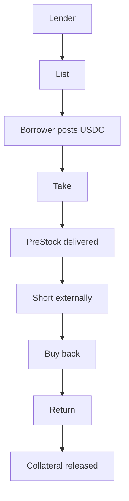
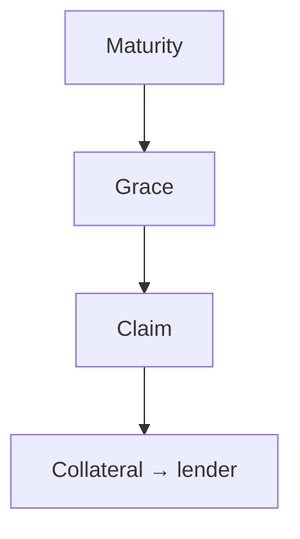
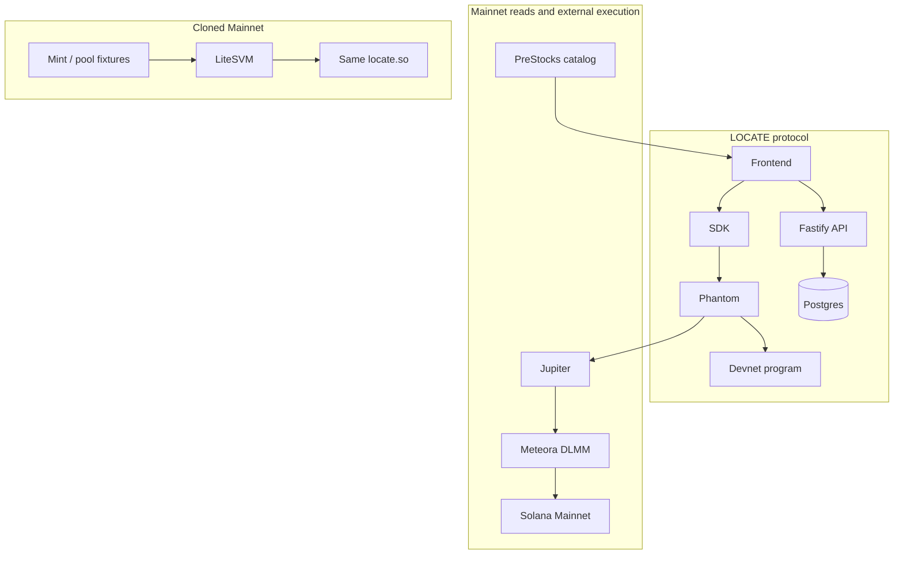

# LOCATE

**Lend PreStocks. Let someone short them.**

LOCATE turns idle PreStocks into borrowable short supply, secured by USDC collateral and settled by delivery.

| LEND | BORROW | SETTLE |
| --- | --- | --- |
| Borrowable supply | USDC-secured access | Return the token, or claim collateral after default |

Live app: [locate-blue.vercel.app](https://locate-blue.vercel.app) · Proof: [locate-blue.vercel.app/proof](https://locate-blue.vercel.app/proof) · API: [locate-api-znz1.onrender.com](https://locate-api-znz1.onrender.com)

Program `F1CiKj7c91ptZsLseX49JTsXtAKykkXSV7Ri468RhqS6` on **Devnet**. Five instructions. No oracle. No liquidation. No keeper.

---

## At a glance

Counts below are from `proof/verification/artifact-audit.json`, `proof/security/suite.json`, `proof/replay/manifest.json`, `proof/verification/reproducible-build.json`, and `proof/verification/chain-audit.json` (checked 2026-09-25).

| Fact | Recorded value | Source |
| --- | --- | --- |
| Protocol instructions | 5 | `programs/locate/src/lib.rs` |
| Functional | 17/17 | `proof/security/suite.json` |
| Security | 14/14 | `proof/security/suite.json` |
| Local validator | 42/42 | `proof/local-validator/suite.json` |
| Cross-runtime vectors | 45,000 Rust ↔ TypeScript | `proof/replay/manifest.json` |
| Cloned Mainnet | 24/24 | `proof/mainnet-fork/manifest.json` |
| Signature re-check | 22 finalized, failed 0 | `proof/verification/chain-audit.json` |
| Reproducible build | equality `true` | `proof/verification/reproducible-build.json` |
| Mainnet DEX execution | sell + buyback finalized | `proof/mainnet-dex/execution-case.json` |
| Phantom Devnet execution | create / take / return / claim | `proof/devnet/protocol.json` |

Mutation coverage is 10/10 in the same security artifact. Backend Vitest is 20/20. Neither is a user-count or a TVL figure.

---

## What LOCATE is

LOCATE is a PreStock lending and short-supply rail.

A holder lists tokens that stay in their wallet until someone takes. A borrower posts USDC, receives the net Token-2022 amount, and can sell that inventory on an external market. Settlement is binary: return the required net, or let the clock run and let the lender claim the locked USDC.

The protocol does not price the asset. It does not liquidate. It does not custody the PreStock in a pool.

---

## The problem

PreStocks can be bought and sold. They are hard to borrow.

Holders sit on idle supply. Borrowers need a locked USDC bond and a known return amount. Token-2022 transfer fees mean the received amount is not the sent amount. A price feed is the wrong settlement input for that problem.

Live catalog prices on the landing page are **read-only Mainnet market context**. They are not settlement inputs.

---

## The lifecycle



If the token never comes back:



One loan, two exits. Return restores the lender’s net and releases the borrower’s leftover USDC. Claim closes the loan and sends vault USDC to the lender. There is no third path.

---

## Why it matters

Idle PreStock inventory is otherwise stuck. LOCATE turns it into dated, collateralized borrowable supply without asking the protocol to become an exchange, an oracle consumer, or a liquidation engine.

The short itself stays where it belongs: the external market. LOCATE only guarantees delivery or collateral.

---

## Why Solana / Token-2022

Token-2022 fees, pause, and hooks are on-chain facts the program must read at the instruction boundary. Wallet-native signing is the only way funds move. External DEX programs are ordinary accounts the client can compose. Mainnet account bytes clone into a local validator without inventing a second protocol.

That combination is why this rail lives on Solana.

---

## How the protocol works

Tokens remain in the lender ATA until take. The offer PDA is already the delegate. Returning restores the lender’s original net. Claiming is binary.

| Instruction | Purpose | Token movement | Major checks |
| --- | --- | --- | --- |
| `create_offer` | List amount, collateral, fee, term, grace, expiry | None. Tokens stay with the lender. | Mint, USDC mint, term/grace bounds, lender ATA, nonce PDA |
| `cancel_offer` | Remove an unused listing | None | Lender signer, offer still open |
| `take_offer` | Post USDC, receive net tokens | Fee to lender. Collateral into loan vault. Gross transfer from lender ATA; borrower receives net after Token-2022 fee. | Terms match, not self-take, funded approval, not paused, no transfer hook, no pending fee change |
| `return_loan` | Deliver required net, release collateral | Borrower sends computed gross. Lender ATA must rise by the original amount. Vault USDC minus fee returns to the borrower. | Gross cap, short-delivery refusal, pause/hook deferral |
| `claim_collateral` | After maturity + grace, send vault USDC to the lender | Collateral only | `ClaimRefusedNotMatured` (6015) before the window |

**Happy path:** LISTED → TAKEN → ACTIVE → RETURNED → SETTLED

**Default path:** LISTED → TAKEN → MATURITY → GRACE → CLAIMABLE → CLAIMED

A Chrome simulation of `claim_collateral` on live loan `4U3UUMfK9QdJt2tm2S2NtTvFrBxX15L9JVvVgb2JDqnF` returned `ClaimRefusedNotMatured`. The claim button stayed disabled. No signature was sent.

---

## The settlement invariant

LOCATE does not settle on price.

It settles on:

**TIME + DELIVERY + COLLATERAL**

No health factor. No liquidation engine. No pooled custody. No protocol fee. No extra instruction beyond the five above.

### Protocol math example (labeled, not a receipt)

Worked identity at 100 bps on `1_000_000` raw:

```
borrow gross     1_000_000
transfer fee        10_000
received net       990_000

return gross     1_010_102
transfer fee        10_102
lender net       1_000_000
```

### Real proof observation (cloned Mainnet OpenAI, epoch 1041)

From `proof/execution/economic-reconciliation.json` and `proof/mainnet-fork/composed-lifecycle.json`. Local execution, not a Mainnet transaction.

```
borrow gross           2_018_660
transfer fee              20_187
received net           1_998_473

return gross           2_039_051
transfer fee              20_391
lender required net    2_018_660
```

The program and SDK share integer `epoch_fee` / `gross_for_net`. Missing fee data on a live loan refuses the return. A fee that changes between quote and sign is a mismatch, not a silent short.

---

## Token-2022, handled at protocol level

UI amounts are display. Settlement is raw `u64`.

LOCATE reads the mint at the instruction boundary and sizes transfers so lender net equals the listed amount.

| Capability | What the protocol does | Status |
| --- | --- | --- |
| Transfer fee | Gross-for-net inversion, epoch-aware schedule | **Exercised** — local-validator cases 12–13; cloned OpenAI 100 bps |
| Pause | Take refused | **Exercised** — cases 14–15 |
| Transfer hook | Take refused | **Exercised** — case 17 |
| Memo transfer | Delivery proceeds with memo requirement enabled | **Exercised** — case 18 |
| Delegation | Take requires a funded approval; unfunded/revoked refuses | **Exercised** — validator refusals |
| Account close / recreate | Return/claim can recreate closed ATAs | **Exercised** — security suite |
| Permanent delegate | Issuer power remains; protocol does not strip it | Parsed on the replica mint; no instruction used it |
| Scaled UI amount | Offers move chain units, not wallet UI | Present on replica; math uses raw amounts |
| Default account state | Not a protocol path | Listed on replica; not asserted |
| CPI Guard | Not a protocol path | Parsed; not exercised as a LOCATE constraint |

**Take refuses when** the mint is paused, a transfer hook is active, or a pending fee schedule is incompatible.

**Return refuses** short delivery, stale or missing fee data, and incorrect terms.

**Claim respects** maturity, the loan’s own grace, and relevant token state. Pause/hook can defer it.

Matrix: `proof/token2022/matrix.json`. Extensions listed as not exercised are not claimed as supported protocol paths.

---

## Execution, not just simulation

Three separate layers. They never merge.

### A. Real Devnet protocol

Phantom-signed against program `F1CiKj7c91ptZsLseX49JTsXtAKykkXSV7Ri468RhqS6`.

**dOPENAI** (`9S2Lb7Yf8pfDKccVgwsMHXQbngGVyfUn5N1FJYQUwE4P`) is a Devnet replica with the same Token-2022 extensions as the OpenAI mint. It is not a Mainnet PreStock. Devnet USDC is `4zMMC9srt5Ri5X14GAgXhaHii3GnPAEERYPJgZJDncDU`.

| Step | Signature | Slot |
| --- | --- | --- |
| create | [`3oW3dET9…fWRxi`](https://explorer.solana.com/tx/3oW3dET9hBUwm1EMwvyWBN21hMBVX2LwUt8K5binJi4iE2JkzdRimFQxja886pLQG7wbrzmMAWtpV7fvV7AfWRxi?cluster=devnet) | 503264904 |
| take | [`3BpyAK9e…X2Vaq`](https://explorer.solana.com/tx/3BpyAK9emZMTyBC4KnNZxYhdR2Z18HwkDgftwAENTLXrX9cHCPcr4vh9NL8rgTGjXnqBy1vU68CYH97L2i2X2Vaq?cluster=devnet) | 503264909 |
| return | [`5YJGkxd9…b85f2h`](https://explorer.solana.com/tx/5YJGkxd9wtZ8PA114v8m53QgbMsbdBuS7LH2BDBWTMk4reP5mgcJyPsidbD5MwcvtLhP986m8L1Xs6MyuZb85f2h?cluster=devnet) | 503264913 |
| claim | [`2paQbq9P…mDGJHn`](https://explorer.solana.com/tx/2paQbq9PaVd5gM9nSbJaupauPMVSAzBJxkEQE9tsZpLkqS7P3nCXAfSHeYWrASrBKqwJThe6P6RUGz7KApmDGJHn?cluster=devnet) | 503265496 |

Return gross raw `2039051`. Early-claim simulation code `6015`. Artifact: `proof/devnet/protocol.json`.

### B. Real Mainnet market

These are real Mainnet market transactions. They are **external market execution, not LOCATE protocol instructions.**

Wallet `Hbkpp56cwNUgXbzFGhYoNbz3Vs3nMqVihW1HroK8TvaC`. Asset: OpenAI PreStock `PreweJYECqtQwBtpxHL171nL2K6umo692gTm7Q3rpgF`. Route: Jupiter → Meteora DLMM. `locateProtocol: false`.

| Leg | Signature | Slot | Direction | Raw in | Raw out | Status |
| --- | --- | --- | --- | --- | --- | --- |
| Sell | [`2C4CND6F…qmuzr`](https://explorer.solana.com/tx/2C4CND6FqBiTgPzgNQojHKa6KzL221gd2Zm4BiyP7WCRnmichUF3m9ptF9xs7pDgTVaa9GMm6eYtqmUnQMbqmuzr) | 450171723 | OpenAI → USDC | 1000 | 1982 | finalized, err null |
| Funding sell | [`4FmrxJKr…PcKSw`](https://explorer.solana.com/tx/4FmrxJKrUUaauhd7tksKFZK1xhJTFB7C6AjYq8dcVv7tnArQZY5woCEBzTeKCuKH1AbzRs3mQcwaGTKD6pVPcKSw) | 450174357 | OpenAI → USDC | 1000 | 1982 quote | finalized, err null |
| Buyback | [`5cHQQxCB…ZgR6F`](https://explorer.solana.com/tx/5cHQQxCByufmPazGRqKPgfdPDVJHMvCVFkz3NdutoPjrjc1p6RhboJXcjzMmQRgcQ8KoqkQNH8NJSGnpPRQZgR6F) | 450174446 | USDC → OpenAI | 3964 | 1956 | finalized, err null |

Wallet OpenAI delta raw `-44`, USDC delta `0`. Case file: `proof/mainnet-dex/execution-case.json`. Rechecked in `proof/verification/chain-audit.json`.

### C. Cloned Mainnet state

Covered in the next section. Local execution against cloned Mainnet account bytes. **Not a Mainnet transaction.**

---

## LOCATE against cloned Mainnet state

Mainnet account state is installed locally. The program then runs the full lifecycle against those bytes.

```text
Mainnet account state
  → real mint bytes
  → real USDC bytes
  → real Token-2022 executable
  → real DLMM program
  → real reserves
  → active bin
  → LOCATE lifecycle
  → local swap sell
  → local buyback
  → return
```

| Fixture | Address | Slot | Owner |
| --- | --- | --- | --- |
| OpenAI mint | `PreweJYECqtQwBtpxHL171nL2K6umo692gTm7Q3rpgF` | 449882176 | Token-2022 |
| Neuralink mint | `PrekqLJvJ3qVdXmBGDiexvwUTF4rLFDa6HWS4HJbw9S` | 450079771 | Token-2022 |
| Mainnet USDC | `EPjFWdd5AufqSSqeM2qN1xzybapC8G4wEGGkZwyTDt1v` | 449882177 | Tokenkeg |
| Token-2022 | `TokenzQdBNbLqP5VEhdkAS6EPFLC1PHnBqCXEpPxuEb` | cloned executable | — |
| DLMM | `LBUZKhRxPF3XUpBCjp4YzTKgLccjZhTSDM9YuVaPwxo` | cloned executable | — |

Matrix: **24/24** (`proof/mainnet-fork/manifest.json`). Epoch used for the active fee: **1041**. Token balances in these runs are written into local ATAs after the cloned mint bytes are installed. The issuer did not mint them.

Composed local trace (`proof/mainnet-fork/composed-lifecycle.json`):

| Stage | Observation |
| --- | --- |
| Take | delivered `1_998_473` raw |
| Local sell | `1_000` token → `2_013` USDC |
| Local buyback | `2_013` USDC → `963` token |
| Return | loan closed |

Same environment. Ordered local execution. Not one chain transaction. Not a Mainnet transaction.

---

## End-to-end execution trace

```text
LENDER
  ↓
LOCATE CREATE
  ↓
LOCATE TAKE
  ↓
TOKEN DELIVERY
  ↓
EXTERNAL MARKET
  ↓
SELL
  ↓
BUY BACK
  ↓
LOCATE RETURN
  ↓
SETTLEMENT
```

On Devnet the CREATE / TAKE / RETURN / CLAIM legs are real program signatures. On Mainnet the SELL / BUY BACK legs are real external DEX signatures. On cloned Mainnet state the whole spine runs locally against real account bytes.

The UI does not accept optimistic success. `VERIFIED` requires a backend receipt after RPC confirmation.

---

## Security model

This is adversarial test coverage, not an audit.

| Threat | Protection | Evidence |
| --- | --- | --- |
| Wrong mint / USDC | `InvalidMint`, `InvalidUsdcMint` | security 14/14 |
| Self-take | `SelfTakeNotAllowed` | security suite |
| Unfunded / revoked delegate | `TakeRefusedUnfunded` | local validator refusals |
| Paused mint | `TakeRefusedPaused` | Token-2022 matrix |
| Active hook | `TakeRefusedHook` | Token-2022 matrix |
| Pending fee | `TakeRefusedFeePending` | Token-2022 matrix |
| Short return | `ReturnRefusedShortDelivery` | functional + fork |
| Early claim | `ClaimRefusedNotMatured` (6015) | Devnet simulation + Chrome |
| Replay / second return | loan closed, second ix fails | fork + validator |
| PDA / vault mix-up | derived addresses, vault owner is the loan | security + mutation |

Mutation suite (10/10) flips behavior and requires the tests to fail. That is how the suite proves it notices regressions.

---

## Testing depth

| Layer | Count | What it proves | Command |
| --- | --- | --- | --- |
| Functional | 17/17 | Core create/take/return/claim | `cargo test -p locate --test functional` |
| Security | 14/14 | Adversarial accounts and Token-2022 refusals | `cargo test -p locate --test security` |
| Mutation | 10/10 | Tests catch intentional regressions | `cargo test -p locate --test mutation` |
| Local validator | 42/42 | Real validator semantics; 34 expected refusals still `PASS` | local-validator suite |
| Cross-runtime replay | 45,000 | Rust ↔ TypeScript integer agreement | `proof/replay/manifest.json` |
| Cloned Mainnet | 24/24 | Real mint bytes, local LOCATE + DLMM | `cargo test -p locate --test fork_proof` |
| Signature re-check | 22 signatures, failed 0 | Finalized RPC re-check | `node scripts/audit-proof-chain.mjs` |
| Reproducible build | equality `true` | Two Solana 4.1.2 builds, same ELF | `proof/verification/reproducible-build.json` |
| Artifact check | problems `[]` | Proof JSON copies match `proof/` | `node scripts/audit-proof-artifacts.mjs` |
| Backend | 20/20 | Receipts, economics, DEX helpers | `npm test --prefix backend` |

Devnet deployed binary correspondence is also `true` (`proof/verification/devnet-deployed-binary.json`). That is **not** a Mainnet verified program.

Do not rerun the passed 24/24, 42/42, 45,000, security, or mutation suites to “refresh” these numbers. They already stand.

---

## Architecture



Proof page layers: Devnet protocol · cloned Mainnet state · Mainnet external market · validation (42/42, 45,000, security, mutation).

---

## Frontend / wallet / backend

**Lender.** Connect Phantom → set amount, USDC collateral, fee, term → simulate → approve → offer live. Tokens stay in the wallet until take.

**Borrower.** Open the book → inspect collateral and net delivery → simulate → approve → tokens arrive, loan is ACTIVE.

**Short.** External market, not an instruction. Sell the borrowed token, buy it back, hold enough gross to return.

**Return.** SDK computes gross from live fee → simulate → approve → lender net restored → collateral released.

**Default.** Maturity, then the loan’s grace, then claimable.

The frontend is the product surface. The SDK builds and simulates the five instructions. The Fastify API stores finalized receipts in Postgres and serves catalog context. `VERIFIED` in the UI is a backend receipt after RPC confirmation, not a client-side guess.

---

## Integrations

Solana · Anchor 1.2.0 · Solana CLI 4.1.2 · Token-2022 · PreStocks catalog API · Jupiter (quotes + Mainnet swap) · Meteora DLMM · Phantom / Wallet Standard · Fastify · Postgres · Vercel · Render

---

## Reproduction

Prerequisites: Rust, Solana CLI 4.1.2, Anchor 1.2.0, Node 22+, a Devnet RPC. Copy `.env.example`. Do not commit `.env`.

```bash
git clone https://github.com/goat-dev8/LOCATE.git
cd LOCATE
cargo build-sbf --manifest-path programs/locate/Cargo.toml --features devnet
npm install --prefix sdk && npm test --prefix sdk
npm install --prefix backend && npm test --prefix backend
npm install --prefix frontend && npm run build --prefix sdk && npx tsc --noEmit --prefix frontend
node scripts/audit-proof-artifacts.mjs
```

| Check | Command |
| --- | --- |
| Program suites | `cargo test -p locate` |
| Cloned Mainnet | `cargo test -p locate --test fork_proof` |
| SDK | `npm test --prefix sdk` |
| Backend | `npm test --prefix backend` |
| Proof copies | `node scripts/audit-proof-artifacts.mjs` |
| Chain signatures | `node scripts/audit-proof-chain.mjs` (public RPC; paced) |

Fork fixtures live under `tests/fixtures/mainnet`. They are cloned account bytes, not live Mainnet sends.

`node scripts/audit-proof-artifacts.mjs` is the local verifier: fork 24, validator 42, replay 45,000, security 0 failed, chain 22/0, build equality, no Mainnet LOCATE flags, Devnet DEX still recorded as an external venue miss.

---

## Evidence index

| Artifact | What it records |
| --- | --- |
| [`proof/EXECUTION_STATUS.json`](proof/EXECUTION_STATUS.json) | Layer classification |
| [`proof/verification/artifact-audit.json`](proof/verification/artifact-audit.json) | Count lock: 24 / 42 / 45,000 / 22 |
| [`proof/security/suite.json`](proof/security/suite.json) | 17 functional, 14 security, 10 mutation, 20 backend |
| [`proof/local-validator/suite.json`](proof/local-validator/suite.json) | 42/42, 34 expected refusals |
| [`proof/replay/manifest.json`](proof/replay/manifest.json) | 45,000 integer vectors |
| [`proof/mainnet-fork/manifest.json`](proof/mainnet-fork/manifest.json) | 24/24 cloned Mainnet |
| [`proof/mainnet-fork/composed-lifecycle.json`](proof/mainnet-fork/composed-lifecycle.json) | Local take → sell → buyback → return |
| [`proof/execution/economic-reconciliation.json`](proof/execution/economic-reconciliation.json) | Raw-unit identity on that lifecycle |
| [`proof/devnet/protocol.json`](proof/devnet/protocol.json) | Phantom-signed Devnet cycle |
| [`proof/mainnet-dex/execution-case.json`](proof/mainnet-dex/execution-case.json) | Real Mainnet sell + buyback |
| [`proof/verification/chain-audit.json`](proof/verification/chain-audit.json) | 22 signatures rechecked |
| [`proof/verification/reproducible-build.json`](proof/verification/reproducible-build.json) | ELF equality |
| [`proof/verification/devnet-deployed-binary.json`](proof/verification/devnet-deployed-binary.json) | Devnet binary correspondence |
| [`proof/token2022/matrix.json`](proof/token2022/matrix.json) | Exercised vs parsed extensions |
| [`proof/devnet/venue-final.json`](proof/devnet/venue-final.json) | Devnet DEX external venue record |

On-chain program: [F1CiKj7c91ptZsLseX49JTsXtAKykkXSV7Ri468RhqS6](https://explorer.solana.com/address/F1CiKj7c91ptZsLseX49JTsXtAKykkXSV7Ri468RhqS6?cluster=devnet)

---

## Architecture & trust boundaries

This is intentional architecture, not an unfinished deploy.

**LOCATE protocol execution** is real Devnet deployment and real wallet execution.

**Mainnet** is live market state, real external DEX execution, and real transaction evidence.

**Cloned Mainnet** is real Mainnet account state, real token programs, and real liquidity state, with local LOCATE execution and local DEX execution.

| State | Classification |
| --- | --- |
| Reproducible build | PASS |
| Devnet deployed binary correspondence | PASS |
| Devnet LOCATE lifecycle | PASS |
| Cloned Mainnet execution | PASS |
| Mainnet external DEX sell / buyback | PASS |
| Mainnet LOCATE deployment | not a protocol target |
| Mainnet LOCATE protocol transactions | not a protocol target |
| Devnet DEX short loop | external venue unavailable for the replica mint |

LOCATE is not deployed on Mainnet. A fork swap is not a Mainnet transaction. An external DEX swap is not a LOCATE instruction.

---

## Known external constraints

The Devnet replica mint `9S2Lb7Yf8pfDKccVgwsMHXQbngGVyfUn5N1FJYQUwE4P` has no permissionless venue. Jupiter returns `TOKEN_NOT_TRADABLE`. That is recorded as an external venue constraint in `proof/devnet/venue-final.json`. The protocol is not weakened to fake a pool, and a simulation is not labeled a transaction.

Catalog marks can move. They never enter settlement math.

---

## Repository structure

```text
programs/locate   Anchor program — five instructions, Token-2022 math
sdk               TypeScript client, integer helpers, instruction builders
backend           Fastify API, Postgres receipts, catalog + DEX helpers
frontend          Landing + wallet workspace (Phantom)
proof/            Evidence artifacts copied into the app
tests/fixtures    Cloned Mainnet account bytes
scripts/          Proof audit, push, deploy
.github/workflows Program, SDK, backend, frontend, secret-scan
```

Only `README.md` is the public markdown surface. Local engineering notes stay on disk.
