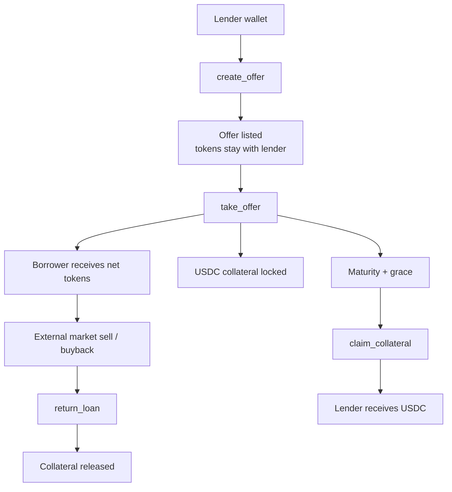
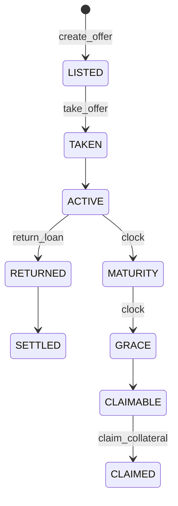
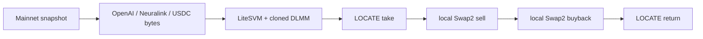
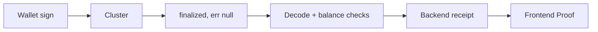
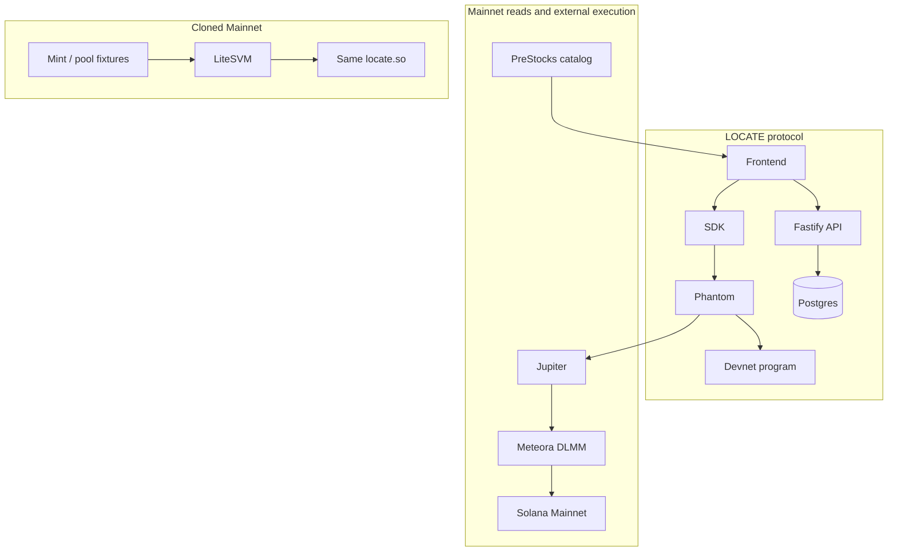

# LOCATE

**Lend PreStocks. Let someone short them.**

LOCATE turns idle PreStocks into borrowable short supply, secured by USDC collateral and settled by delivery.

| Solana | Anchor | Token-2022 | Devnet protocol | Cloned Mainnet state | Mainnet external DEX |
| --- | --- | --- | --- | --- | --- |
| 4.1.2 | 1.2.0 | fee-aware net delivery | live program | 24/24 local | sell + buyback finalized |

Live app: [locate-blue.vercel.app](https://locate-blue.vercel.app) · Proof: [locate-blue.vercel.app/proof](https://locate-blue.vercel.app/proof) · API: [locate-api-znz1.onrender.com](https://locate-api-znz1.onrender.com)

---

## Why it exists

PreStocks can be bought and sold. They are hard to borrow.

Holders sit on idle supply. Borrowers need a locked USDC bond and a known return amount. Token-2022 transfer fees mean the received amount is not the sent amount. Settlement must not depend on a price feed.

LOCATE answers that with five instructions, raw-integer Token-2022 math, and a clock.

Live catalog prices on the landing page are **read-only Mainnet market context**. They are not settlement inputs.

---

## Core concept



Default path if the borrower never returns:



---

## Protocol surface

Program `F1CiKj7c91ptZsLseX49JTsXtAKykkXSV7Ri468RhqS6` on **Devnet**. Five instructions. No oracle. No liquidation. No keeper. No admin.

| Instruction | Purpose | Token movement | Major checks |
| --- | --- | --- | --- |
| `create_offer` | List an amount, collateral, fee, term, grace, expiry | None. Tokens stay in the lender ATA. Offer PDA is already the delegate. | Mint, USDC mint, term/grace bounds, lender ATA, nonce PDA |
| `cancel_offer` | Remove an unused listing | None | Lender signer, offer still open |
| `take_offer` | Post USDC, receive net tokens | Fee to lender. Collateral into loan vault. Gross transfer from lender ATA; borrower receives net after Token-2022 fee. | Terms match, not self-take, funded approval, not paused, no transfer hook, no pending fee change |
| `return_loan` | Deliver required net, release collateral | Borrower sends computed gross. Lender ATA must rise by original amount. Vault USDC minus fee returns to borrower. | Gross cap, short-delivery refusal, pause/hook deferral |
| `claim_collateral` | After maturity + grace, send vault USDC to the lender | Collateral only | `ClaimRefusedNotMatured` (6015) before the window. Pause/hook can defer. |

Tokens remain in the lender wallet until take. Returning restores the lender’s net. Claiming is binary: the loan is closed and the USDC moves.

---

## Settlement is time + delivery + collateral

Settlement inputs are the clock, the delivered raw amount, and the locked USDC. The protocol never reads a market price.

- No health factor
- No liquidation engine
- No pooled custody
- No protocol fee
- No extra instruction beyond the five above

**Happy path:** LISTED → TAKEN → ACTIVE → RETURNED → SETTLED

**Default path:** LISTED → TAKEN → MATURITY → GRACE → CLAIMABLE → CLAIMED

A Chrome simulation of `claim_collateral` on live loan `4U3UUMfK9QdJt2tm2S2NtTvFrBxX15L9JVvVgb2JDqnF` returned `ClaimRefusedNotMatured`. The claim button stayed disabled. No signature was sent.

---

## Token-2022

UI amounts are display. Settlement is raw `u64`.

Worked identity at 100 bps on `1_000_000` raw (labeled math, not a receipt):

```
borrow gross     1_000_000
transfer fee        10_000
received net       990_000

return gross     1_010_102
transfer fee        10_102
lender net       1_000_000
```

Cloned Mainnet OpenAI at epoch 1041 delivered `1_998_473` net from a `2_018_660` loan at 100 bps (`proof/mainnet-fork/openai-full-lifecycle.json`).

The program and SDK share integer `epoch_fee` / `gross_for_net`. Missing fee on a live loan refuses the return. A fee that changes between quote and sign is a mismatch, not a silent short.

| Extension | Behavior |
| --- | --- |
| Transfer fee | Gross sized so lender net equals the original amount |
| Pending fee schedule | Take refused until the new epoch |
| Pause | Take refused. Return/claim deferred |
| Transfer hook | Take refused. Claim deferred |
| Permanent delegate | Issuer power remains. Protocol does not strip it |
| Scaled UI amount | Wallet UI ≠ chain amount. Offers move chain units |
| Memo / CPI Guard | Accounted in delivery paths |

---

## Security model

This is adversarial test coverage, not an audit.

| Threat | Protection | Evidence |
| --- | --- | --- |
| Wrong mint / USDC | `InvalidMint`, `InvalidUsdcMint` | security 14/14 |
| Self-take | `SelfTakeNotAllowed` | security suite |
| Unfunded / revoked delegate | `TakeRefusedUnfunded` | local validator refusals |
| Paused mint | `TakeRefusedPaused` | Token-2022 matrix |
| Active hook | `TakeRefusedHook` | Token-2022 matrix |
| Pending fee | `TakeRefusedFeePending` | Token-2022 matrix |
| Short return | `ReturnRefusedShortDelivery` | functional + fork |
| Early claim | `ClaimRefusedNotMatured` (6015) | Devnet simulation + Chrome |
| Replay / second return | loan closed, second ix fails | fork + validator |
| PDA / vault mix-up | derived addresses, vault owner is the loan | security + mutation |

Mutation suite (10/10) flips behavior and requires the tests to fail. That is how the suite proves it notices regressions.

---

## Verified test depth

Counts from `proof/verification/artifact-audit.json` and `proof/security/suite.json` (checked 2026-09-25).

| Layer | Count | What it proves | Command |
| --- | --- | --- | --- |
| Functional | 17/17 | Core create/take/return/claim | `cargo test -p locate --test functional` |
| Security | 14/14 | Adversarial accounts and Token-2022 refusals | `cargo test -p locate --test security` |
| Mutation | 10/10 | Tests catch intentional regressions | `cargo test -p locate --test mutation` |
| Local validator | 42/42 | Real validator semantics; 34 expected refusals still `PASS` | local-validator suite |
| Cross-runtime replay | 45,000 | Rust ↔ TypeScript integer agreement | `proof/replay/manifest.json` |
| Cloned Mainnet | 24/24 | Real mint bytes, local LOCATE + DLMM | `cargo test -p locate --test fork_proof` |
| Signature re-check | 22 signatures, failed 0 | Finalized RPC re-check | `node scripts/audit-proof-chain.mjs` |
| Reproducible build | equality `true` | Two Solana 4.1.2 builds, same ELF | `proof/verification/reproducible-build.json` |
| Artifact check | problems `[]` | Proof JSON copies match `proof/` | `node scripts/audit-proof-artifacts.mjs` |

Devnet deployed binary correspondence is also `true` (`proof/verification/devnet-deployed-binary.json`). That is **not** a Mainnet verified program.

---

## Mainnet state, executed locally



OpenAI mint `PreweJYECqtQwBtpxHL171nL2K6umo692gTm7Q3rpgF` (slot 449882176). Neuralink mint `PrekqLJvJ3qVdXmBGDiexvwUTF4rLFDa6HWS4HJbw9S` (slot 450079771). USDC `EPjFWdd5AufqSSqeM2qN1xzybapC8G4wEGGkZwyTDt1v`. Token-2022 and DLMM `LBUZKhRxPF3XUpBCjp4YzTKgLccjZhTSDM9YuVaPwxo` run as cloned executables.

Composed local trace (`proof/mainnet-fork/composed-lifecycle.json`): take delivered `1998473`, local sell `1000` → `2013` USDC, buyback `963`, return closed the loan. **Not a Mainnet transaction.**

---

## Real Mainnet external market execution

LOCATE is **not** in these transactions.

Wallet `Hbkpp56cwNUgXbzFGhYoNbz3Vs3nMqVihW1HroK8TvaC`. Case file: `proof/mainnet-dex/execution-case.json`.

| Leg | Signature | Slot | Raw |
| --- | --- | --- | --- |
| Sell | [`2C4CND6F…qmuzr`](https://explorer.solana.com/tx/2C4CND6FqBiTgPzgNQojHKa6KzL221gd2Zm4BiyP7WCRnmichUF3m9ptF9xs7pDgTVaa9GMm6eYtqmUnQMbqmuzr) | 450171723 | 1000 OpenAI → 1982 USDC |
| Funding sell | [`4FmrxJKr…PcKSw`](https://explorer.solana.com/tx/4FmrxJKrUUaauhd7tksKFZK1xhJTFB7C6AjYq8dcVv7tnArQZY5woCEBzTeKCuKH1AbzRs3mQcwaGTKD6pVPcKSw) | 450174357 | 1000 OpenAI |
| Buyback | [`5cHQQxCB…ZgR6F`](https://explorer.solana.com/tx/5cHQQxCByufmPazGRqKPgfdPDVJHMvCVFkz3NdutoPjrjc1p6RhboJXcjzMmQRgcQ8KoqkQNH8NJSGnpPRQZgR6F) | 450174446 | 3964 USDC → 1956 OpenAI |

Route: Jupiter → Meteora DLMM. `locateProtocol: false`. Wallet OpenAI delta raw `-44`, USDC delta `0`.

---

## Devnet protocol execution

**dOPENAI** (`9S2Lb7Yf8pfDKccVgwsMHXQbngGVyfUn5N1FJYQUwE4P`) is a Devnet replica with the same Token-2022 extensions as the OpenAI mint. It is not a Mainnet PreStock. Devnet USDC is `4zMMC9srt5Ri5X14GAgXhaHii3GnPAEERYPJgZJDncDU`.

Phantom-signed cycle (`proof/devnet/protocol.json`):

| Step | Signature | Slot |
| --- | --- | --- |
| create | [`3oW3dET9…fWRxi`](https://explorer.solana.com/tx/3oW3dET9hBUwm1EMwvyWBN21hMBVX2LwUt8K5binJi4iE2JkzdRimFQxja886pLQG7wbrzmMAWtpV7fvV7AfWRxi?cluster=devnet) | 503264904 |
| take | [`3BpyAK9e…X2Vaq`](https://explorer.solana.com/tx/3BpyAK9emZMTyBC4KnNZxYhdR2Z18HwkDgftwAENTLXrX9cHCPcr4vh9NL8rgTGjXnqBy1vU68CYH97L2i2X2Vaq?cluster=devnet) | 503264909 |
| return | [`5YJGkxd9…b85f2h`](https://explorer.solana.com/tx/5YJGkxd9wtZ8PA114v8m53QgbMsbdBuS7LH2BDBWTMk4reP5mgcJyPsidbD5MwcvtLhP986m8L1Xs6MyuZb85f2h?cluster=devnet) | 503264913 |
| claim | [`2paQbq9P…mDGJHn`](https://explorer.solana.com/tx/2paQbq9PaVd5gM9nSbJaupauPMVSAzBJxkEQE9tsZpLkqS7P3nCXAfSHeYWrASrBKqwJThe6P6RUGz7KApmDGJHn?cluster=devnet) | 503265496 |

Return gross raw `2039051`. Early-claim simulation code `6015`.

---

## Evidence pipeline



The UI does not accept optimistic success. `VERIFIED` requires a backend receipt after RPC confirmation.



Proof page layers: Devnet protocol · cloned Mainnet state · Mainnet external market · validation (42/42, 45,000, security, mutation).

---

## User journeys

**Lender.** Connect Phantom → set amount, USDC collateral, fee, term → simulate → approve → offer live. Tokens stay in the wallet until take.

**Borrower.** Open the book → inspect collateral and net delivery → simulate → approve → tokens arrive, loan is ACTIVE.

**Short.** External market, not an instruction. Sell the borrowed token, buy it back, hold enough gross to return.

**Return.** SDK computes gross from live fee → simulate → approve → lender net restored → collateral released.

**Default.** Maturity, then the loan’s grace, then claimable. Lender (or anyone paying the ix) sends vault USDC to the lender.

---

## Reproduce locally

Prerequisites: Rust, Solana CLI 4.1.2, Anchor 1.2.0, Node 22+, a Devnet RPC. Copy `.env.example`. Do not commit `.env`.

```bash
git clone https://github.com/goat-dev8/LOCATE.git
cd LOCATE
cargo build-sbf --manifest-path programs/locate/Cargo.toml --features devnet
npm install --prefix sdk && npm test --prefix sdk
npm install --prefix backend && npm test --prefix backend
npm install --prefix frontend && npm run build --prefix sdk && npx tsc --noEmit --prefix frontend
node scripts/audit-proof-artifacts.mjs
```

| Check | Command |
| --- | --- |
| Program suites | `cargo test -p locate` |
| Cloned Mainnet | `cargo test -p locate --test fork_proof` |
| SDK | `npm test --prefix sdk` |
| Backend | `npm test --prefix backend` |
| Proof copies | `node scripts/audit-proof-artifacts.mjs` |
| Chain signatures | `node scripts/audit-proof-chain.mjs` (public RPC; paced) |

Fork fixtures live under `tests/fixtures/mainnet`. They are cloned account bytes, not live Mainnet sends.

`node scripts/audit-proof-artifacts.mjs` is the local verifier: fork 24, validator 42, replay 45,000, security 0 failed, chain 22/0, build equality, no Mainnet LOCATE flags, Devnet DEX still `FAIL`.

---

## Integrations in this tree

Solana · Anchor · Token-2022 · PreStocks catalog API · Jupiter (quotes + Mainnet swap) · Meteora DLMM · Phantom / Wallet Standard · Fastify · Postgres · Vercel · Render

---

## Why Solana here

Token-2022 fees, pause, and hooks are on-chain facts the program must read. Wallet-native signing is the only way funds move. External DEX programs are ordinary accounts the client can compose. Account state clones into LiteSVM without inventing a second protocol.

---

## Scope and trust boundaries

| State | Classification |
| --- | --- |
| Reproducible build | PASS |
| Devnet deployed binary correspondence | PASS |
| Devnet LOCATE lifecycle | PASS |
| Cloned Mainnet execution | PASS |
| Mainnet external DEX sell / buyback | PASS |
| Mainnet LOCATE deployment | NOT_APPLICABLE_BY_DESIGN |
| Mainnet LOCATE protocol transactions | NOT_APPLICABLE_BY_DESIGN |
| Devnet DEX short loop | BLOCKED_EXTERNAL — replica mint has no permissionless venue |

LOCATE is not deployed on Mainnet. A fork swap is not a Mainnet transaction. An external DEX swap is not a LOCATE instruction.

---

## Proof links

- Program: [F1CiKj7c91ptZsLseX49JTsXtAKykkXSV7Ri468RhqS6](https://explorer.solana.com/address/F1CiKj7c91ptZsLseX49JTsXtAKykkXSV7Ri468RhqS6?cluster=devnet)
- App: [locate-blue.vercel.app](https://locate-blue.vercel.app)
- Proof: [locate-blue.vercel.app/proof](https://locate-blue.vercel.app/proof)
- Artifacts: [`proof/`](proof/)
- Status: [`proof/EXECUTION_STATUS.json`](proof/EXECUTION_STATUS.json)

Roadmap stays empty until a new instruction or a real venue exists. Neither is promised here.
